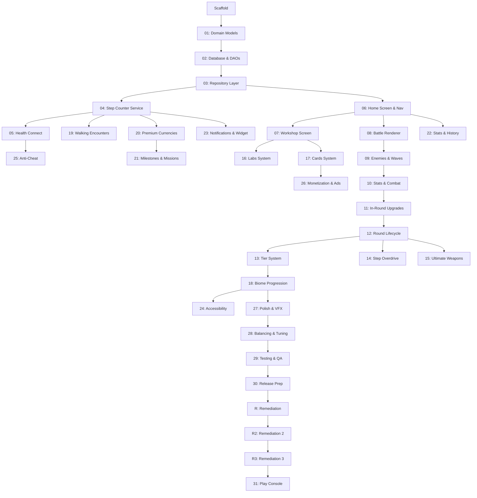

# AGENTS.md — Steps of Babylon

## Project Overview

Steps of Babylon is an Android mobile game that combines idle tower defense gameplay with a real-world step counter. Players earn **Steps** by physically walking, then spend them to upgrade an ancient ziggurat that fights wave-based battles against mythic enemies. Progression is gated entirely by physical activity.

See `docs/StepsOfBabylon_GDD.md` for the full game design document.

## Project Memory (read first)

| File | Purpose |
|---|---|
| `docs/agent/START_HERE.md` | Agent contract — what this is, how to work here |
| `docs/agent/STATE.md` | One-page project snapshot (current objective, priorities, next actions) |
| `docs/agent/CONSTRAINTS.md` | Architecture invariants, security rules, "never do" list |
| `docs/agent/RUN_LOG.md` | Append-only log of every agent session |
| `docs/agent/DECISIONS/` | Architecture Decision Records (ADRs) |

Operating rules:
- Always do Context Preflight before planning (see `.kiro/steering/11-agent-protocol.md`).
- Always update STATE.md + append RUN_LOG.md at end of run.
- Record meaningful decisions as ADRs in `docs/agent/DECISIONS/`.

## Tech Stack

- **Language:** Kotlin (JVM target 17)
- **Package:** `com.whitefang.stepsofbabylon`
- **Min SDK:** 34 (Android 14)
- **Target/Compile SDK:** 36
- **Version:** 1.0.0 (versionCode 6 — v3 was uploaded + rolled out to internal track 2026-05-15, on-device smoke test PASSED 2026-05-18; v4 (RO-08 + RO-09 fix bundles) was uploaded to the internal track 2026-05-18 then superseded by v5 before closed-track promotion; v5 (RO-11 Labs wiring + in-round upgrade-effect readout, 572 → 609 tests) uploaded to Play Console internal track 2026-05-19 — v5 on-device smoke test 2026-05-19 morning surfaced an in-round stat-drift bug bundle (RO-12: lab + card multipliers stripped on every in-round upgrade purchase + DescribeUpgradeEffect drift + HEALTH_REGEN precision); fixes landed on `main` 2026-05-19 (609 → 615 tests); versionCode bumped 5 → 6 in commit `1796b4c`. v5 smoke also surfaced 4 GitHub-tracked bugs (issues #1–#4) — R3 (Remediation 3) plan written 2026-05-19 early afternoon; **R3-01 (#2 backgrounding mid-round state loss, blocker)** fix landed on branch `fix/2-battle-backgrounding-state-loss` 2026-05-19 afternoon (615 → 619 tests) and merged to `main` (PR #5); **R3-02 (#4 THORN_DAMAGE wiring + LIFESTEAL visibility, major)** fix landed on branch `fix/4-thorn-damage-lifesteal` 2026-05-19 afternoon (619 → 622 tests) and merged to `main` (PR #6); **R3-03 (#1 COMPLETE_RESEARCH mission false trigger, major)** fix landed on branch `fix/1-complete-research-false-trigger` 2026-05-19 mid-afternoon (622 → 627 tests); awaiting v6 `bundleRelease` + re-upload until R3 Tier 1 fully closes)
- **Architecture:** MVVM + Clean Architecture
- **UI:** Jetpack Compose (menus/screens) + SurfaceView (battle renderer)
- **DI:** Hilt (with KSP)
- **Database:** Room (SQLite) with SQLCipher encryption — offline-first, all game state stored locally
- **Background:** WorkManager + Foreground Service (step counting)
- **Step Tracking:** Android Sensor API (`TYPE_STEP_COUNTER`) + Health Connect SDK (cross-validation, Activity Minute Parity)
- **Build:** Gradle 9.3.1 (Kotlin DSL), version catalog at `gradle/libs.versions.toml`
- **Security:** SQLCipher (database encryption), Android Keystore (key management), R8 (obfuscation), network security config (cleartext blocked)

## Architecture

```
app/src/main/java/com/whitefang/stepsofbabylon/
├── data/           # Android-dependent layer
│   ├── local/      # Room database, entities, DAOs
│   ├── repository/ # Repository implementations (Room-backed)
│   ├── sensor/     # Step sensor data source, rate limiter, daily step manager
│   └── healthconnect/ # Health Connect client, step reader, cross-validator, gap filler
├── domain/         # Pure Kotlin — no Android imports
│   ├── model/      # Currency, PlayerWallet, PlayerProfile, BattleConditionEffects, and all game domain models
│   ├── repository/ # Repository interfaces
│   └── usecase/    # CalculateUpgradeCost, CanAffordUpgrade, ResolveStats, CalculateDamage, CalculateDefense, PurchaseUpgrade, QuickInvest, UpdateBestWave, CheckTierUnlock, ActivateOverdrive, UnlockUltimateWeapon, UpgradeUltimateWeapon, CalculateResearchCost, CalculateResearchTime, StartResearch, CompleteResearch, RushResearch, UnlockLabSlot, CheckResearchCompletion, UpdateCompleteResearchMissionProgress, OpenCardPack, UpgradeCard, ApplyCardEffects, ManageCardLoadout, GenerateSupplyDrop, ClaimSupplyDrop, TrackWeeklyChallenge, TrackDailyLogin, AwardWaveMilestone, CheckMilestones, ClaimMilestone, GenerateDailyMissions, PurchaseGemPack
├── presentation/   # ViewModels, Compose screens, SurfaceView battle renderer
│   ├── navigation/ # Screen routes, BottomNavBar
│   ├── home/       # HomeScreen, TierSelector
│   ├── workshop/   # WorkshopScreen, UpgradeCard
│   ├── battle/     # BattleScreen, BattleViewModel
│   │   ├── engine/ # GameEngine, WaveSpawner, EnemyScaler, CollisionSystem
│   │   ├── entities/ # ZigguratEntity, EnemyEntity, ProjectileEntity, OrbEntity
│   │   ├── effects/ # ParticlePool, EffectEngine, ScreenShake, DeathEffect, UWVisualEffect, OverdriveAuraEffect, WaveAnnouncement, FloatingText, ProjectileTrailEffect
│   │   ├── biome/  # BiomeTheme, BackgroundRenderer
│   │   └── ui/     # InRoundUpgradeMenu, PostRoundOverlay, PauseOverlay, HealthBarRenderer, BiomeTransitionOverlay, OverdriveMenu, UltimateWeaponBar
│   ├── weapons/    # UltimateWeaponScreen, UltimateWeaponViewModel
│   ├── labs/       # LabsScreen, LabsViewModel
│   ├── cards/      # CardsScreen, CardsViewModel
│   ├── supplies/   # UnclaimedSuppliesScreen, UnclaimedSuppliesViewModel
│   ├── economy/    # CurrencyDashboardScreen, CurrencyDashboardViewModel
│   ├── missions/   # MissionsScreen, MissionsViewModel
│   ├── settings/   # NotificationSettingsScreen, NotificationSettingsViewModel
│   ├── stats/      # StatsScreen, StatsViewModel
│   └── ui/theme/   # Color, Theme
├── di/             # Hilt modules (DatabaseModule, RepositoryModule, StepModule, HealthConnectModule)
└── service/        # Foreground step-counting service, WorkManager workers, boot receiver, notifications, widget
```

Follow Clean Architecture layers: `presentation → domain ← data`. The domain layer has zero Android dependencies.

See `.kiro/steering/source-files.md` for the full source file index.

## Plans & Roadmap

Development follows a master plan with 35 entries (Plans 01–31, 10b, R, R2, and R3). See `docs/plans/master-plan.md` for the full index, dependency graph, and status tracker.

### Key Documents

| Document | Path |
|---|---|
| Game Design Document | `docs/StepsOfBabylon_GDD.md` |
| Master Plan (34 entries) | `docs/plans/master-plan.md` |
| Plan 01: Domain Models | `docs/plans/plan-01-domain-models.md` |
| Plan 02: Database & DAOs | `docs/plans/plan-02-database.md` |
| Battle Formulas | `docs/battle-formulas.md` |
| Database Schema | `docs/database-schema.md` |
| Step Tracking | `docs/step-tracking.md` |
| Monetization | `docs/monetization.md` |
| Architecture | `docs/architecture.md` |

### Full Plan Index

| # | Plan | Description | Dependencies |
|---|---|---|---|
| 01 | Domain Models & Currency System | Core domain models, enums, cost calculation engine. Pure Kotlin. | Scaffold |
| 02 | Room Database & DAOs | All Room entities, DAOs, migration strategy. | Plan 01 |
| 03 | Repository Layer | Repository interfaces (domain) + Room-backed impls (data). Flows. | Plan 02 |
| 04 | Step Counter Service | Foreground service, TYPE_STEP_COUNTER, WorkManager sync, anti-cheat. | Plan 03 |
| 05 | Health Connect Integration | Cross-validation, Activity Minute Parity, gap-filling. | Plan 04 |
| 06 | Home Screen & Navigation | Compose nav graph, dashboard, bottom nav bar. | Plan 03 |
| 07 | Workshop Screen & Upgrades | Workshop UI (Attack/Defense/Utility tabs), Step purchases. | Plan 06 |
| 08 | Battle Renderer — Game Loop & Ziggurat | Custom SurfaceView, game loop thread, fixed timestep, ziggurat. | Plan 06 |
| 09 | Battle System — Enemies & Waves | Enemy entities, wave spawning (26s+9s), scaling, collision. | Plan 08 |
| 10 | Battle System — Stats & Combat | Stats resolution (Workshop × In-Round), crit, knockback, lifesteal. | Plan 09 |
| 11 | In-Round Upgrades & Cash Economy | Cash from kills, in-round upgrade menu, interest, free upgrade chance. | Plan 10 |
| 12 | Round Lifecycle & Post-Round | Start/end flow, speed controls, post-round summary. | Plan 11 |
| 13 | Tier System & Progression | Tier unlock logic, cash multipliers, battle conditions (Tier 6+). | Plan 12 |
| 14 | Step Overdrive | 4 overdrive types, Step cost, 60s buff, once-per-round. | Plan 12 |
| 15 | Ultimate Weapons | 6 UW types, Power Stone unlock/upgrade, loadout (3 max), cooldowns. | Plan 12 |
| 16 | Labs System | Research projects, Step cost + real-time duration, 1-4 slots, Gem rush. | Plan 07 |
| 17 | Cards System | Card packs (Gem purchase), 3 rarities, Card Dust, loadout (3 max). | Plan 07 |
| 18 | Narrative Biome Progression | 5 biomes, environment art swap, enemy themes, cinematics. | Plan 13 |
| 19 | Walking Encounters & Supply Drops | Seeded random drops, push notifications, Unclaimed Supplies inbox. | Plan 04 |
| 20 | Power Stone & Gem Economy | Weekly challenges, milestones, daily login streaks. | Plan 04 |
| 21 | Milestones & Daily Missions | Walking milestones, 3 daily missions, midnight refresh. | Plan 20 |
| 22 | Stats & History Screen | Walking history charts, battle stats, all-time stats. | Plan 06 |
| 23 | Notifications & Widget | Persistent notification, home widget (2x2), smart reminders. | Plan 04 |
| 24 | Accessibility *(deferred)* | TalkBack, audio cues, color-blind modes, adjustable text. | Plan 18 |
| 25 | Anti-Cheat & Validation | Rate limiting, daily ceiling, Health Connect cross-validation. | Plan 05 |
| 26 | Monetization & Ads | Reward ads, ad removal IAP, Gem packs, Season Pass, cosmetics. | Plan 17 |
| 27 | Polish & Visual Effects | Projectile/UW/Overdrive effects, death anims, sound integration. | Plan 18 |
| 28 | Balancing & Tuning | Step economy, Workshop cost curves, enemy scaling, Card balance. | Plan 27 |
| 29 | Testing & QA | Unit tests, ViewModel tests, DAO tests, sensor tests, UI tests. | Plan 28 |
| 30 | Release Prep | ProGuard/R8, signing, Play Store assets, privacy policy, AAB. | Plan 29 |
| 31 | Play Console & Store Publication | Console setup, store listing upload, IAP/ad SDK integration, test tracks, publication. | Plan 30, Plan R (Tier 1), Plan R2 (Tier 1) |
| R | Remediation | Bug and UX fixes from external code review. 12 sub-plans (R01–R12), 3 priority tiers. | Plan 30 |
| R2 | Remediation 2 | Bug and UX fixes from second external review. 12 sub-plans (R2-01–R2-12), 3 priority tiers. | Plan R |
| R3 | Remediation 3 | Bug fixes from v5 internal-track on-device smoke test (2026-05-19). 4 sub-plans (R3-01–R3-04) tracked as GitHub issues #1–#4. Tier 1 blocks closed-track promotion. | Plan R2 |

### Dependency Graph



### Critical Path

01 → 02 → 03 → 06 → 08 → 09 → 10 → 11 → 12 → 13 → 18 → 27 → 28 → 29 → 30 → R (Tier 1) → R2 (Tier 1) → R3 (Tier 1) → 31

### Current Status

- [x] Project scaffold (Gradle, Hilt, Room skeleton, Compose theme, Home placeholder)
- [x] **Plan 01: Domain Models & Currency System** ✓
- [x] **Plan 02: Room Database & DAOs** ✓
- [x] **Plan 03: Repository Layer** ✓
- [x] **Plan 04: Step Counter Service** ✓
- [x] **Plan 05: Health Connect Integration** ✓
- [x] **Plan 06: Home Screen & Navigation** ✓
- [x] **Plan 07: Workshop Screen & Upgrades** ✓
- [x] **Plan 08: Battle Renderer** ✓
- [x] **Plan 09: Battle System — Enemies & Waves** ✓
- [x] **Plan 10: Battle System — Stats & Combat** ✓
- [x] **Plan 10b: Advanced Combat (Orbs, Multishot, Bounce)** ✓
- [x] **Plan 11: In-Round Upgrades & Cash Economy** ✓
- [x] **Plan 12: Round Lifecycle & Post-Round** ✓
- [x] **Domain Layer Unit Tests** ✓ (206 JVM tests — all use cases, domain models, formulas, anti-cheat, tier system, labs, cards, encounters, milestones, missions)
- [x] **Plan 13: Tier System & Progression** ✓
- [x] **Plan 18: Narrative Biome Progression** ✓
- [x] **Plan 14: Step Overdrive** ✓
- [x] **Plan 15: Ultimate Weapons** ✓
- [x] **Plan 16: Labs System** ✓
- [x] **Plan 17: Cards System** ✓
- [x] **Plan 19: Walking Encounters & Supply Drops** ✓
- [x] **Plan 20: Power Stone & Gem Economy** ✓
- [x] **Plan 21: Milestones & Daily Missions** ✓
- [x] **Plan 22: Stats & History Screen** ✓
- [x] **Plan 23: Notifications & Widget** ✓
- [x] **Plan 25: Anti-Cheat & Validation** ✓
- [x] **Plan 26: Monetization & Ads** ✓ (real Play Billing v8 + AdMob v25 + UMP v4 wired end-to-end via C.5 PR 1–3 + C.6 PR 1–3; on-device verification PASSED 2026-05-18)
- [x] **Plan 27: Polish & Visual Effects** ✓
- [x] **Plan 28: Balancing & Tuning** ✓
- [x] **Plan 29: Testing & QA** ✓
- [x] **Plan 30: Release Prep** ✓
- [x] **Plan R: Remediation** (R01–R12 complete)
- [x] **Plan R2: Remediation 2** (R2-01–R2-12) ✓
- [ ] **Plan R3: Remediation 3** *(in progress — plan written, 4 GitHub issues triaged + labeled + milestoned to `v1.0.0 closed-test gate`. R3-01 (#2 backgrounding state loss, blocker) merged to `main` via PR #5 (615 → 619 tests). R3-02 (#4 THORN_DAMAGE wiring + LIFESTEAL visibility, major) merged to `main` via PR #6 (619 → 622 tests). **R3-03 (#1 COMPLETE_RESEARCH mission false trigger, major) fix landed on branch `fix/1-complete-research-false-trigger` 2026-05-19 (622 → 627 tests, both `testDebugUnitTest` and `bundleRelease` green) — awaiting PR review + merge.** R3-04 (#3 bottom-bar scroll) needs reporter clarification.)*
- [ ] **Plan 31: Play Console & Store Publication** *(in progress — Phases A–G landed: developer account verified, AdMob ad units created + wired, privacy policy hosted, upload keystore + Play App Signing enrolled, package registered via Android Developer Verification (debug keystore path, see ADR-0007), main store listing populated, content rating + data safety + target audience submitted, Phase F unblocker `feat(billing): lowercase SKU wire format` landed 2026-05-14, Phase G internal-track AAB v3 (versionCode 3) uploaded + rolled out 2026-05-15, on-device smoke test PASSED 2026-05-18 (real Play Billing test purchase credited the wallet end-to-end across all 5 SKUs). C.5 PR 3 landed 2026-05-18 — `StubBillingManager` deleted, `BillingModule` collapsed to `@Binds BillingManagerImpl`, `BuildConfig.USE_REAL_BILLING` flag removed; test count 527 → 524 (parity test obsoleted). RO-08 (4-fix upgrade-wiring bundle, 535 → 565 tests) + RO-09 (3-fix pre-closed-test bundle, 565 → 572 tests) landed 2026-05-18; AAB v4 (versionCode 4) uploaded to internal track 2026-05-18 then superseded by v5 before closed-track promotion. RO-11 (3-phase Labs wiring + in-round upgrade-effect readout, 572 → 609 tests) landed 2026-05-19; AAB v5 (versionCode 5) uploaded to internal track 2026-05-19 — awaiting on-device smoke test of the 8 RO-11 acceptance checks before closed-track promotion. Next: smoke-test v5, then promote internal v5 → closed; closed-track recruitment (≥12 testers, ≥14 days) before production access can be applied for.)*

### Parallelizable Branches (after dependencies met)

- Round Lifecycle: Plan 12 (complete)
- Battle extensions: Plans 14/15 (complete)
- Labs: Plan 16 (complete)
- Cards: Plan 17 (complete)
- Monetization: Plan 26 (complete — real Play Billing v8 + AdMob v25 + UMP v4)
- Polish: Plan 27 (complete)
- Balancing: Plan 28 (complete)
- Stats: Plan 22 (ready now — Plan 06 complete)
- Anti-cheat: Plan 25 (complete)
- Walking features: Plan 23 (ready now — Plan 04 complete); Plans 19/20 complete

## Key Domain Concepts

- **Steps** — primary permanent currency, earned only from real-world walking/activity. Never generated in-game.
- **Cash** — temporary in-round currency from killing enemies. Resets each round.
- **Gems** — permanent premium currency from milestones and daily logins.
- **Power Stones** — permanent currency for Ultimate Weapons, from weekly challenges.
- **Workshop** — permanent upgrades (Attack/Defense/Utility) purchased with Steps. 23 upgrade types total.
- **Labs** — time-gated research projects initiated with Steps, completed over real time. 10 research types.
- **Cards** — per-round bonus items (3 equipped max), acquired via Gem-purchased packs. 9 card types, 3 rarities.
- **Ultimate Weapons (UWs)** — activatable abilities (3 equipped max), unlocked with Power Stones. 6 UW types.
- **Tiers** — difficulty levels (1–10+) with escalating battle conditions and cash multipliers.
- **Biomes** — narrative environments tied to tier ranges (Hanging Gardens → Burning Sands → Frozen Ziggurats → Underworld of Kur → Celestial Gate).
- **Step Overdrive** — mid-battle mechanic to burn Steps for a 60-second combat boost (once per round). 4 types.
- **Walking Encounters** — Supply Drop rewards delivered via push notifications during walks.
- **Activity Minute Parity** — Health Connect Active Minutes converted to Step-equivalents for indoor workouts.
- **Enemies** — 6 types (Basic, Fast, Tank, Ranged, Boss, Scatter) with distinct speed/health/damage multipliers.

## Conventions

- Use Kotlin coroutines and Flow for all async operations.
- ViewModels expose `StateFlow` to Compose UI.
- Room is the single source of truth for game state.
- All upgrade cost formulas follow: `baseCost * (scaling ^ level)`.
- Step counting must work reliably when the app is backgrounded or killed.
- Steps can **never** be generated passively in-game — this is a hard design rule.
- Anti-cheat: rate-limit at 200 steps/min, step velocity analysis (shaker/spoof detection), daily ceiling of 50,000 steps, graduated Health Connect cross-validation (4 offense levels), activity minute validation, per-minute overlap deduction.
- Domain models are pure Kotlin — no Android imports in `domain/`.
- Loadouts enforce max capacity: 3 UWs, 3 Cards.

## Battle Renderer

The battle screen uses a custom `SurfaceView` with a game loop (not Compose). Keep rendering code separate from game logic:

- **Game loop** runs on a dedicated thread with fixed timestep.
- **Entity system** manages ziggurat, enemies, projectiles, and effects.
- **Stats resolution** combines Workshop (permanent) × In-Round (temporary) upgrades multiplicatively.
- **Wave timing:** 26s spawn phase + 9s cooldown between waves.
- **Speed controls:** 1x / 2x / 4x.

## Testing

- Unit test domain use cases and game logic (cost calculations, damage formulas, tier progression).
- Use fakes for repositories in ViewModel tests.
- Instrumented tests for Room DAOs and step sensor integration.
- **Test framework:** JUnit 5 + kotlinx-coroutines-test (pure JVM, no emulator needed).
- **Run tests:** `./run-gradle.sh testDebugUnitTest`
- **Test source:** `app/src/test/java/com/whitefang/stepsofbabylon/`
- **Fakes:** `test/fakes/` — FakePlayerRepository, FakeWorkshopRepository, FakeUltimateWeaponRepository, FakeLabRepository, FakeCardRepository, FakeWalkingEncounterRepository, FakeStepRepository, FakeCosmeticRepository, FakeBillingManager (scriptable via `resultQueue` + `reconcileCallCount` for C.5 PR 2 hook assertions), FakeRewardAdManager (scriptable via `resultQueue`; sole ad-manager test double post-C.6 PR 3), FakeMilestoneDao, FakeDailyMissionDao, FakeDailyLoginDao, FakeWeeklyChallengeDao, FakeDailyStepDao, FakeCosmeticDao (in-memory StateFlow-backed; FakeCosmeticDao simulates Room auto-increment ids).
- **Current coverage:** 627 JVM tests — all use cases, domain models with validation logic, battle condition effects, tier unlock logic, biome themes, EnemyScaler, StepRateLimiter, StepVelocityAnalyzer, StepCrossValidator, ActivityMinuteValidator, StepIngestionPreferences (heartbeat/day-start counter), StepIngestion (service/worker coordination, no double-credit), DailyStepManager (widget balance, walking mission progress, activity-minute idempotency, activity-minute follow-on pipeline, Season Pass bonus in background ingestion, **RO-08 STEP_MULTIPLIER walking-credit multiplier** with level-0/50/200/cap-50k/activity-minute-exclusion coverage), Labs research (cost/time/start/complete/rush/unlock/auto-complete), Cards (pack opening/upgrade/effects/loadout), Walking Encounters (supply drop generation/claiming), Wave Milestones (PS awards), Milestones (check/claim/step-threshold validation), Daily Missions (generation/types), Battle Step Rewards (per-enemy reward, 2k/day cap, partial credit, capped-kill FloatingText suppression), ParticlePool (acquire/release/recycle/expire), ScreenShake (trigger/decay/override), DeathEffect (particle counts per enemy type), Balance validation (step economy, cost curves, enemy scaling, tier progression, cash economy, card balance, UW/overdrive balance, supply drop economy), ViewModel tests (Stats, UltimateWeapon, Supplies, Workshop, Cards, Labs, Home, Battle, Missions, Economy with reactive balances, Store with billing failure modes), TrackDailyLogin, TrackWeeklyChallenge, Currency guards (non-negative clamp), UX feedback (user messages on failed actions), Integration tests (widget SharedPreferences, DatabaseKeyManager recovery wipe, Room v8 schema round-trip, deep-link routing for all 12 argument-free routes, escrow lifecycle, TimeProvider abstraction + midnight-boundary tests (B.1)), **RO-02 atomic transactions — 5/5 sites landed** (PurchaseUpgrade via `WorkshopDao.purchaseUpgradeAtomic` — SQL-guarded deduct + concurrent double-tap race; AwardBattleSteps via `DailyStepDao.creditBattleStepsAtomic` — cap check + wallet credit atomic + concurrent 1-headroom race; StepCrossValidator `AppDatabase.withTransaction { }` — multi-write branch wraps, single-write bypass; ClaimMilestone via `MilestoneDao.claimMilestoneAtomic` — concurrent double-claim race, persisted already-claimed short-circuit; BattleViewModel.runEndRoundPersistence wrapped in `AppDatabase.withTransaction { }` — tx opened once per round, UI push runs AFTER tx commits), **RO-03 resilient endRound — 2/2 sites landed** (`runEndRoundPersistence` with per-write `runCatching { }.onFailure { Log.w }` isolation; all-writes-fail still produces `RoundEndState` via `.getOrNull()` fallbacks; `roundEnded` guard dedup across repeated `quitRound()`; `onCleared` guard via `@ApplicationScope CoroutineScope` — mid-nav round persistence, no-progress bounce-through is no-op, post-quitRound is no-op), **RO-07 cosmetic renderer override pipeline — PRs 1+2+3+3b+3c + ensureSeedData fix** (pipeline plumbing → first cosmetic `zig_jade` → all 3 milestone cosmetics seeded and end-to-end tested: `lapis_lazuli_skin` (IRON_SOLES reward), `garden_ziggurat_skin` (MARATHON_WALKER reward, Hanging Gardens palette), `sandals_of_gilgamesh` (GLOBE_TROTTER reward, bronze ziggurat palette reframed from footwear narrative — description bridges the semantic gap, no schema change); ClaimMilestoneTest has one end-to-end test per milestone-with-cosmetic-reward using the real CosmeticRepositoryImpl + FakeCosmeticDao; ZIGGURAT_COLOR_LOOKUP 4 entries each with exact-value palette assertions; synthetic rejection-before-atomic guard preserved for future content regressions; `ensureSeedData` per-cosmeticId filter means new seed rows land cleanly on existing installs; all 6 Milestone entries now claim cleanly end-to-end — closes the "shipped but disabled" monetization gap tracked since Plan R2-11), **C.4 ClaimMilestone UnknownCosmetic detection** (sealed `ClaimMilestoneResult` replaces `Boolean` return; pre-flight `CosmeticRepository.idExists` check surfaces the 3 currently-mismatched milestone cosmetic ids (`garden_ziggurat_skin`, `lapis_lazuli_skin`, `sandals_of_gilgamesh`) as `UnknownCosmetic(cosmeticId)` — rejects claim before the atomic DAO call so no partial credit; positive path demonstrates the atomic credit runs when the cosmetic id matches a seed row; MissionsViewModel surfaces non-Success results as snackbar messages), **RO-09 #1 CHRONO_FIELD enemy-slow propagation** (3 GameEngineTest entries: chrono active slows enemies to 10 % of baseline movement via per-entity `deltaTime` scaling in the `entities.forEach` loop; chrono inactive deterministic baseline; projectiles unaffected — regression guard for the `EnemyEntity`-only gate that keeps `ProjectileEntity` / `OrbEntity` / `ZigguratEntity` at full speed), **RO-09 #2 GOLDEN_ZIGGURAT × overdrive `fortuneMultiplier` stacking** (4 GameEngineTest entries covering all 3 production sites: GOLDEN expiry preserves FORTUNE's 3.0× when FORTUNE active; GOLDEN expiry resets to 1.0× when ASSAULT active — regression guard for the leak that pre-fix kept 5.0× across ASSAULT/FORTRESS/SURGE; FORTUNE activation does **not** downgrade GOLDEN's 5.0× via `coerceAtLeast(3.0)`; `expireOverdrive` preserves GOLDEN's 5.0× via `if (goldenZigActive) 5.0 else 1.0`), **RO-11 Labs research wiring + in-round upgrade-effect readout** (37 new tests across `ResolveStatsTest` (+4 for DAMAGE/HEALTH/CRITICAL/REGEN_RESEARCH outer multipliers), `GameEngineTest` (+2 for cashResearchMultiplier kill cash + uwCooldownMultiplier activate cooldown), `DailyStepManagerTest` (+3 for STEP_EFFICIENCY alone, STEP_MULTIPLIER + STEP_EFFICIENCY combined, shared +100 % cap), `WaveSpawnerTest` (+1 new file for WAVE_SKIP startWave constructor), `BattleViewModelTest` (+1 for WAVE_SKIP L5 → startWave 6 propagation), `ResearchTypeTest` (+1 new file: set-equality contract that AUTO_UPGRADE_AI + ENEMY_INTEL are the only `isComingSoon` enums), `DescribeUpgradeEffectTest` (+25 new file: per-upgrade-type Now → Next readout coverage including caps + lab-research stacking + smoke test). Closes the dead-enum gap that would have surfaced as "research does nothing" closed-test feedback within the first round of any tester at level 3+ DAMAGE_RESEARCH., **RO-12 in-round stat drift bugfix bundle** (6 new tests across `BattleViewModelTest` (+3 for in-round HEALTH purchase preserving HEALTH_RESEARCH lab bonus, WALKING_FORTRESS card bonus, and both stacked) and `DescribeUpgradeEffectTest` (+3 for HEALTH_REGEN 2-decimal precision Lv 0→Lv 1 visibly different, HEALTH readout reflects WALKING_FORTRESS card multiplier, HEALTH readout default-arg behaviour preserved). RO-12 closes a closed-test-blocker drift discovered in the v5 on-device smoke test: `BattleViewModel.purchaseInRoundUpgrade` was calling `resolveStats(workshopLevels, inRoundLevels)` without `labLevels` AND without re-applying `applyCardEffects`, silently stripping every lab research multiplier (DAMAGE / HEALTH / CRITICAL / REGEN _RESEARCH) and every stat-modifying card (WALKING_FORTRESS, GLASS_CANNON, IRON_SKIN, SHARP_SHOOTER, VAMPIRIC_TOUCH, CHAIN_REACTION) on every in-round purchase for the rest of the round; `DescribeUpgradeEffect` was likewise not threading `equippedCards` so the "Now → Next" readout drifted from the live engine when stat-modifying cards were equipped; `HEALTH_REGEN` readout used `%.1f/s` and showed "Now: 1.3/s → 1.3/s" for a real Lv 0 → Lv 1 upgrade. Fix: extracted `BattleViewModel.resolveCurrentStats(inRound)` private helper running the full live-engine `resolveStats → applyCardEffects` pipeline, threaded `equippedCards` into `DescribeUpgradeEffect.invoke` as an optional `emptyList()`-default arg, bumped HEALTH_REGEN format to `%.2f/s`. **R3-01 battle backgrounding state preservation** (4 new tests in new `GameSurfaceViewTest.kt` Robolectric file: surface recreation preserves engine progress mid-round; setSpeedMultiplier persists pendingSpeed for next thread; setPaused persists pendingPaused for next thread; initEngineIfNeeded does run engine init when no progress yet (inverse no-regression guard). Closes GitHub issue #2 — backgrounding the app mid-round previously wiped wave / cash / kills / elapsedTime because `GameSurfaceView.surfaceCreated` and `surfaceChanged` unconditionally called `engine.init` on every Android lifecycle event, and the new `GameLoopThread` started with default `speedMultiplier = 1f` / `isPaused = false` because `setSpeedMultiplier` / `setPaused` wrote only to `gameThread` which was null between `surfaceDestroyed` and the next `surfaceCreated`. Fix: extracted `@VisibleForTesting internal fun initEngineIfNeeded()` that gates `engine.init` on `!engine.hasWaveProgress()` (helper added by RO-03 / B.3 PR 2 for `BattleViewModel.onCleared` mid-nav persistence — right signal at the wrong call site, now wired in); added `@Volatile internal var pendingSpeed: Float = 1f` / `pendingPaused: Boolean = false` written by both setters alongside the live thread; `surfaceCreated` reads them when constructing the new thread so a recreated game loop inherits the player's UI selections. **R3-02 THORN_DAMAGE wiring + LIFESTEAL visibility** (3 new GameEngineTest entries: `R302 THORN_DAMAGE reflects damage on melee hit via plumbed attacker reference`, `R302 THORN_DAMAGE scales linearly with thornPercent`, `R302 LIFESTEAL emits visible floating text when accumulated heal crosses 1 HP`. Closes GitHub issue #4 — THORN_DAMAGE was plumbed through `ResolvedStats.thornPercent` and consumed by `GameEngine.applyThorn`, but every `applyDamageToZiggurat` call site passed `attacker = null` because the `EnemyEntity.onMeleeHit` -> `WaveSpawner.onMeleeHit` -> `GameEngine` callback chain was typed `(Double) -> Unit` and dropped the enemy reference, so reflect never fired regardless of upgrade level. LIFESTEAL math was correct (`zig.currentHp += damage * lifestealPercent`) but at low levels the heal was sub-pixel — Lv 1 (0.2 % × base damage 10 = 0.02 HP / hit) produced an invisible HP-bar nudge. Fix: changed callback chain to `(EnemyEntity, Double) -> Unit` so consumers see the attacker; flipped 2 `GameEngine` call sites to `{ atk, dmg -> applyDamageToZiggurat(dmg, atk) }`; ranged-projectile path stays null per GDD wording 'damage reflected to attackers'. Added `lifestealAccumulator: Double = 0.0` field reset in `init()`; existing in-place lifesteal heal extracted to a new `applyLifesteal(healAmount)` helper that does math + accumulator + `FloatingText("+X HP", STEP_COLOR)` emit each time the accumulator crosses an integer HP threshold, mirroring the RECOVERY_PACKAGES feedback pattern. Math identical to pre-fix; only the visible feedback is new.). **R3-03 COMPLETE_RESEARCH mission false-trigger fix** (5 new tests in new `UpdateCompleteResearchMissionProgressTest.kt`: `R303 does NOT tick when completedCount is 0`, `R303 does NOT tick when completedCount is negative`, `R303 ticks to 1 when completedCount is 1`, `R303 caps progress at target when multiple research complete in one batch`, `R303 is a no-op when no mission row exists for the given date`. Closes GitHub issue #1 — `LabsViewModel.init` previously called `updateResearchMission()` unconditionally after `CheckResearchCompletion`, ignoring the use case's actual return value, so opening Labs with no in-flight research falsely advanced the daily COMPLETE_RESEARCH mission to progress=1, completed=true. Fix: extracted the mission-tick logic into a new `domain/usecase/UpdateCompleteResearchMissionProgress.kt` use case (matches the project convention for cross-layer use cases like `TrackDailyLogin`, `GenerateDailyMissions`); the use case gates the DAO write on `completedCount >= 1` (early return otherwise) and replaces the historical "always set to target, completed=true" write with an additive-with-cap increment so multi-completion auto-batches correctly reflect all completions while clamping at the mission target. All 3 LabsViewModel call sites (init / rushResearch / freeRush) updated to pass an explicit count: init passes `completed.size` from CheckResearchCompletion; rushResearch passes 1 on Result.Rushed; freeRush passes 1 after the manual completeResearch call. The private `updateResearchMission()` helper and the `DailyMissionType` import were removed.).

## Important Notes

- This is a solo-experience game — no multiplayer, no server backend required for v1.0.
- All monetization is cosmetic or convenience. Steps are never purchasable with real money.
- Accessibility is a priority for post-v1.0: TalkBack support, color-blind modes, Activity Minute Parity for non-ambulatory users (already implemented in Plan 05).
- **Gradle in non-TTY environments:** Gradle buffers output when stdout isn't a terminal (e.g., Kiro CLI, CI). Use `./run-gradle.sh <task>` instead of `./gradlew <task>` to avoid hanging. The script is gitignored — see `README.md` for how to recreate it.
