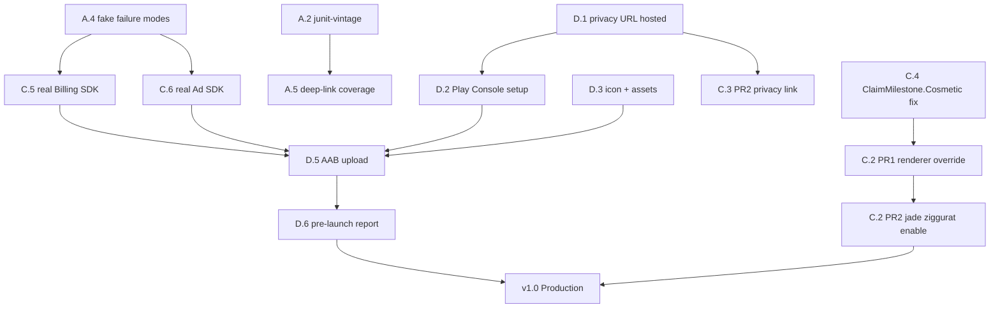

# Implementation Roadmap

*Standard Analysis Phase 14 — Part 2 of 2. Executable phased plan
combining critical cleanup, essential refactors that unblock other
work, smoke-report fixes, incremental gap closure, and
documentation syncs needed to prevent future drift. Every item
cites its source in prior phases; nothing new is introduced here
beyond ordering and per-item release-criticality classification.*

**Progress status (2026-05-07).**

- **Phase A — Foundation**: ✅ complete. All 9 tactical PRs merged on `main` (commits `a336bce..9f7f1d2`, plus memory update `8a730e6`). Test count rose 412 → 453. Exit criteria met per §A.10.
- **Phase B — Core Refactoring**: in progress.
  - **B.1 TimeProvider** ✅ complete. 3 commits (`85c53f0` interface, `d9a7b36` migration, `0eb5d26` FakeTimeProvider + tests). ADR-0004 FollowOnPipeline stub landed as `bcc35da`. Test count 453 → 455. Exit criteria met per §B.1.
  - **B.2 @Transaction**, **B.3 endRound resilience**, **B.4 FollowOnPipeline**, **B.5 UpdateMissionProgress**: pending. Dependency graph in §B.6 still holds.
- **Phase C — Gap Filling**: pending.
- **Phase D — Integration & Polish**: pending.

Code at HEAD now ahead of `a9d0386`; reconcile file-path citations against current `main` before executing any remaining item.

**Source-of-truth.** Code at HEAD `a9d0386`. All file paths,
dependencies, and risk labels are verifiable against code or
against the prior phase write-ups.

**Input phases.**
- Phase 4 `devdocs/archaeology/5_things_or_not.md` — 5 PR-sized
  proposals.
- Phase 10 `devdocs/evolution/gap_analysis.md` — gap severity +
  release gating.
- Phase 11 `devdocs/evolution/gap_closure_plan.md` — phased schedule
  (Q/I/M/MR item IDs used below).
- Phase 12 `smoke_tests/check_what_is_working/report.md` — baseline
  pass/fail + classpath gap.
- Phase 13 `devdocs/archaeology/cleanup_inventory.md` — cleanup
  candidates (A/B/C/D/E/F/G section IDs used below).
- Phase 14 Part 1 `devdocs/evolution/refactoring_opportunities.md`
  — RO-01 through RO-10.
- `docs/plans/plan-31-play-console.md` — release task list.

**Phase structure.**
- **Phase A — Foundation**: quick wins, test infrastructure,
  doc-drift sync. Low risk, high velocity. Nothing here blocks a
  later phase but several enable later phases to land safely.
- **Phase B — Core Refactoring**: cross-cutting abstractions that
  pay down systemic debt (TimeProvider, @Transaction,
  FollowOnPipeline, endRound resilience, UpdateMissionProgress).
- **Phase C — Gap Filling**: missing capabilities and shipped-but-
  disabled features (cosmetic pipeline, anti-cheat visibility,
  settings/privacy link, ClaimMilestone cosmetic fix, real
  Billing/Ads SDK swap).
- **Phase D — Integration & Polish**: Plan 31 release tasks,
  asset production, Play Console tracks, final verification.

**Legend per item.**

| Field | Meaning |
|---|---|
| Source | Phase ID where the item originated |
| Files | Exact paths affected |
| Dependencies | What must be done first (None = independent) |
| Success criteria | Objective post-merge check |
| Risk | Low / Medium / High |
| Verification | Commands + assertions |
| PR size | XS (<100 LoC) / S (100–300) / M (300–800) / L (800+ or multi-file) |
| Rollback | Per-PR revert strategy |
| Owner | Suggested role (Solo dev, Frontend, Backend, Platform, QA, Data, DevOps, Design, Security) |

**Critical path to v1.0** (minimum sequence): A → C.2 cosmetic
pipeline PR1–2 → C.5 real Billing SDK → C.6 real Ad SDK → D.

Everything else is post-release quality investment and can run in
parallel or slip to v1.0.x.

---

## Phase A — Foundation

**Purpose.** Land non-structural improvements, doc sync, test
coverage recovery, and safety nets. All items are independently
shippable; order within this phase is by payback-per-day.

**Exit criteria.**
- Documentation drift corrected (schema v8, test count, Battle Step
  Rewards).
- Test classpath discovers all existing tests (RO-09 / junit-vintage).
- Fake billing/ads fail-paths covered (RO-08) — prerequisite for
  Phase C.5 / C.6.
- High-severity latent bugs patched (DB decrypt recovery, Season
  Pass leak).
- Deep-link coverage for all argument-free routes (RO-06).
- Dead code / confusing code removed (PlaceholderScreen) or
  documented (`Screen.items by lazy` comment).

### A.1 — Doc drift sync (schema v8, test count, Battle Step Rewards)

- **Source:** Phase 11 Q1; gap_analysis §3.12; cleanup §E5, §E6,
  §D2.
- **Files:**
  - `docs/database-schema.md` — claims "Current schema version: 2"
    at top and mentions v7 in Security section (self-contradicting).
    Should reflect v8 + `battleStepsEarned` + `CosmeticEntity`.
  - `.kiro/steering/source-files.md` — claims
    `@Database(version = 7)`; missing `MilestoneNotificationPreferences.kt`
    (R2-08 new file).
  - `docs/architecture.md` — still references v7 and omits
    `CosmeticEntity`.
  - `AGENTS.md` — any reference to 397/401 test counts should
    align to 412 (per `STATE.md`).
- **Dependencies:** None.
- **Success criteria:** `grep -rn "version 7\|schema v7" docs/ .kiro/`
  returns only historical migration notes, not current-state claims.
- **Risk:** Low — doc-only edit.
- **Verification:**
  1. Doc grep above.
  2. `./run-gradle.sh testDebugUnitTest` — unchanged (doc edit
     cannot affect tests).
- **PR size:** XS.
- **Rollback:** `git revert` single commit.
- **Owner:** Solo dev (Documentation).

### A.2 — Add `junit-vintage-engine` (RO-09)

- **Source:** Phase 14 RO-09; smoke report §"What is broken but
  acceptable"; cleanup §C1.
- **Files:**
  - `app/build.gradle.kts` — add
    `testRuntimeOnly("org.junit.vintage:junit-vintage-engine:5.11.4")`.
  - `gradle/libs.versions.toml` — add version alias if the project
    convention demands it (per steering rule).
- **Dependencies:** None. Prerequisite for A.5 (deep-link coverage
  tests) and for any future JUnit 4 + Robolectric test.
- **Success criteria:**
  - Classpath audit `./run-gradle.sh :app:dependencies --configuration debugUnitTestRuntimeClasspath | grep vintage`
    returns a match.
  - Test count rises from 412 to ≥418 (3 files × 3 tests each =
    up to 9 previously-hidden tests now running).
- **Risk:** Low — vintage engine is stable, additive.
- **Verification:**
  1. `./run-gradle.sh testDebugUnitTest --rerun-tasks` shows new
     count.
  2. JUnit XML reports for `RoomSchemaTest`, `StepWidgetProviderTest`,
     `DeepLinkRoutingTest` exist with tests > 0.
  3. Any test that fails on first run blocks merge — investigate
     in the same PR.
- **PR size:** XS.
- **Rollback:** Revert the one-line dependency addition.
- **Owner:** Solo dev (Platform / Build).

### A.3 — Wipe SQLCipher DB file on decrypt failure

- **Source:** Phase 11 Q2; gap_analysis §3.7; trace 12 §9; cleanup
  §F (DynamicRisk SQLCipher row).
- **Files:** `app/src/main/java/com/whitefang/stepsofbabylon/data/local/DatabaseKeyManager.kt`.
- **Dependencies:** A.2 (new Robolectric test is currently
  silently-skipped without vintage engine).
- **Success criteria:** when `SupportOpenHelperFactory` throws on
  wrong passphrase, `DatabaseKeyManager` wipes the passphrase blob
  **and** deletes `context.getDatabasePath("steps_of_babylon.db")`;
  next DB open rebuilds from scratch instead of crashing in a
  loop.
- **Risk:** Medium — wipes user progress. But progress is already
  unrecoverable at this point; the alternative is crash-on-launch
  loop requiring manual "Clear App Data". Net-positive recovery.
- **Verification:**
  1. New Robolectric test next to `RoomSchemaTest`: write a DB
     with key K1; simulate key rotation by replacing K1 with K2;
     `openDatabase()` succeeds (rebuilt empty DB) rather than
     throwing.
  2. `./run-gradle.sh testDebugUnitTest` — all existing tests
     remain green.
- **PR size:** XS (3-line code change + one new test).
- **Rollback:** Revert. Crash-in-loop behaviour returns.
- **Owner:** Solo dev (Platform / Security).

### A.4 — Configurable failure modes in Fake billing / ad managers (RO-08)

- **Source:** Phase 14 RO-08; Phase 11 Q3; gap_analysis §3.1.
- **Files:**
  - `app/src/test/java/com/whitefang/stepsofbabylon/fakes/FakeBillingManager.kt`
  - `app/src/test/java/com/whitefang/stepsofbabylon/fakes/FakeRewardAdManager.kt`
  - `app/src/test/java/com/whitefang/stepsofbabylon/presentation/store/StoreViewModelTest.kt`
  - `app/src/test/java/com/whitefang/stepsofbabylon/presentation/cards/CardsViewModelTest.kt`
- **Dependencies:** None. Prerequisite for C.5 and C.6 (real SDK
  swaps must have partial-failure net before shipping).
- **Success criteria:** `FakeBillingManager.nextResult` and
  `FakeRewardAdManager.nextAdResult` are configurable; at least one
  test per `PurchaseResult` variant (Success, Cancelled, Failed,
  Pending) and per `AdResult` variant (Rewarded, Failed, Skipped)
  in `StoreViewModelTest` / `CardsViewModelTest`.
- **Risk:** Low — fakes are test-only.
- **Verification:**
  1. Test count rises by ≥5.
  2. `./run-gradle.sh testDebugUnitTest` stays green.
- **PR size:** S.
- **Rollback:** Revert. Fakes return to always-succeed.
- **Owner:** Solo dev (QA / Backend test scaffolding).

### A.5 — Deep-link coverage for all argument-free routes (RO-06)

- **Source:** Phase 14 RO-06; Phase 11 Q5; gap_analysis §2.3.
- **Files:**
  - `app/src/main/java/com/whitefang/stepsofbabylon/presentation/navigation/Screen.kt`
    — add `fun fromRoute(name: String?): Screen?` and
    `val argumentFreeRoutes: Set<String>`.
  - `app/src/main/java/com/whitefang/stepsofbabylon/presentation/MainActivity.kt`
    — replace 5-route `when` with `Screen.fromRoute(name)?.takeIf { it.route in Screen.argumentFreeRoutes }?.let { navController.navigate(it.route) }`.
  - `app/src/test/java/com/whitefang/stepsofbabylon/presentation/DeepLinkRoutingTest.kt`
    — extend with 7 new cases.
- **Dependencies:** A.2 (vintage engine) — without it the test
  extensions are silently not discovered.
- **Success criteria:** deep-links to Store, Stats, Weapons, Cards,
  Economy, Settings, Labs all land on their respective screens.
  Unknown route strings fall through to Home (preserved behaviour).
  `Battle` route stays on the Battle-specific 5-route whitelist
  (requires tier context).
- **Risk:** Low. `argumentFreeRoutes` allow-list prevents a
  `navigate_to=battle` deep-link from crashing `BattleScreen` init.
- **Verification:**
  1. 7 new `DeepLinkRoutingTest` cases pass.
  2. Manual smoke: `am start -a ... --es navigate_to store` intent
     opens StoreScreen.
- **PR size:** XS.
- **Rollback:** Revert. Collector returns to 5-route `when`.
- **Owner:** Solo dev (Frontend).

### A.6 — Season Pass flags in background `TrackDailyLogin` call

- **Source:** Phase 11 Q8; gap_analysis §3.8; cleanup §A9.
- **Files:** `app/src/main/java/com/whitefang/stepsofbabylon/data/sensor/DailyStepManager.kt`
  (`runFollowOnPipeline`'s call to `TrackDailyLogin(...)`).
- **Dependencies:** None. **Tactical fix** — cleaner home is B.4
  `FollowOnPipeline` extraction, but that is multi-PR. Q8 here is
  one-line patch; B.4 PR 4 removes the duplication later.
- **Success criteria:** Season-Pass owners who cross the
  1,000-step threshold while the app is closed receive the +10
  Gems bonus (matching `HomeViewModel.init` behaviour).
- **Risk:** Low. New test case isolates the behaviour change.
- **Verification:**
  1. New `DailyStepManagerTest` case with `hasSeasonPass = true`
     asserts bonus Gems credited.
  2. `./run-gradle.sh testDebugUnitTest` stays green.
- **PR size:** XS.
- **Rollback:** Revert. Current leak re-appears (invisible to
  users).
- **Owner:** Solo dev (Backend).

### A.7 — Suppress Battle Step Reward FloatingText when cap hit

- **Source:** Phase 11 Q4; gap_analysis §4.2.7; Phase 9 §3 edge
  case.
- **Files:** `app/src/main/java/com/whitefang/stepsofbabylon/presentation/battle/BattleViewModel.kt`
  (`onStepRewardHook` callback).
- **Dependencies:** None.
- **Success criteria:** when `AwardBattleSteps` returns 0 (daily
  2,000-cap exhausted), no "+Step" FloatingText is spawned. HUD
  counter remains visible at `2000/2000` (the freeze communicates
  the cap).
- **Risk:** Low.
- **Verification:**
  1. New `BattleViewModelTest` case: fake `AwardBattleSteps`
     returns 0; assert `effectEngine.spawnFloatingText` is not
     invoked for the step reward path.
  2. Manual smoke: play rounds past the 2,000/day cap; confirm
     "+Step" stops rendering while kills still show "+Cash".
- **PR size:** XS.
- **Rollback:** Revert.
- **Owner:** Solo dev (Frontend / UX).

### A.8 — Delete `PlaceholderScreen` dead code

- **Source:** Phase 11 Q7; gap_analysis §3.11; cleanup §A1; trace
  05 §"Feels Incomplete".
- **Files:** `app/src/main/java/com/whitefang/stepsofbabylon/presentation/MainActivity.kt`
  — remove `private fun PlaceholderScreen(name: String)` at line
  237–242.
- **Dependencies:** None. Independent of all other items.
- **Success criteria:** `grep PlaceholderScreen app/src` returns
  empty.
- **Risk:** Low — zero call sites since Plan 06 replaced the
  placeholders. Function is `private`, single file, no reflection
  reachable.
- **Verification:**
  1. `grep PlaceholderScreen app/src` returns empty.
  2. Lint + tests + `assembleDebug` green.
- **PR size:** XS.
- **Rollback:** Revert.
- **Owner:** Solo dev.

**Non-goal:** do **not** touch `Screen.items by lazy` — Phase 10
§3.11 and cleanup §A7 flag it as a documented NPE workaround that
must stay. If desired, add a one-line comment on the
`items by lazy` line as part of A.8 or A.1 doc sweep.

### A.9 — `SupplyDropTrigger.STEP_BURST` decision (delete or wire)

- **Source:** Phase 11 Q6; gap_analysis §1.4; cleanup §B1.
- **Files:** depends on decision.
  - Delete route: `domain/model/SupplyDropTrigger.kt:5` (remove
    enum entry).
  - Wire route: new velocity-based producer in
    `domain/usecase/GenerateSupplyDrop.kt` +
    `DropGeneratorState.lastBurstCheck` field +
    `data/sensor/DailyStepManager.kt` (or `FollowOnPipeline` once
    B.4 lands).
- **Dependencies:** **Product decision first.** No doc demands
  either outcome.
- **Success criteria (delete route):**
  - `grep -r STEP_BURST app/src` returns no hits.
  - Commit body documents original notification copy: "Your pace
    is impressive! An energy surge flows into your ziggurat." +
    `concept_mappings.md` historical-context appendix preserves
    intent (rule #2).
- **Risk:** Medium — the enum is stored as `.name` string in
  `WalkingEncounterEntity.triggerType`. Today no row exists with
  this value; deletion is safe. Any future re-add would require a
  data migration.
- **Verification:**
  1. Grep post-change.
  2. `./run-gradle.sh testDebugUnitTest` — all 412 tests green
     (no test references the enum entry per Phase 9).
- **PR size:** XS (delete route) or M (wire route).
- **Rollback:** Revert. Enum entry returns verbatim.
- **Owner:** Design / Solo dev (needs product choice).

### A.10 — Phase A rollout order

No hard dependencies within the phase. Suggested order by
payback-per-day:

1. **A.3** (DB decrypt recovery) — user-visible severity.
2. **A.6** (Season Pass leak) — correctness bug.
3. **A.2** (junit-vintage) — unlocks A.5 verification.
4. **A.5** (deep-link coverage) — unlocks future notification
   features.
5. **A.4** (fake failure modes) — prerequisite for C.5 / C.6.
6. **A.1** (doc sync), **A.7** (float-text guard), **A.8**
   (PlaceholderScreen), **A.9** (STEP_BURST decision) — any
   order; each is <1 day.

### Phase A exit criteria

- All 9 tactical PRs merged **or** explicitly deferred with
  rationale in `STATE.md`.
- Test count ≥ 418 (412 baseline + A.2 recovered + A.4 new +
  A.5 new + A.6 new + A.7 new).
- `grep STEP_BURST app/src` returns empty (delete route) **or**
  one producer site + one test (wire route).
- Schema/test-count drift in docs is aligned to HEAD state.

---

## Phase B — Core Refactoring

**Purpose.** Cross-cutting abstractions that pay down systemic
debt. Every item here is pre-costed in Phase 4 `5_things_or_not.md`
(items 1–5) or gap_analysis §2 / §3, and maps to Phase 14 Part 1
RO-01 through RO-05.

**Exit criteria.**
- `TimeProvider` abstraction exists and at least 3 call sites
  migrated (RO-01).
- `@Transaction` wraps all 5 multi-write sites (RO-02).
- `BattleViewModel.endRound` survives mid-battle navigation and
  logs partial-failure (RO-03).
- `FollowOnPipeline` owns all 5 follow-on stages; `DailyStepManager`
  shrinks to anti-cheat-gated crediting only (RO-04).
- `UpdateMissionProgress` is the single entry for mission-progress
  writes; 4 forbidden-direction DAO imports removed (RO-05).

### B.1 — `TimeProvider` abstraction (RO-01)

- **Source:** Phase 14 RO-01; Phase 11 I5; Phase 4 §1.
- **Files:**
  - PR 1 (new): `app/src/main/java/com/whitefang/stepsofbabylon/domain/time/TimeProvider.kt`,
    `data/time/SystemTimeProvider.kt`, `di/TimeModule.kt`.
  - PR 2 migrations: `domain/usecase/AwardBattleSteps.kt:27`,
    `presentation/battle/BattleViewModel.kt:168`,
    `presentation/missions/MissionsViewModel.kt` ticker.
  - PR 3 (tests): `app/src/test/java/com/whitefang/stepsofbabylon/fakes/FakeTimeProvider.kt`;
    one new test per migrated site exercising a synthetic midnight
    boundary.
- **Dependencies:** None. Independent of other Phase B items.
- **Success criteria:**
  - `grep -r 'import android' app/src/main/java/com/whitefang/stepsofbabylon/domain/time/`
    returns empty (domain stays pure Kotlin).
  - Three midnight-boundary tests that currently cannot exist are
    now present and passing.
- **Risk:** Low. Scope creep is the main risk.
  **Mitigation:** PR description explicitly lists only the three
  target files.
- **Verification:**
  1. `./run-gradle.sh testDebugUnitTest` — 412 → ~415 tests, all
     green.
  2. Domain-Android-import grep above.
  3. Existing 50 non-migrated wall-clock sites still compile
     unchanged (default-arg fallback preserved).
- **PR size:** 3 PRs, each S.
- **Rollback:** Per PR. PR 1 alone is dead code if reverted. PR 2
  revert restores default-arg behaviour. PR 3 is tests only.
- **Owner:** Solo dev (Backend / Domain).

### B.2 — `@Transaction` for currency-mutating multi-writes (RO-02)

- **Source:** Phase 14 RO-02; Phase 11 I2 + I3; Phase 4 §2;
  gap_analysis §2.1.
- **Files (per PR):**
  - PR 1 (`PurchaseUpgrade`): `data/local/WorkshopDao.kt`,
    `data/local/PlayerProfileDao.kt`,
    `domain/usecase/PurchaseUpgrade.kt`,
    `app/src/test/.../PurchaseUpgradeTest.kt`.
  - PR 2 (`AwardBattleSteps`): `data/local/DailyStepDao.kt`,
    `data/local/PlayerProfileDao.kt`,
    `domain/usecase/AwardBattleSteps.kt`,
    `app/src/test/.../AwardBattleStepsTest.kt`.
  - PR 3 (`StepCrossValidator`): `data/healthconnect/StepCrossValidator.kt`
    — wrap three parallel branches in `AppDatabase.withTransaction { ... }`.
  - PR 4 (`ClaimMilestone`): `data/local/MilestoneDao.kt`,
    `domain/usecase/ClaimMilestone.kt`.
  - PR 5 (`endRound`): `presentation/battle/BattleViewModel.kt`
    (wraps the extracted persistence function from B.3 in a
    transaction).
- **Dependencies:** PR 1 proves the pattern; PRs 2–4 reuse it.
  PR 5 depends on B.3 (extracted `runEndRoundPersistence`).
- **Success criteria:**
  - `grep -c "withTransaction\|@Transaction" app/src/main` returns
    ≥5.
  - Each PR's composite DAO method is exercised by one success +
    one partial-failure test.
- **Risk:**
  - PR 1: Medium — SQL `WHERE ... >= :cost` changes semantics
    from read-then-deduct to race-closed. Behaviour change is
    net-positive (closes double-tap race) but must be flagged in
    review.
  - PR 3: Medium — the validator is in `data/healthconnect/` so
    `RoomDatabase.withTransaction` is legal, but three parallel
    branches each need wrapping; an accidental miss leaves one
    branch un-transactional.
  - PRs 2, 4: Low — pattern established.
  - PR 5: Low — wraps an already-extracted function.
- **Verification (per PR):**
  1. Existing tests for the use case stay green.
  2. Two new tests: success + partial-failure (throw from inside
     transaction, assert no state leaks).
  3. Manual smoke for PR 1: debug APK, buy an upgrade, confirm
     single-increment.
- **PR size:** M each.
- **Rollback:** Per PR. PR 1's `@Deprecated` fallback (Phase 11
  I2) means revert is feature-flag-flip equivalent for one PR
  cycle.
- **Owner:** Solo dev (Backend / Data).

### B.3 — Resilient `BattleViewModel.endRound` (RO-03)

- **Source:** Phase 14 RO-03; Phase 11 I4; Phase 4 §3; trace 08 §8;
  trace 10 §9.
- **Files:**
  - PR 1: `presentation/battle/BattleViewModel.kt` — extract
    `runEndRoundPersistence(engine: GameEngine)`; wrap each of the
    3 writes (`updateBestWave`, `awardWaveMilestone`,
    `updateHighestUnlockedTier`) in `runCatching { } .onFailure { Log.w }`;
    make `endRound()` and `quitRound()` both call the extracted
    function.
  - PR 2: `presentation/battle/BattleViewModel.kt` — `onCleared()`
    guard; mid-round state persisted via `ProcessLifecycleOwner.get().lifecycleScope`.
- **Dependencies:** None for PR 1. PR 2 requires PR 1 to have
  extracted the function. B.2 PR 5 composes with PR 1 (wraps the
  extracted function in a transaction).
- **Success criteria:**
  - Mid-battle navigation (e.g. deep-link) now saves the round
    per `quitRound()` semantics.
  - Three persistence errors that previously printed nothing now
    log at `Log.w(TAG, "...", exception)`.
- **Risk:**
  - Medium — `ProcessLifecycleOwner.lifecycleScope` survives VM
    cancellation but not process death. A background kill mid-
    persistence still loses the round.
  - **Mitigation:** B.2 PR 5 wraps in transaction, turning 3
    atomicity gaps into 1.
  - Behaviour change: intentional nav-away now counts the wave
    toward best-wave.
  - **Mitigation:** matches existing `quitRound()` semantics per
    Phase 4 §3.
- **Verification:**
  1. New `BattleViewModelTest` case — simulate `onCleared()` mid-
     round; assert `updateBestWave` called exactly once.
  2. Failure-injection case — throw from `updateBestWave`; assert
     `awardWaveMilestone` is **not** called and VM does not
     propagate the exception.
  3. Manual smoke: start battle, reach wave 5, press system back;
     confirm Stats reflects the run.
- **PR size:** 2 PRs, each S.
- **Rollback:** Per PR. Either PR reverts cleanly to current
  behaviour.
- **Owner:** Solo dev (Frontend / Battle subsystem).

### B.4 — Extract `FollowOnPipeline` (RO-04)

- **Source:** Phase 14 RO-04; Phase 11 M1 (major refactor); Phase 4
  §4; gap_analysis §2.5.
- **Prerequisites:**
  - B.1 merged (so new code can take `TimeProvider` by convention).
  - A.6 merged (so Season Pass regression test exists; M1 must
    not regress it).
  - New ADR: `docs/agent/DECISIONS/ADR-0004-follow-on-pipeline.md`
    explaining the split + why `dropState` stays `@Singleton`.
  - New plan: `docs/plans/plan-32-follow-on-pipeline.md` (or a
    short RUN_LOG entry — team choice).
- **Files (per PR):**
  - PR 1 (extraction): new `data/sensor/FollowOnPipeline.kt`;
    `data/sensor/DailyStepManager.kt` (loses 6 constructor params);
    new `di/SensorModule.kt` entry if Hilt binding needs it;
    `app/src/test/.../FollowOnPipelineTest.kt` (new) +
    `DailyStepManagerTest.kt` (slimmed).
  - PR 2 (`UpdateMissionProgress` use case — see B.5 PR 1):
    composes here because pipeline is the first consumer.
  - PR 3 (mission-progress migrations): see B.5 PR 2.
  - PR 4 (remove Q8 tactical patch): `data/sensor/DailyStepManager.kt`
    — delete duplicated `observeProfile().first()`; pipeline owns
    the single `TrackDailyLogin` call site with Season Pass flags.
- **Dependencies:** B.1 + A.6. B.5 composes.
- **Success criteria:**
  - `DailyStepManager` constructor shrinks from 12 params to 6.
  - `DailyStepManagerTest` + `FollowOnPipelineTest` combined
    preserve all pre-extraction assertions.
  - `grep -rn 'observeProfile' app/src/main/java/com/whitefang/stepsofbabylon/data/sensor/`
    returns 0 hits after PR 4 (single call site in pipeline).
- **Risk:**
  - PR 1: Medium — behaviour parity. The five follow-on stages
    may have ordering dependencies.
  - **Mitigation:** zero-change extraction; all existing assertions
    must pass verbatim under the new composition.
  - `dropState` ownership moves; both types are `@Singleton`, so
    lifetime is identical. Flag for reviewer.
- **Verification:**
  1. Full test suite green after each PR.
  2. Post-PR 1: `DailyStepManagerTest` + `FollowOnPipelineTest`
     together match pre-extraction assertion count.
  3. Post-PR 4: Season Pass grep returns 0 in `data/sensor/`.
- **PR size:** PR 1 is L (~300 lines moved); PRs 2–4 each S/M.
- **Rollback:** Per-PR revert. Mechanical extraction reverts
  cleanly.
- **Owner:** Solo dev (Backend / Sensor subsystem).

### B.5 — `UpdateMissionProgress` use case (RO-05)

- **Source:** Phase 14 RO-05; Phase 11 M1 PR 2–3; gap_analysis §2.4.
- **Files (per PR):**
  - PR 1 (use case + walking path):
    `domain/usecase/UpdateMissionProgress.kt` (new),
    `data/local/DailyMissionDao.kt` (new atomic method),
    `data/repository/DailyMissionRepositoryImpl.kt` (if the repo
    interface exists; otherwise skip),
    `data/sensor/FollowOnPipeline.kt` (first consumer; walking
    mission path).
  - PR 2 (presentation migrations):
    `presentation/battle/BattleViewModel.kt`,
    `presentation/labs/LabsViewModel.kt`,
    `presentation/workshop/WorkshopViewModel.kt`.
  - PR 3 (midnight-regen migration):
    `presentation/missions/MissionsViewModel.kt`.
- **Dependencies:** B.4 PR 1 (pipeline owns the walking path).
  Can run in parallel with B.2 / B.3.
- **Success criteria:**
  - `grep -rn 'DailyMissionDao' app/src/main/java/com/whitefang/stepsofbabylon/presentation/`
    returns 0 hits.
  - All 5 previous mission-progress sites now funnel through
    `UpdateMissionProgress`.
  - At least 2 forbidden-direction imports removed (Workshop VM,
    Labs VM).
- **Risk:** Low. Each PR migrates one site fully; old and new
  paths never coexist within a VM.
- **Verification:**
  1. New tests: per category (WALKING, BATTLE, UPGRADE), one
     success + one partial-failure case.
  2. Forbidden-import grep above.
  3. Full test suite green after each PR.
- **PR size:** S each.
- **Rollback:** Per PR.
- **Owner:** Solo dev (Backend / Frontend).

### B.6 — Phase B rollout order

1. **B.1** (TimeProvider, narrow) — lowest risk, unblocks B.4 and
   future features.
2. **B.2 PR 1** (PurchaseUpgrade atomic) — proves the
   `@Transaction` pattern.
3. **B.3** (endRound resilience) — composes with B.2 PR 5.
4. **B.2 PRs 2–4** (AwardBattleSteps, StepCrossValidator,
   ClaimMilestone) — pattern established; can parallelise.
5. **B.4** (FollowOnPipeline) — requires B.1 and A.6.
6. **B.5** (UpdateMissionProgress) — composes with B.4; can start
   after B.4 PR 1.
7. **B.2 PR 5** (endRound transaction wrapper) — last, wraps B.3's
   extracted function.

### Phase B exit criteria

- `grep -c "withTransaction\|@Transaction" app/src/main` ≥ 5.
- `grep -rn 'LocalDate.now()' domain/usecase/AwardBattleSteps.kt`
  returns no direct calls (B.1 migration verified).
- `DailyStepManager` constructor parameter count drops from 12 to 6.
- `grep -rn 'DailyMissionDao' presentation/` returns 0.
- Test count ≥ 430 (baseline 412 + Phase A recovered + Phase B
  new; exact number varies by per-PR test additions).
- No new Android imports in `domain/time/` or `domain/usecase/`.

---

## Phase C — Gap Filling

**Purpose.** Missing capabilities and shipped-but-disabled features.
Mix of release-blocker code-swaps (real Billing/Ads SDKs) and
quality-of-life gap closures (anti-cheat visibility,
settings/privacy link, cosmetic pipeline, ClaimMilestone fix).

**Release-critical subset.** C.5 (Billing) + C.6 (Ads) + C.2 PRs
1–2 (one cosmetic end-to-end). The rest are post-v1.0 acceptable.

### C.1 — Anti-cheat visibility on Stats screen

- **Source:** Phase 11 I1; Phase 4 §5; gap_analysis §1.10.
- **Files:**
  - PR 1 (getters): `data/anticheat/AntiCheatPreferences.kt` —
    add `getStepsDiscardedToday(): Long`,
    `getCvOffenseCount(): Int`, `getLastEscrowNote(): String?`.
    Fields already exist (Phase 4 §5).
  - PR 2 (UI): `presentation/stats/StatsUiState.kt` — add
    `AntiCheatSummary(discardedToday: Long, offenseLevel: Int)`;
    `presentation/stats/StatsScreen.kt` — render conditional
    `Card { }` in a "Step validation" section, shown only when
    counters > 0.
- **Dependencies:** None.
- **Success criteria:**
  - Section hidden when `discardedToday == 0 && offenseLevel == 0`.
  - Coarse facts only (count + level indicator); no thresholds,
    no decay rules (per Phase 4 §5 mitigation).
- **Risk:** Low. Sophisticated users could reverse-engineer the
  ladder.
  **Mitigation:** coarse-grain display only.
- **Verification:**
  1. Extend `StatsViewModelTest` with `stepsDiscardedToday=500, cvOffenseCount=2`
     → summary exposed; `== 0` → hidden.
  2. `./run-gradle.sh testDebugUnitTest` stays green.
- **PR size:** 2 PRs, each S.
- **Rollback:** Per-PR revert. Counters continue being tracked
  invisibly as before.
- **Owner:** Solo dev (Frontend / UX).

### C.2 — Cosmetic rendering pipeline (RO-07)

- **Source:** Phase 14 RO-07; Phase 11 MR1; gap_analysis §1.3, §5.2.
- **Prerequisites:**
  - Product decision on "which one cosmetic ships first"
    (gap_analysis §6.2 item 2 — unknown). Proposed default: jade
    ziggurat recolour per gap_analysis §5.2.
  - **C.4 merged** (so milestone cosmetic IDs surface
    `UnknownCosmetic` rather than silently dropping).
- **Files (per PR):**
  - PR 1 (renderer override contract):
    `presentation/battle/engine/GameEngine.kt` — add
    `cosmeticOverrides: Map<CosmeticCategory, CosmeticItem>`
    property; populate from `PlayerRepository.observeProfile().equippedCosmeticIds`
    via `CosmeticRepository.resolveEquipped(ids)`.
    `presentation/battle/BattleViewModel.kt` — hydrate overrides
    before engine init.
    `presentation/battle/entities/ZigguratEntity.kt` — no change
    (constructor already takes `layerColors: IntArray`).
  - PR 2 (seed + enable):
    `data/repository/CosmeticRepositoryImpl.kt` — add
    `CosmeticItem(id="ZIG_JADE", category=ZIGGURAT, overrideColors=[...])`
    to `SEED_COSMETICS`.
    `presentation/store/StoreScreen.kt` — remove R2-11 guard for
    the `ZIG_JADE` ID only.
  - PR 3+ (content): remaining 6 seeded + 3 milestone cosmetics.
    Each is one new seed row + optional colour constants.
- **Dependencies:** C.4 for milestone cosmetic ID surfacing.
- **Success criteria (PR 1):**
  - Default `emptyMap()` preserves current rendering exactly.
  - Equipping a cosmetic updates `GameEngine.cosmeticOverrides`
    before the next battle start.
- **Risk:** Medium for PR 1 (renderer changes can regress battle
  screen).
  **Mitigation:** PR 1 is pure-additive; a VM-level test asserts
  "no-cosmetic equipped → identical colours to today".
- **Verification:**
  1. Unit test: `GameEngine.cosmeticOverrides` maps correctly
     from `equippedCosmeticIds`.
  2. Robolectric VM test: equip jade → `onBattleStart` →
     ziggurat colours match override.
  3. Manual smoke: equip in Store, start battle, see the jade
     tint.
- **PR size:** PR 1 M; PR 2 S; PR 3+ XS each (content work).
- **Rollback:** PR 1 additive — revert restores empty-map default.
  PR 2 re-hides the purchase button. PR 3+ delete seed rows.
- **Owner:** PR 1 Frontend / Battle subsystem; PR 2+ Design /
  Content.
- **Non-goals:** no animated cosmetics (gap_analysis §6.2 item 7
  deferred); PR 1 only for `ZIGGURAT` category; PR 2 enables only
  one validated ID.

### C.3 — Settings-screen rename + in-app privacy-policy link

- **Source:** Phase 11 I7; gap_analysis §1.11, §4.2.5, §4.2.6.
- **Files:**
  - PR 1 (rename + split):
    `presentation/settings/NotificationSettingsScreen.kt` → rename
    to `SettingsScreen.kt`; split body into "Notifications" and
    "Audio" sections (sound mute/volume moved here — cleanup §A8
    follow-on).
    `presentation/settings/NotificationSettingsViewModel.kt` →
    rename to `SettingsViewModel.kt`.
    `presentation/navigation/Screen.kt` — update route name;
    keep old route string as an alias so deep-links don't break.
    `presentation/navigation/BottomNavBar.kt` — update label.
    `app/src/test/.../NotificationSettingsViewModelTest.kt` →
    rename.
  - PR 2 (privacy link): `presentation/settings/SettingsScreen.kt`
    — add "Privacy Policy" row launching external URL via
    `CustomTabsIntent`. **Gated on `BuildConfig.PRIVACY_POLICY_URL`
    not null**; hide if null.
- **Dependencies:** PR 1 none. PR 2 depends on D.1 (privacy-policy
  hosting, external).
- **Success criteria (PR 1):**
  - Screen renders under new route name.
  - Sound + notifications settings both accessible from one
    screen.
  - Existing deep-link route alias keeps old notifications working.
- **Risk:** Low. Composable move is mechanical; route alias
  protects existing deep-links.
- **Verification:**
  1. Renamed VM test still passes.
  2. Manual smoke: screen loads under new route name; existing
     notification toggles persist.
- **PR size:** PR 1 S; PR 2 XS.
- **Rollback:** Per-PR revert.
- **Owner:** Solo dev (Frontend).

### C.4 — `ClaimMilestone.Cosmetic` branch fix (detection)

- **Source:** Phase 11 I6; gap_analysis §4.2.4, §1.3; cleanup §B3.
- **Files:**
  - `domain/usecase/ClaimMilestone.kt:25` — when
    `reward is MilestoneReward.Cosmetic`, look up the cosmetic by
    ID; on miss, return a new `Result.UnknownCosmetic` sealed
    variant (or `Result.Failure("Unknown cosmetic id=$id")`) so
    the caller sees the issue. **Do not silently drop.**
  - `data/repository/CosmeticRepositoryImpl.kt` or
    `CosmeticRepository` interface — ensure ID lookup exists.
- **Dependencies:** None for detection. Resolution (matching 3
  milestone cosmetic IDs to seed rows) depends on C.2 direction.
- **Success criteria:**
  - Milestone claims with unknown cosmetic IDs return an
    identifiable result (not silent drop).
  - Three current mismatched IDs (`garden_ziggurat_skin`,
    `lapis_lazuli_skin`, `sandals_of_gilgamesh`) produce
    `Result.UnknownCosmetic` until resolved.
- **Risk:** Low.
- **Verification:**
  1. New `ClaimMilestoneTest` case per mismatched ID: assert
     `Result.UnknownCosmetic`.
  2. Positive case: an ID that matches a seed row credits the
     cosmetic.
- **PR size:** S.
- **Rollback:** Revert. Silent drop returns.
- **Owner:** Solo dev (Backend).
- **Non-goals:** do not rename the 3 mismatched IDs in this PR
  (that is content work coupled to C.2 PR 3).

### C.5 — Real Google Play Billing SDK swap

- **Source:** Phase 11 M2; gap_analysis §1.1 Task 4; Plan 31 Task 4.
  **Release-critical.**
- **Prerequisites:**
  - **A.4 merged** — fakes exercise failure paths; regression net
    exists.
  - Plan 31 external steps advanced far enough to have Play
    Console app entry, licensing test account, and product SKUs
    configured. Without those, real SDK cannot be exercised end-
    to-end.
  - New ADR: `docs/agent/DECISIONS/ADR-0005-billing-sdk.md`
    covering chosen SDK version, pending-purchase handling,
    receipt verification strategy (v1.0 is client-only; no
    backend per `CONSTRAINTS.md`).
- **Files (per PR):**
  - PR 1 (dep + impl): `gradle/libs.versions.toml` — add
    `billing-play:<pinned>` entry.
    `app/build.gradle.kts` — add dependency.
    `data/billing/BillingManagerImpl.kt` (new) — implements
    `BillingManager`; connects to `BillingClient`, handles
    `PurchasesUpdatedListener`, reconnection, pending-purchase
    query on `onResume`.
    `app/proguard-rules.pro` — add Play Billing keep rules per
    SDK release notes.
    `app/src/test/.../BillingManagerImplTest.kt` (new) — mock
    `BillingClient` behaviour for every `PurchaseResult` variant.
  - PR 2 (binding swap): `di/BillingModule.kt` — change
    `@Binds BillingManager` from `StubBillingManager` to
    `BillingManagerImpl` **behind a `BuildConfig.USE_REAL_BILLING`
    flag** so debug/release can diverge during beta.
    `app/build.gradle.kts` — add `buildConfigField` for the flag.
  - PR 3 (stub removal): `data/billing/StubBillingManager.kt` —
    delete (document behaviour in commit body per rule #2) once
    internal + closed tracks confirm behaviour.
- **Dependencies:** A.4; external Play Console setup.
- **Success criteria:**
  - `@Binds BillingManager` points at `BillingManagerImpl` in
    release builds.
  - Every `PurchaseResult` variant has a unit test against a
    mocked `BillingClient`.
  - `StubBillingManager.kt` file deleted.
- **Risk:** **High.**
  - Real SDK failure paths have never run against production
    code. **Mitigation:** A.4 fake tests exercise each sealed
    variant; Firebase Test Lab pre-launch report.
  - Mishandled pending purchases → duplicate grants or lost
    purchases. **Mitigation:** persist receipt-id → granted
    flag in Room; re-query pending purchases on `onResume`;
    document in ADR-0005.
  - SKU drift between code and Play Console. **Mitigation:**
    code is source of truth for SKU IDs (`BillingProduct.kt`);
    any Play Console entry must match a code constant. Startup
    sanity check.
- **Verification:**
  1. New unit tests against mocked `BillingClient` cover all
     `PurchaseResult` variants (uses A.4 patterns).
  2. Manual QA on internal test track: happy purchase, cancelled,
     pending, reconnection after kill.
  3. Firebase Test Lab pre-launch report clean (D.3).
- **PR size:** PR 1 L; PR 2 S; PR 3 XS.
- **Rollback:**
  - PR 2 is gated by flag: flip `USE_REAL_BILLING = false` and
    ship a hotfix if a purchase-path regression is discovered
    post-release.
  - PR 3 is reversible via git revert up to ~1 week; after that
    the stub is considered gone.
- **Owner:** Backend / Platform.
- **Non-goals:**
  - No server-side receipt verification (forbidden by
    `CONSTRAINTS.md`).
  - No subscription products (all listed products are one-time
    per `BillingProduct.kt`).
  - Do not refactor `StoreViewModel` contract — interface stays
    stable; swap is pure impl.

### C.6 — Real Ad SDK swap

- **Source:** Phase 11 M3; gap_analysis §1.1 Task 5; Plan 31 Task 4.
  **Release-critical.** Mirrors C.5 structure.
- **Prerequisites:**
  - **A.4 merged** — ad-failure fakes.
  - AdMob app ID + ad unit IDs provisioned (external, stored in
    `local.properties` / `BuildConfig` per steering; never
    hardcoded).
  - New ADR: `docs/agent/DECISIONS/ADR-0006-ad-sdk.md` — choice
    between AdMob vs mediation, test-ad strategy for debug builds.
- **Files (per PR):**
  - PR 1 (dep + impl): `gradle/libs.versions.toml` — add
    `play-services-ads:<pinned>`.
    `app/build.gradle.kts` — add dependency + `buildConfigField`
    for ad unit IDs.
    `data/ads/RewardAdManagerImpl.kt` (new) — implements
    `RewardAdManager`; handles `RewardedAd.load`, `show`,
    `OnUserEarnedRewardListener`, failure callbacks.
    `app/proguard-rules.pro` — add Play Services ads keep rules.
    `app/src/test/.../RewardAdManagerImplTest.kt` (new) — mock
    AdMob behaviour for every `AdResult` variant.
  - PR 2 (binding swap): `di/AdModule.kt` — change `@Binds
    RewardAdManager` from `StubRewardAdManager` to
    `RewardAdManagerImpl` behind `BuildConfig.USE_REAL_ADS`.
  - PR 3 (stub removal): `data/ads/StubRewardAdManager.kt` —
    delete.
- **Dependencies:** A.4; external AdMob setup.
- **Success criteria:**
  - Test ads render in debug builds (AdMob documented test IDs).
  - Reward callback fires exactly once per successful view.
  - Load-failed path surfaces `AdResult.Failed`.
  - `StubRewardAdManager.kt` file deleted.
- **Risk:** Medium–High. Identical risk categories to C.5.
  Ad-unit IDs are secrets-adjacent (revenue impact, not security).
- **Verification:**
  1. New unit tests against mocked AdMob cover all `AdResult`
     variants.
  2. Manual QA: test ads in debug; reward grants exactly once.
  3. Firebase Test Lab pre-launch report clean.
- **PR size:** PR 1 L; PR 2 S; PR 3 XS.
- **Rollback:** Flag flip (PR 2) + revert (PR 3) — same as C.5.
- **Owner:** Backend / Platform.
- **Non-goals:**
  - No banner / interstitial ads in v1.0 (only reward ads per
    `AdPlacement.kt`).
  - No custom mediation tier selection (use AdMob default if
    enabled).

### C.7 — `PreferencesStore` consolidation (RO-10)

- **Source:** Phase 14 RO-10; Phase 11 I7; cleanup §A8.
- **Files:** See RO-10 for full enumeration — 6 SharedPreferences
  wrappers + `presentation/battle/GameSurfaceView.kt:26` leak.
- **Dependencies:** None. Independent of other Phase C items.
  **Post-release acceptable** — not release-critical.
- **Success criteria (Option B, the cheaper default):**
  - New `data/prefs/PreferencesBase.kt` + `data/prefs/README.md`.
  - At least one wrapper migrated (e.g. `SoundPreferences`).
  - `GameSurfaceView.kt:26` bypass fixed — now reads via
    `SoundPreferences`, not inline.
- **Risk:** Medium — preference keys must be preserved byte-for-
  byte.
  **Mitigation:** per-wrapper Robolectric test reading pre-refactor
  file name + key.
- **Verification:**
  1. New Robolectric test per migrated wrapper: write via old
     path, read via new path, assert equal.
  2. `./run-gradle.sh testDebugUnitTest` stays green.
  3. `grep -rn 'getSharedPreferences("sound_prefs"' app/src/main`
     returns 0 hits (leak closed).
- **PR size:** M (per wrapper migration).
- **Rollback:** Per-PR revert.
- **Owner:** Solo dev (Backend / Platform).

### C.8 — Phase C rollout order

1. **C.1** (anti-cheat visibility) — isolated, no cross-coupling.
2. **C.4** (ClaimMilestone cosmetic detection) — small, enables C.2.
3. **C.3** (Settings rename) — any time; PR 2 gated on D.1.
4. **C.7** (PreferencesStore) — parallel track, post-release OK.
5. **C.2 PR 1** (cosmetic renderer override) — additive, gated on
   C.4.
6. **C.2 PR 2** (jade ziggurat enable) — blocks release story for
   the "coming soon" grey-out.
7. **C.5 + C.6** (real SDKs) — parallel tracks if different
   engineers; sequential if one. Both gate on A.4.
8. **C.2 PR 3+** (remaining cosmetics) — content, any time.

### Phase C exit criteria

- `@Binds BillingManager` → `BillingManagerImpl` in release.
- `@Binds RewardAdManager` → `RewardAdManagerImpl` in release.
- `StubBillingManager.kt` and `StubRewardAdManager.kt` deleted.
- `GameEngine.cosmeticOverrides` populated at battle start for at
  least one end-to-end-working cosmetic.
- Stats screen renders anti-cheat summary when counters > 0.
- Settings screen hosts notification + sound + privacy-policy rows.
- `ClaimMilestone.Cosmetic` surfaces `UnknownCosmetic` for
  unmatched IDs.

---

## Phase D — Integration & Polish

**Purpose.** Plan 31 external tasks (non-code), asset production,
Play Console configuration, AAB track promotion, Firebase Test
Lab pre-launch verification. Final gates to v1.0 shipment.

**Blocker.** D cannot fully close until C.5 + C.6 are merged
(production AAB must have real SDKs bound).

### D.1 — Privacy-policy hosting (external)

- **Source:** Phase 11 M4 T3; gap_analysis §1.2; `docs/release/privacy-policy.md`.
- **Files:** none in the repo. External task:
  - Host `docs/release/privacy-policy.md` content at an
    https-reachable URL.
  - `app/build.gradle.kts` — add
    `buildConfigField("String", "PRIVACY_POLICY_URL", "\"$url\"")`
    so C.3 PR 2 can consume it.
- **Dependencies:** None. Blocks C.3 PR 2 (in-app link) and D.2
  (Play Console linking).
- **Success criteria:** URL returns the privacy-policy HTML with
  `Content-Type: text/html` and no auth wall.
- **Risk:** Low — external hosting step.
- **Verification:**
  1. `curl -I <url>` returns `200 OK`.
  2. Content matches `docs/release/privacy-policy.md` verbatim.
- **PR size:** XS (one build.gradle line + DNS/hosting setup).
- **Rollback:** Take the URL offline; re-add stub.
- **Owner:** Solo dev / Legal.

### D.2 — Play Console app listing + content rating + data safety

- **Source:** Phase 11 M4 T1; Plan 31 Task 1.
- **Files:** none in the repo. External steps:
  - Create app listing in Google Play Console.
  - Set up internal testing track.
  - Configure pricing (Free with IAP).
  - Set target countries/regions.
  - Complete content-rating questionnaire (IARC).
  - Complete data-safety section — disclose Health Connect usage,
    SQLCipher encryption, no analytics/crash reporting per
    `CONSTRAINTS.md`.
  - Link privacy-policy URL (from D.1).
- **Dependencies:** D.1 merged.
- **Success criteria:**
  - App entry exists in Play Console.
  - Content rating returned by IARC matches the game's content.
  - Data-safety disclosure truthfully reflects code behaviour.
- **Risk:** Medium. Misclassification → app rejection; data-safety
  mismatch vs code → policy strike.
  **Mitigation:** code is source of truth. Walk the IARC
  questionnaire conservatively. For data safety, enumerate each
  data category by reading `data/` layer code (HC SDK, SQLCipher,
  no network) and disclose only what is actually collected.
- **Verification:**
  1. Play Console "Setup" checklist shows all green ticks.
  2. Data-safety form preview matches
     `docs/release/privacy-policy.md`.
- **PR size:** N/A (external).
- **Rollback:** Unpublish the app entry (Play Console allows
  removal while still in internal testing).
- **Owner:** Solo dev / Release manager.

### D.3 — Store listing upload (assets)

- **Source:** Phase 11 M4 T2; Plan 31 Task 2;
  `docs/release/play-store-listing.md`.
- **Files (to produce — not in repo today):**
  - App icon (512×512 PNG) + `res/mipmap-*` adaptive icon
    resources (Phase 11 M4 T6 is code-touching).
  - Feature graphic (1024×500 PNG).
  - Phone + tablet screenshots (minimum 2 phone, 2 tablet).
  - Short description (≤80 chars) + full description (≤4000
    chars).
- **Files (to modify in repo for icon):**
  - `app/src/main/res/mipmap-*/ic_launcher.*`,
    `ic_launcher_round.*`, `ic_launcher_foreground.xml`.
  - `AndroidManifest.xml` — add `android:icon="@mipmap/ic_launcher"`
    and `android:roundIcon="@mipmap/ic_launcher_round"` if missing.
- **Dependencies:** Design/content production (not gated on other
  code).
- **Success criteria:**
  - App icon appears on the device launcher (not the default
    Android icon).
  - Play Console store listing preview renders all assets without
    rejection warnings.
- **Risk:** Low — asset-only changes for screenshots / feature
  graphic. Icon XML changes are mechanical.
- **Verification:**
  1. `./run-gradle.sh assembleDebug` — APK installs with custom
     icon.
  2. Play Console upload validator accepts each asset.
- **PR size:** Icon XS; other assets are out-of-tree.
- **Rollback:** Revert icon PR; leave Play Console assets in draft
  state.
- **Owner:** Design / Solo dev.

### D.4 — Sound assets (replace placeholders)

- **Source:** `STATE.md` known issues ("Sound assets are placeholder
  sine wave tones"); cleanup §D7.
- **Files:**
  - `app/src/main/res/raw/sfx_enemy_death.ogg`,
    `sfx_hit.ogg`, `sfx_round_end.ogg`, `sfx_shoot.ogg`,
    `sfx_upgrade.ogg`, `sfx_uw_activate.ogg`, `sfx_wave_start.ogg`
    — replace with licensed/royalty-free audio.
  - New: `app/src/main/res/raw/LICENSES.md` or
    `docs/release/audio-licenses.md` documenting provenance per
    cleanup §G2.
- **Dependencies:** Audio sourcing (external).
- **Success criteria:**
  - Each effect sounds appropriate for its context.
  - Provenance/license is documented.
- **Risk:** Low — drop-in replacement keeps `SoundManager.kt`
  references stable.
- **Verification:**
  1. Manual playback on debug APK.
  2. `./run-gradle.sh testDebugUnitTest` stays green (test layer
     doesn't load OGG files).
- **PR size:** XS per replacement.
- **Rollback:** Revert to placeholder sine wave.
- **Owner:** Design / Audio.

### D.5 — AAB upload → internal → closed → open → production

- **Source:** Phase 11 M4 T4; Plan 31 Task 3, Task 6.
- **Files:**
  - `app/keystore.properties` (gitignored) — production signing
    config per `docs/release/signing-guide.md`.
  - `app/build.gradle.kts` — `signingConfigs.release` already
    configured; verify it reads `keystore.properties` correctly.
  - `docs/release/release-checklist.md` — walk through
    pre-upload checks.
- **Dependencies:** C.5 + C.6 merged (production AAB has real
  SDKs). D.2 + D.3 complete (listing accepts upload).
- **Success criteria:**
  - AAB size < 100 MB.
  - Signed with production key.
  - Internal track → at least 3 testers × 2 days with no crash.
  - Closed track → wider test + IAP verification.
  - Open track → vitals clean (crash rate <1%, ANR rate <0.5%).
  - Production rollout begins at 5% → staged expansion.
- **Risk:** **High.** Production rollout is the first time real
  users exercise the system.
  **Mitigation:** staged rollout is itself the mitigation; halt at
  any track boundary if vitals degrade.
- **Verification:**
  1. `./run-gradle.sh bundleRelease` produces signed AAB.
  2. `bundletool` universal APK installs on test device.
  3. Play Console vitals dashboard during each track.
  4. Monitor crash reports for 48 hours per track.
- **PR size:** N/A (external + one signing config verification
  PR).
- **Rollback:** Halt rollout at the track boundary. Staged tracks
  exist specifically so rollback is "don't promote to the next
  track" — no destructive action needed.
- **Owner:** Release manager / Solo dev.

### D.6 — Firebase Test Lab pre-launch report

- **Source:** Phase 11 M4 T5; Plan 31 Task 5.
- **Files:** none in the repo. Enable pre-launch report in Play
  Console → App → Release → Pre-launch report settings.
- **Dependencies:** D.5 AAB uploaded to at least internal track.
- **Success criteria:**
  - Automated crawl reports zero critical issues (crashes, ANRs
    on launch, permission denial spirals).
  - Non-critical warnings reviewed and either fixed or documented
    as accepted.
- **Risk:** Medium. First time the app runs on a matrix of devices
  without manual driving.
  **Mitigation:** fix-before-promote; each critical issue blocks
  track advancement.
- **Verification:**
  1. Pre-launch report dashboard green.
  2. Any critical issue → fix PR + re-upload → rerun.
- **PR size:** N/A (external, possibly one fix PR per issue).
- **Rollback:** Same as D.5 — halt rollout.
- **Owner:** QA / Release manager.

### D.7 — Phase D rollout order

1. **D.1** (privacy URL) — unblocks D.2 and C.3 PR 2.
2. **D.3 icon** — unblocks a clean AAB.
3. **D.4 audio** — parallel; not release-blocking but visible
   quality signal.
4. **D.2** (Play Console setup) — after D.1.
5. **D.5 internal track** — after C.5 + C.6 + D.3 icon + D.2.
6. **D.6 pre-launch report** — after D.5 internal.
7. **D.5 closed → open → production** — staged per vitals.

### Phase D exit criteria

- Production AAB live on Google Play Store.
- Play Console data-safety + content rating + privacy URL all
  approved.
- Firebase pre-launch report clean.
- First 48 hours of production rollout shows crash rate <1%, ANR
  rate <0.5%.
- `STATE.md` updated to reflect v1.0.0 shipped.

---

## Aggregate critical path

Minimum sequence to v1.0 release:

```
HEAD (a9d0386)
  │
  ├─ A.3 (DB decrypt recovery)  ┐
  ├─ A.2 (junit-vintage)        │  Phase A quick wins
  ├─ A.4 (fake failure modes)   │  (parallel where possible)
  ├─ A.1, A.5, A.6, A.7, A.8    │
  └─ A.9 (STEP_BURST decision)  ┘
                │
                ▼
  ┌─ C.4 (ClaimMilestone.Cosmetic detection)
  │  │
  │  ▼
  ├─ C.2 PR 1 (renderer override)
  │  │
  │  ▼
  └─ C.2 PR 2 (jade ziggurat enable) ──┐
                                        │
                         C.5 + C.6 ─────┤  Real SDK swap
                          (parallel)    │  (requires A.4)
                                        │
                                        ▼
                                     D.1 → D.2 → D.3 → D.5 internal
                                                         │
                                                         ▼
                                                    D.6 pre-launch
                                                         │
                                                         ▼
                                            D.5 closed → open → prod = v1.0
```

**Phase B is optional for v1.0** — it is post-release quality
investment. Ship v1.0 with B deferred; pay down after initial
release.

**Phase C items C.1, C.3, C.7** are optional for v1.0 — post-
release acceptable.

---

## Dependency graph (release-blocking subset only)



---

## Documentation updates needed to prevent future drift

Cross-cutting documentation tasks, **not** release-blocking but
required to prevent the doc drift catalogued in cleanup §E5, §E6,
§D13 and gap_analysis §3.12.

| Doc | Update needed | When | Owner |
|---|---|---|---|
| `docs/database-schema.md` | Bump to v8; add `battleStepsEarned`; add `CosmeticEntity`; resolve "version 2" vs "v7" internal contradiction | A.1 | Solo dev |
| `.kiro/steering/source-files.md` | `@Database(version = 8)`; add `MilestoneNotificationPreferences.kt` | A.1 | Solo dev |
| `docs/architecture.md` | Reflect current schema v8; cosmetic entity; stub-swap pattern | A.1 | Solo dev |
| `AGENTS.md` | Align test counts (current: 412) with STATE.md claim | A.1 | Solo dev |
| `docs/plans/master-plan.md` | Mark Plan 31 sub-tasks per Phase D | After each D item closes | Release manager |
| `docs/agent/STATE.md` + `docs/agent/RUN_LOG.md` | Per `.kiro/steering/11-agent-protocol.md` after every phase / PR | Per-PR | Solo dev |
| New `docs/agent/DECISIONS/ADR-0004-follow-on-pipeline.md` | Document `FollowOnPipeline` extraction rationale | Before B.4 PR 1 | Solo dev |
| New `docs/agent/DECISIONS/ADR-0005-billing-sdk.md` | Pinned SDK, pending-purchase strategy, client-only verification | Before C.5 PR 1 | Backend |
| New `docs/agent/DECISIONS/ADR-0006-ad-sdk.md` | AdMob vs mediation, test-ad strategy | Before C.6 PR 1 | Backend |
| `docs/release/audio-licenses.md` (new) | Audio provenance per D.4 | D.4 | Design / Audio |
| `docs/plans/plan-32-follow-on-pipeline.md` (new, optional) | Short plan file if team prefers over a RUN_LOG entry | Before B.4 PR 1 | Solo dev |

---

## Non-goals for this roadmap

Lifted verbatim from Phase 11 §5 plus items explicitly rejected in
Phase 10 §5 and Phase 14 Part 1's deferred appendix. These are
**deliberately out of scope** for the current critical path:

1. **Accessibility (Plan 24).** Deferred to post-v1.0. Activity
   Minute Parity (Plan 05) already serves non-ambulatory users.
2. **Onboarding / tutorial.** Deferred; revisit post-launch with
   Play Console funnel data.
3. **Localisation / i18n.** Defer until market signal.
4. **Closed-app Labs completion notification.** No action until
   retention data supports it.
5. **Boss / high-threat targeting priority.** Not a documented
   requirement.
6. **Celestial Gate (Tier 11+) distinct visual.** GDD §6.3 defines
   5 biomes; Tier 11+ is a bucket.
7. **Cloud save / cross-device sync.** Forbidden for v1.0 by
   `CONSTRAINTS.md`.
8. **Analytics / crash reporting.** Privacy > observability per
   foundations.
9. **Server-side anti-cheat.** No backend for v1.0.
10. **CI/CD.** Manual release gate for v1.0.
11. **Multi-module Gradle split.** Rejected in gap_analysis §5.1;
    revisit when a second engineer joins.
12. **`Reward` sealed unification.** Rejected in gap_analysis
    §3.5; revisit when a fourth reward type ships.
13. **`TimeProvider.nanoTime()`.** Game loop stays on direct
    `System.nanoTime()`.
14. **Typed-route Navigation Compose migration.** Defer until
    routes grow past 12. A.5 is the minimal replacement.
15. **In-code reward audit log.** C.1 reads existing counters; no
    new table.
16. **Removing `Screen.items by lazy` workaround.** Documented NPE
    fix; must stay.
17. **SharedPreferences → DataStore migration.** Separate ADR
    scope. Auto Backup is already disabled so current persistence
    semantics are fine.

---

## Memory-update checklist (per §11-agent-protocol)

When any phase item from this roadmap is executed:

- Append `docs/agent/RUN_LOG.md` with: phase ID, PR list, test-
  count delta, any deviation from this plan.
- Update `docs/agent/STATE.md` "Current objective" and "Top
  priorities" to reflect which phase item is in-flight / done.
- If a phase changes architecture (B.4, C.2, C.5, C.6), add a new
  ADR under `docs/agent/DECISIONS/` **before** the first code PR.
- If a **Non-goals** entry is later promoted (e.g. Plan 24
  accessibility moves in), update `docs/plans/master-plan.md`
  first, not this file — this roadmap is the **Phase 14
  artefact**; Plan 24 is roadmap-level.

---

## Relationship to prior phases

| Phase 14 item | Source phase | Source ID |
|---|---|---|
| A.1 | Phase 11 | Q1 |
| A.2 | Phase 12 | smoke report §"What is broken but acceptable"; Phase 14 RO-09 |
| A.3 | Phase 11 | Q2 |
| A.4 | Phase 11 | Q3; Phase 14 RO-08 |
| A.5 | Phase 11 | Q5; Phase 14 RO-06 |
| A.6 | Phase 11 | Q8 |
| A.7 | Phase 11 | Q4 |
| A.8 | Phase 11 | Q7 |
| A.9 | Phase 11 | Q6 |
| B.1 | Phase 11 | I5; Phase 14 RO-01; Phase 4 §1 |
| B.2 | Phase 11 | I2 + I3; Phase 14 RO-02; Phase 4 §2 |
| B.3 | Phase 11 | I4; Phase 14 RO-03; Phase 4 §3 |
| B.4 | Phase 11 | M1; Phase 14 RO-04; Phase 4 §4 |
| B.5 | Phase 11 | M1 PR 2–3; Phase 14 RO-05 |
| C.1 | Phase 11 | I1; Phase 4 §5 |
| C.2 | Phase 11 | MR1; Phase 14 RO-07; gap_analysis §5.2 |
| C.3 | Phase 11 | I7 |
| C.4 | Phase 11 | I6 |
| C.5 | Phase 11 | M2 |
| C.6 | Phase 11 | M3 |
| C.7 | Phase 14 | RO-10; cleanup §A8 |
| D.1–D.6 | Phase 11 | M4 T1–T6 |

---

*End of Phase 14 implementation roadmap (Part 2 of 2). Companion
document: `refactoring_opportunities.md`. Written 2026-05-06
against HEAD `a9d0386`; no code modified this session; every item
traces back to prior-phase outputs without introducing new
findings.*
