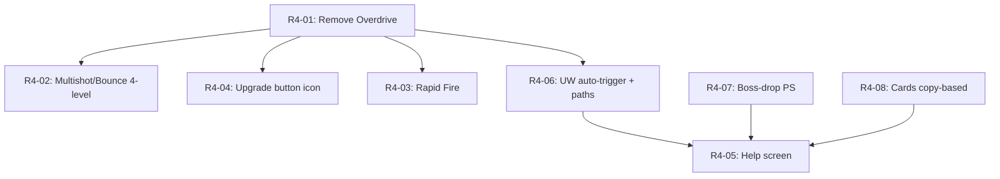

# Remediation Plan R4 — Internal Soak Feedback Bundle

Game-design changes driven by user-supplied feedback during the AAB v7 internal-track soak (~2026-05-22 → ~2026-06-04 window). Source of record is the planning conversation with the user on 2026-05-22 evening; every decision is recorded under the `Plan-R4-Feedback-Bundle` memory entity with a UTC+1 BST timestamp.

This plan is **larger and more invasive than R3**. It is not bug remediation — it is gameplay redesign. Expected total dev effort: ~3 weeks across 4 waves of incremental shipping. Two Room migrations (v9→v10, v10→v11). Three new ADRs. Test count expected to move from 627 → ~750.

The **internal soak window pauses while R4 ships** — the goal of R4 is to deliver a more compelling internal build before the closed-track ≥14-day clock starts.

---

## Sub-Plan Index

| # | Sub-Plan | Wave | Description | Schema | Effort |
|---|---|---|---|---|---|
| R4-01 | Remove Overdrive | 1 | Delete the entire Step Overdrive feature (4 enums, 17 files, ~600–800 LOC, ~50 tests) | — | 1–2 days |
| R4-02 | Multishot/Bounce 4-level scaling | 1 | Replace 100/60-level grind with 4 levels @ 5k/8k base × 1.5× scaling | — | 0.5 day |
| R4-04 | In-round upgrade button icon | 1 | `Icons.Filled.Upgrade` replaces `"⬆"` Unicode text | — | 5 min |
| R4-03 | Rapid Fire upgrade | 2 | New ATTACK upgrade: periodic-pulse attack-speed burst, L1 60s/5s/2.0× → L10 permanent/3.0× | — | 2–3 days |
| R4-06 | UW auto-trigger + per-UW upgrade paths | 2 | Auto-fire on cooldown when enemies present; replace single `level` with 3 paths × 10 levels per UW (180 total upgrade purchases) | v9→v10 (UW state) | 1 week |
| R4-07 | Boss-drop Power Stones | 2 | Each boss kill credits `tier` PS, capped at 100/day. Visual + atomic DAO + ADR | (folded into R4-06) | 2–3 days |
| R4-08 | Cards: copy-based 7-level progression | 3 | Scrap dust mechanic. Duplicates → copies. Rarity-scaled copies/level (3/4/5). MaxLevel 5 → 7. Pack guarantees 1 of pack-tier rarity | v10→v11 (cards) | 4–5 days |
| R4-05 | Help screen | 4 | New `Screen.Help` route, 9-section warm explainer, on-demand only, depends on R4-01/06/08 design content | — | 1 day |

---

## Wave Structure (Hybrid Sequencing — Option C)

| Wave | Items | Schema | AAB | Goal |
|---|---|---|---|---|
| 1 | R4-01, R4-02, R4-04 | None | v8 | Quick UX wins shipped to internal soak immediately |
| 2 | R4-03, R4-06, R4-07 | v9 → v10 (single migration) | v9 | Combat depth + PS economy land coherently |
| 3 | R4-08 | v10 → v11 | v10 | Card economy isolated for clean diagnosis |
| 4 | R4-05 | None | v11 | Help screen written last with locked content |

Each wave produces a signed AAB uploaded to the internal track for on-device verification before the next wave starts. The closed-track ≥14-day clock starts only once R4 fully lands, the latest internal AAB is promoted, and ≥12 testers have opted in.

---

## Dependency Graph



R4-01's `fortuneMultiplier` cleanup feeds R4-06 (GOLDEN_ZIGGURAT becomes the sole writer). R4-05's content depends on the final shape of R4-01 (no more Overdrive controls), R4-06 (UW upgrade UI), and R4-08 (no more card dust). Hence R4-05 ships last.

---

## Sub-Plan Details

### R4-01 — Remove Overdrive completely

**Source feedback:** *"Completely remove overdrive feature (not fun and wastes steps for not a lot of benefit)."*

**Decision locked 2026-05-22T20:23 BST:** full removal, no partial-keep alternative.

**Files affected (17 production, 7 test, 161 references):**

- `domain/model/OverdriveType.kt` — DELETE
- `domain/model/RoundState.kt` — drop `overdriveUsed` and `overdriveType` fields (transient, no DB)
- `domain/usecase/ActivateOverdrive.kt` — DELETE
- `presentation/battle/engine/GameEngine.kt` — remove `activeOverdrive` field, `overdriveTimeRemaining`, `preOverdriveStats`, `activateOverdrive()`, `expireOverdrive()`, all 4 OverdriveType branches in `activateOverdrive`. `fortuneMultiplier` lifecycle simplifies to GOLDEN_ZIGGURAT-only writer.
- `presentation/battle/entities/ZigguratEntity.kt` — remove `overdriveColor`, `overdriveProgress`, related render code
- `presentation/battle/effects/OverdriveAuraEffect.kt` — DELETE
- `presentation/battle/ui/OverdriveMenu.kt` — DELETE
- `presentation/battle/BattleScreen.kt` — remove Overdrive button from bottom control row + OverdriveMenu rendering
- `presentation/battle/BattleViewModel.kt` — remove `activateOverdrive`, `toggleOverdriveMenu`, related state
- `presentation/battle/BattleUiState.kt` — drop `activeOverdriveType`, `overdriveTimeRemaining`, `overdriveUsed`, `showOverdriveMenu`
- `presentation/battle/GameSurfaceView.kt`, `presentation/battle/engine/EnemyScaler.kt` — drop incidental references

**Tests affected:**
- `domain/usecase/ActivateOverdriveTest.kt` — DELETE (10 tests)
- `presentation/battle/engine/GameEngineTest.kt` — remove all 4 fortuneMultiplier cross-overdrive guards (RO-09 #2 collapses from 4 → 2 since GOLDEN is sole writer); remove ASSAULT/FORTRESS propagation tests; ~20 tests deleted
- `balance/UWOverdriveBalanceTest.kt` — rewrite to UW-only (drop Overdrive section, ~7 tests deleted)
- `balance/CashEconomyTest.kt` — drop FORTUNE multiplier reference (1 line)
- `presentation/battle/GameSurfaceViewTest.kt` — drop incidental reference

**ADR-0003 amendment:** the Battle Step Rewards ADR explicitly notes "Fortune overdrive does NOT multiply battle steps." That constraint becomes vacuously true. Append a one-line note to ADR-0003.

**Estimated test count delta:** -50 tests (627 → ~577).

**Acceptance:** zero references to `Overdrive` or `OverdriveType` in `app/src/main/java/`. `fortuneMultiplier` written only by GOLDEN_ZIGGURAT activate / expire. AAB v8 builds clean.

---

### R4-02 — Multishot/Bounce → 4-level scaling

**Source feedback:** *"Multishot and bounce shot shouldn't be multiple levels for no benefit, make 1 level give 1 bonus but make it an expensive upgrade."*

**Decision locked 2026-05-22T20:25 BST:** Interpretation B (per-level +1 bonus), not single-shot. Costs 5k / 8k base with 1.5× scaling.

**Spec:**

| Upgrade | maxLevel | baseCost | scaling | Per-level effect | L0 → L4 |
|---|---|---|---|---|---|
| MULTISHOT | 4 | 5,000 Steps | 1.5× | +1 target | 1 → 5 targets |
| BOUNCE_SHOT | 4 | 8,000 Steps | 1.5× | +1 bounce | 0 → 4 bounces |

CHAIN_REACTION card stacks additively on top of upgrade levels (unchanged behaviour).

**Files affected:**
- `domain/model/UpgradeType.kt` — MULTISHOT/BOUNCE_SHOT config replacement
- `domain/usecase/ResolveStats.kt` — change formulas to `multishotTargets = 1 + total(MULTISHOT)`, `bounceCount = total(BOUNCE_SHOT)`, drop the `floor(.../20)` and `floor(.../15)` math
- `domain/usecase/DescribeUpgradeEffect.kt` — `formatTargets` / `formatBounces` unchanged but driven by simpler formula
- Tests: `ResolveStatsTest.kt` (20 references rewritten), `DescribeUpgradeEffectTest.kt` (5 references), `CostCurveTest.kt` (1 reference)

**Existing test installs:** auto-cap on read (`level.coerceAtMost(maxLevel)`); no refund. Acceptable because only the developer's own internal-soak install is affected.

**Acceptance:** L1 of MULTISHOT visibly fires at 2 enemies; L1 of BOUNCE_SHOT visibly bounces once. Costs reach 5,000 / 8,000 Steps at L1, ~16,875 / ~27,000 at L4 each.

---

### R4-04 — In-round upgrade button icon

**Source feedback:** *"Make round upgrade button have a more obvious icon."*

**Decision locked 2026-05-22T21:24 BST:** `Icons.Filled.Upgrade`.

**Files affected:** `presentation/battle/BattleScreen.kt` (~line 140) — single `Text("⬆", ...)` swap to `Icon(Icons.Filled.Upgrade, contentDescription = "Upgrades", tint = Color.White)`. Add Material icons import.

**Tests affected:** none (Compose UI surface, no JVM-testable change).

**Acceptance:** in-round upgrade button shows the Material upgrade icon. On-device check.

---

### R4-03 — Rapid Fire upgrade

**Source feedback:** *"Add 'Rapid Fire', upgradable duration and speed, auto triggers at time interval (max upgrade should be constant)."*

**Decision locked 2026-05-22T20:27 BST:** new `RAPID_FIRE` UpgradeType in ATTACK category. Mirror RECOVERY_PACKAGES periodic-pulse engine pattern.

**Spec:**

| Parameter | L1 | L10 |
|---|---|---|
| Interval (s between bursts) | 60 | matches duration → permanent |
| Burst duration (s) | 5 | matches interval → permanent |
| Attack-speed multiplier during burst | 2.0× | 3.0× |

Cost: baseCost 2,000 Steps, scaling 1.18× per level. Cumulative max ≈ 35k Steps. Linear interpolation between L1 and L10 for all 3 parameters. At L10, interval = duration → effectively permanent +3.0× attack speed.

**Engine implementation:**
- New `@Volatile var rapidFireTimer: Float = 0f` and `@Volatile var rapidFireActiveRemaining: Float = 0f` on `GameEngine`
- New `tickRapidFire(deltaTime: Float)` private method called from `update()`, mirrors `tickRecoveryPackages` shape
- When timer crosses interval: timer = 0, rapidFireActiveRemaining = duration, emit `FloatingText("RAPID FIRE!", yellow)`
- During active: ziggurat tints yellow (similar visual treatment to old Overdrive aura but lighter)
- ZigguratEntity attack-speed read multiplies by `if (rapidFireActiveRemaining > 0) currentMultiplier else 1.0`
- ResolveStats: NO change — Rapid Fire is dynamic engine state, not a stat

**Files affected:**
- `domain/model/UpgradeType.kt` — new RAPID_FIRE enum entry + config
- `presentation/battle/engine/GameEngine.kt` — fields, tick method, multiplier application
- `presentation/battle/entities/ZigguratEntity.kt` — multiplier read at attack-speed site
- `domain/usecase/DescribeUpgradeEffect.kt` — new branch: `"Now: 60s/5s/2.0× → permanent/3.0×"` style readout
- New tests: ~6 GameEngineTest entries (timer fires at interval, duration applies, attack-speed multiplied, level interpolation, max-level permanent), 2 DescribeUpgradeEffectTest entries

**Acceptance:** purchasing RAPID_FIRE L1 produces a visible 5-second yellow burst every 60s with ~2× projectile rate. L10 produces continuous yellow tint and ~3× projectile rate.

---

### R4-06 — UW auto-trigger + per-UW upgrade paths

**Source feedback:** *"How to trigger UWs? They should be auto starting and one of the upgrades paths should be reducing the time (this should be dependant on the UW, for instance chain lightning should always happen but the upgrades should be number of bounces and power, discuss each one with me for a plan)."*

**Cross-cutting decisions locked 2026-05-22T21:26 BST:**
1. Auto-trigger fires when cooldown reaches 0 **AND** enemies are present (skips empty-screen / wave-cooldown firing)
2. `UltimateWeaponBar` UI stays as passive cooldown progress indicator (not clickable)
3. 3 upgrade paths per UW
4. Symmetric max level 10 per path
5. Cost per path level: `unlockCost × 2 × currentPathLevel` (matches existing UW upgrade cost pattern)

#### Per-UW spec (all locked 2026-05-22T21:27–21:31 BST)

##### CHAIN_LIGHTNING (unlock 75 PS)

| Path | L1 | L10 | Per-level delta |
|---|---|---|---|
| Damage | 500 | 2,000 | +166.66 linear |
| Chain length | 3 enemies | 12 enemies | +1 |
| Cooldown | 30s | 6s | -2.66s linear |

##### DEATH_WAVE (unlock 50 PS)

| Path | L1 | L10 | Per-level delta |
|---|---|---|---|
| Damage | 500 | 3,000 | +277.77 linear |
| Radius | 50% screen | 100% screen | +5.55% linear |
| Cooldown | 60s | 20s | -4.44s linear |

Note: radius path replaces the pre-R4 "always full screen" baseline — at L0 DEATH_WAVE only hits ~50% radius.

##### BLACK_HOLE (unlock 100 PS)

| Path | L1 | L10 | Per-level delta |
|---|---|---|---|
| Damage | 50 DPS | 250 DPS | +22.22 linear |
| Pull strength | 30 px/sec | 200 px/sec | +18.88 linear |
| Cooldown | 90s | 30s | -6.66s linear |

Duration stays 5s flat. Pull-strength path is the novel crowd-control axis.

##### CHRONO_FIELD (unlock 75 PS)

| Path | L1 | L10 | Per-level delta |
|---|---|---|---|
| Slow factor | 50% enemy speed | 5% enemy speed | -5% linear |
| Duration | 5s | 14s | +1s |
| Cooldown | 75s | 25s | -5.55s linear |

`CHRONO_SLOW_FACTOR = 0.10f` companion constant in `GameEngine.kt` becomes per-UW-state. **Balance flag:** max-config produces ~56% uptime at 5% slow which may be too defensively strong combined with BLACK_HOLE pull. Re-evaluate after on-device.

##### POISON_SWAMP (unlock 60 PS)

| Path | L1 | L10 | Per-level delta |
|---|---|---|---|
| DoT % MaxHP/sec | 1% | 8% | +0.77% linear |
| Area | 50% | 100% | +5.55% linear |
| Cooldown | 60s | 20s | -4.44s linear |

Duration stays 6s flat. Pre-R4 L10 was 20% MaxHP/sec — new L10 = 8% is meaningful nerf at max but DoT still uniquely scales against tank/boss HP.

##### GOLDEN_ZIGGURAT (unlock 80 PS)

| Path | L1 | L10 | Per-level delta |
|---|---|---|---|
| Cash multiplier | 2× | 8× | +0.66 linear |
| Damage multiplier | 1.2× | 3× | +0.2 linear |
| Cooldown | 90s | 30s | -6.66s linear |

`fortuneMultiplier` write at activation = `coerceAtLeast(currentCashMultLevelValue)`. Reset to 1.0 on expiry. RO-09 #2's 4 regression tests collapse to 2 since R4-01 removes Overdrive as the second writer.

#### Schema impact

`UltimateWeaponStateEntity` (single `level: Int`) becomes:

```
@Entity(tableName = "ultimate_weapon_state")
data class UltimateWeaponStateEntity(
    @PrimaryKey val weaponType: String,
    val damageLevel: Int = 0,
    val secondaryLevel: Int = 0,
    val cooldownLevel: Int = 0,
    val isUnlocked: Boolean = false,
    val isEquipped: Boolean = false,
)
```

Migration v9 → v10:
- Add 3 columns NOT NULL DEFAULT 0
- Add `isUnlocked` column NOT NULL DEFAULT 0
- For each existing row: redistribute the legacy `level` value across `damageLevel`, `secondaryLevel`, `cooldownLevel` proportionally (e.g. legacy L5 → 2/2/1). Seed `isUnlocked = (level >= 1)`.
- Drop legacy `level` column

#### Files affected

- `domain/model/UltimateWeaponType.kt` — replace single `unlockCost`/`baseCooldownSeconds`/`effectDurationSeconds` with per-path `damageL1/L10`, `secondaryL1/L10`, `cooldownL1/L10` blocks. Add a sealed `UWPath` enum (DAMAGE / SECONDARY / COOLDOWN).
- `domain/model/OwnedWeapon.kt` — replace `level: Int` with `damageLevel`, `secondaryLevel`, `cooldownLevel`, `isUnlocked`
- `domain/usecase/UpgradeUltimateWeapon.kt` — accept `path: UWPath` parameter
- `domain/usecase/UnlockUltimateWeapon.kt` — gates on `isUnlocked` flag instead of `level >= 1`
- `domain/repository/UltimateWeaponRepository.kt` — new `upgradePathLevel(type, path)` method
- `data/local/UltimateWeaponStateEntity.kt` + `UltimateWeaponDao.kt` — schema + new query methods
- `data/local/Migrations.kt` — new MIGRATION_9_10 object with the redistribution SQL
- `data/local/AppDatabase.kt` — version 9 → 10
- `data/repository/UltimateWeaponRepositoryImpl.kt` — toDomain/toEntity rewrite
- `presentation/battle/engine/GameEngine.kt` — `updateUWs()` adds enemy-presence-gated auto-trigger; rewrite all 6 weapon `activateUW` branches to read per-path levels
- `presentation/battle/ui/UltimateWeaponBar.kt` — drop clickable, keep passive cooldown indicator
- `presentation/weapons/UltimateWeaponScreen.kt` — replace single Upgrade button with 3 per-path Upgrade buttons
- `presentation/weapons/UltimateWeaponViewModel.kt` + `UWDisplayInfo.kt` — per-path display state
- ~80 new tests across `UpgradeUltimateWeaponTest`, `GameEngineTest`, `UltimateWeaponViewModelTest`, schema migration tests

#### New ADR

`docs/agent/DECISIONS/ADR-0008-uw-per-path-upgrades.md` — records the redesign: 3 paths per UW, symmetric L10 cap, auto-trigger semantics, schema migration approach, and the design rationale for each per-UW path choice. Sibling of ADR-0003 (Battle Step Rewards) and ADR-0005 (Billing SDK).

#### Acceptance

- All 6 UWs auto-fire when their cooldown reaches 0 and at least one enemy is alive
- `UltimateWeaponBar` shows cooldown progress visually but isn't clickable
- `UltimateWeaponScreen` shows 3 per-path Upgrade buttons per equipped UW
- Each path's per-level effect matches the spec table
- Migration v9 → v10 correctly redistributes legacy single-level UW state
- All existing tests pass; ~80 new tests added; ~7 RO-09 #2 fortuneMultiplier guards collapse to 2

---

### R4-07 — Boss-drop Power Stones

**Source feedback:** *"Each boss killed should drop Power Stones (1 for tier 1, 2 for tier 2 etc)... Up to a max per day, maybe 20?"*

**Decision locked 2026-05-22T21:32 BST:** daily cap revised UP from user's 20 to **100 PS/day** following PS-economy analysis. Without boss-drop PS, maxing 2 favourite UWs at the new R4-06 cost curve takes ~6 years from existing PS sources. With 100/day cap it takes ~12 months — the design target.

**Spec:**

- Per boss kill: `tier` PS (T1 = 1, T2 = 2, …, T10 = 10)
- Daily cap: 100 PS/day total across all tiers
- Reset: local-time midnight (matches `DailyStepRecordEntity` daily-rollover pattern)
- Visual: `FloatingText("+N PS")` above dead boss; **silent suppression** when cap exhausted (mirrors battle-step cap behaviour from ADR-0003)

**Schema (combined with R4-06's v9 → v10 migration):**

`DailyStepRecordEntity` adds:
```
@ColumnInfo(defaultValue = "0")
val bossPsEarnedToday: Long = 0
```

`DailyStepDao` adds atomic credit method:
```kotlin
@Transaction
suspend fun creditBossPowerStonesAtomic(today: String, requested: Long, dailyCap: Long, playerDao: PlayerProfileDao): Long {
    val record = getRecord(today) ?: insertEmpty(today)
    val headroom = (dailyCap - record.bossPsEarnedToday).coerceAtLeast(0)
    val granted = requested.coerceAtMost(headroom)
    if (granted > 0) {
        updateBossPs(today, record.bossPsEarnedToday + granted)
        playerDao.adjustPowerStones(granted)
    }
    return granted
}
```

(Mirrors `creditBattleStepsAtomic` shape from RO-02.)

**Files affected:**

- `data/local/DailyStepRecordEntity.kt` — new column
- `data/local/DailyStepDao.kt` — new query + atomic credit method
- `data/local/Migrations.kt` — MIGRATION_9_10 adds `bossPsEarnedToday` column (combined with R4-06 UW state migration into one v9→v10 migration)
- `data/local/AppDatabase.kt` — version 9 → 10
- `domain/usecase/AwardBossPowerStones.kt` — NEW use case; takes `tier`, today's date, calls `creditBossPowerStonesAtomic`, returns granted amount
- `presentation/battle/engine/GameEngine.kt` — new `@Volatile var onBossKilled: ((tier: Int) -> Unit)?` callback fired in `handleEnemyDeath` when `enemy.enemyType == EnemyType.BOSS`
- `presentation/battle/BattleViewModel.kt` — subscribes in `startPollingEngine`, calls `AwardBossPowerStones`, on non-zero result emits `FloatingText("+N PS")` via existing engine effect channel
- New tests: `AwardBossPowerStonesTest` (cap behaviour, zero on exhausted, partial credit, cross-day reset), `GameEngineTest` boss-callback regression guard, `BattleViewModelTest` boss-PS credit path

**New ADR:** `docs/agent/DECISIONS/ADR-0009-boss-drop-power-stones.md` — sibling of ADR-0003. Records the cap value (100/day), per-tier reward (linear), atomic-DAO pattern (mirrors RO-02), silent-suppression visual rule.

**Acceptance:**
- Killing a Tier-N boss credits exactly N Power Stones (when under cap)
- Killing additional bosses past 100 PS/day produces no PS and no `+N PS` floating text
- Daily counter resets at local midnight via the existing `DailyStepRecordEntity.date` keying
- Cross-day boss kills correctly start fresh at 0/100

---

### R4-08 — Cards: copy-based 7-level progression

**Source feedback:** *"Cards - scrap the dust mechanic, they should be upgraded by getting more copies of the card, so 5(?) cards will upgrade to a higher level, there should be maybe 7 levels in total."*

**Decisions locked 2026-05-22T21:33 BST:**
- 8A: rarity-scaled copies/level (3 COMMON / 4 RARE / 5 EPIC)
- 8B: extrapolate L1→L7 linearly past current L5 endpoint (~30% stronger at max)
- 8C: silent zero of `cardDust` balance on migration (only the developer's own install is affected)
- 8D: replace `SupplyDropReward.CARD_DUST` with `SupplyDropReward.CARD_COPY` (random card type, 1 copy)
- 8E: pack rolling guarantees 1 card of pack-tier rarity, other 2 still independent rolls

**Schema migration v10 → v11:**

`CardInventoryEntity` becomes:
```
@Entity(tableName = "card_inventory", indices = [Index(value = ["cardType"], unique = true)])
data class CardInventoryEntity(
    @PrimaryKey(autoGenerate = true) val id: Int = 0,
    val cardType: String,
    val level: Int = 1,
    val isEquipped: Boolean = false,
    @ColumnInfo(defaultValue = "1")
    val copyCount: Int = 1,
)
```

Migration steps:
1. Add `copyCount INTEGER NOT NULL DEFAULT 1` column
2. Aggregate duplicate rows by `cardType` into a single row with `copyCount = COUNT(*)`. SQL: temp table dance — create new table with unique constraint, insert grouped rows, drop old, rename.
3. Add unique index on `cardType`

**Files affected:**

- `domain/model/CardType.kt` — `maxLevel` 5 → 7. `effectAtLevel(level)` interpolation changes denominator: `valueLv1 + (valueLv7 - valueLv1) × (level - 1) / 6.0`. `valueLv5` field renamed `valueLv7` and recomputed by linear extrapolation:
  - IRON_SKIN: 10% / 30% (L1/L5) → 10% / 42% (L1/L7)
  - SHARP_SHOOTER: 15% / 35% → 15% / 45%
  - CASH_GRAB: 20% / 50% → 20% / 65%
  - VAMPIRIC_TOUCH: 5% / 15% → 5% / 20%
  - CHAIN_REACTION: 2 / 4 → 2 / 5 (rounded)
  - SECOND_WIND: 50% / 100% → 50% / 125% (capped at 100% — flag for balance review)
  - WALKING_FORTRESS: 50%/-20% / 100%/-10% → 50%/-20% / 125%/-5%
  - GLASS_CANNON: 80%/-40% / 120%/-20% → 80%/-40% / 140%/-10%
  - STEP_SURGE: 2× / 4× → 2× / 5×
- `domain/model/CardRarity.kt` — `dustValue` and `upgradeDustPerLevel` deprecated (kept as `@Deprecated` fields for one release to avoid breaking serialization; deletion deferred to v2.x)
- `domain/usecase/OpenCardPack.kt` — duplicate path rewrites: instead of `playerRepository.addCardDust(...)`, calls `cardRepository.incrementCopyCount(type)`. Pack rolling rewritten: first card guaranteed at pack-tier rarity, other 2 use existing weights.
- `domain/usecase/UpgradeCard.kt` — rewrite. Takes `card: OwnedCard`, no currency arg. Checks `copyCount >= copiesPerLevelForRarity(card.rarity)` and `level < maxLevel`. Atomic decrement copies + increment level.
- `data/local/CardInventoryEntity.kt` + `CardDao.kt` + `data/repository/CardRepositoryImpl.kt` — schema + new methods
- `data/local/Migrations.kt` — MIGRATION_10_11
- `domain/model/SupplyDropReward.kt` — replace `CARD_DUST` with `CARD_COPY` (random card type field)
- `domain/usecase/GenerateSupplyDrop.kt` — drop generation table updates
- `domain/usecase/ClaimSupplyDrop.kt` — `CARD_COPY` branch calls `cardRepository.incrementCopyCount(randomType)`
- `presentation/cards/CardsScreen.kt` — remove `cardDust` display, show `copyCount/copiesPerLevel` per card, remove dust cost from Upgrade button
- `presentation/cards/CardsViewModel.kt` + `CardsUiState.kt` — drop `cardDust`, add `copiesNeededForNext` per card
- `domain/usecase/ApplyCardEffectsTest.kt` — rewrite for L1→L7 effects
- `OpenCardPackTest.kt`, `UpgradeCardTest.kt`, `CardsViewModelTest.kt`, `GenerateSupplyDropTest.kt`, `ClaimSupplyDropTest.kt` — substantial rewrites. ~25 tests changed/added.

**New ADR:** `docs/agent/DECISIONS/ADR-0010-card-copy-progression.md`. Records the design rationale, rarity-scaling decision, migration approach, deprecation of `cardDust`, supply-drop reward type swap.

**Acceptance:**
- 3 COMMON / 4 RARE / 5 EPIC copies upgrade a card to next level
- L1 effect = pre-R4 L1 effect; L7 effect ~30% stronger than pre-R4 L5
- Opening an EPIC pack always returns at least 1 EPIC card (other 2 random per existing weights)
- Existing duplicate-row pre-R4 card data correctly collapses into single rows with `copyCount = COUNT(*)`
- `cardDust` UI element removed; balance silently zeroed
- Supply drops with `CARD_COPY` reward correctly credit 1 copy of a random card type

---

### R4-05 — Help screen

**Source feedback:** *"Create 'Help' section describing important parts of the game."*

**Decisions locked 2026-05-22T21:25 BST:**
- Reach from: Help icon on HomeScreen top-right + "Help" entry in Settings
- On-demand only — no first-launch popup
- Tone: warm explainer, "you" framing, plain English
- 9 sections

**Sections:**

1. **Currencies** — Steps (walking-only), Cash (in-round), Gems (milestones/login), Power Stones (UW + boss drops + weekly), Card copies (replaces dust)
2. **Workshop** — Attack/Defense/Utility categories, cost formula, quick invest button
3. **Battle controls** — speed buttons, pause, in-round upgrade button (now using `Icons.Filled.Upgrade`)
4. **Tiers + biomes** — unlock progression, cash multipliers, biome themes, battle conditions at T6+
5. **Labs** — research projects, real-time durations, slot management, gem rush
6. **Cards** — copy-based progression (post-R4-08), pack opening, equipping, rarity-scaled copy requirements (3/4/5)
7. **Ultimate Weapons** — auto-trigger on cooldown when enemies present (post-R4-06), 3 upgrade paths per UW, equipping (3 max)
8. **Walking encounters** — supply drops, milestones, daily missions
9. **Anti-cheat** — 200 steps/min rate limit, 50k daily ceiling, why Health Connect matters

**Files affected:**
- `presentation/help/HelpScreen.kt` — NEW (~300 LOC of static Compose + scroll state)
- `presentation/navigation/Screen.kt` — new `Help` entry, add to `allScreens` list
- `presentation/MainActivity.kt` — `NavHost` registers `composable(Screen.Help.route)` { HelpScreen() }
- `presentation/home/HomeScreen.kt` — add Help icon top-right (`Icons.Filled.Help` or `Icons.AutoMirrored.Filled.HelpOutline`)
- `presentation/settings/NotificationSettingsScreen.kt` — add "Help" link row that navigates to HelpScreen

**Tests affected:** none (pure static UI). The route is added to `argumentFreeRoutes` so the existing DeepLinkRoutingTest covers Help-route resolution implicitly.

**Acceptance:**
- Tap Help icon on HomeScreen top-right → Help screen opens
- Tap "Help" link in Settings → Help screen opens
- All 9 sections render with current post-R4 content (no Overdrive, copy-based cards, auto-triggering UWs with paths)
- Compose lint clean; build clean

---

## Execution Notes

**Per-PR protocol** (matches the project's R / R2 / R3 / RO-08…RO-12 cadence):
1. Branch named `feat/R4-NN-short-slug` (or `fix/R4-NN-...` if a sub-plan is purely a fix)
2. Failing regression test committed first (red), then the feature/fix
3. Full suite stays green
4. Doc-sync per `.kiro/steering/11-agent-protocol.md` PR Task-List Convention (AGENTS.md test count, CHANGELOG.md, source-files.md, structure.md if applicable, STATE.md, RUN_LOG.md)
5. PR title `feat(<area>): <summary> (R4-NN)`
6. Merge → tag the wave's last commit so we can roll back atomically if needed
7. After each wave completes: versionCode bump → bundleRelease → upload to internal track → on-device verify before starting next wave

**Test count tracking:**
- Wave 1 end: ~575 (R4-01 deletes ~50; R4-02 modifies ~25; R4-04 zero delta)
- Wave 2 end: ~675 (R4-03 +8; R4-06 +80; R4-07 +12)
- Wave 3 end: ~700 (R4-08 +25 net)
- Wave 4 end: ~700 (R4-05 zero JVM delta)

**Schema migrations:**
- v9 → v10: combined R4-06 (UW state) + R4-07 (boss PS column) — single migration in Wave 2
- v10 → v11: R4-08 cards collapse — single migration in Wave 3

Both migrations require Room schema export commits (`app/schemas/`).

**ADRs to write (3 total):**
- ADR-0008 — UW per-path upgrades + auto-trigger
- ADR-0009 — Boss-drop Power Stones (sibling of ADR-0003)
- ADR-0010 — Card copy-based progression

**ADR amendments (1):**
- ADR-0003 — append note that Fortune-overdrive constraint became vacuously true after R4-01

---

## Open Questions

1. **CHRONO_FIELD balance.** R4-06 spec produces ~56% uptime at 5% slow at max-config. Combined with BLACK_HOLE pull this may be too defensively strong. Re-evaluate after on-device testing in Wave 2; rebalance via per-path coefficient tweaks if needed (no schema impact).
2. **SECOND_WIND L7 extrapolation.** Linear extrapolation puts L7 at 125% HP recovery, which exceeds 100% max HP. Cap the field at 100% in `effectAtLevel` clamping logic, OR revise the extrapolation curve to plateau. Recommended: clamp at 100%; flag in plan as not-quite-linear.
3. **`cardDust` field deletion.** Kept for one release as `@Deprecated`. Plan a v2.x migration that drops the column from `PlayerProfileEntity`. Track in v1.x patch backlog.
4. **Cosmetic visual hooks.** Existing 4 `ZIGGURAT_SKIN` cosmetics (`zig_jade`, `lapis_lazuli_skin`, `garden_ziggurat_skin`, `sandals_of_gilgamesh`) ride the R4 changes unchanged. Other 7 seeds (`zig_obsidian`/`zig_crystal`/`zig_golden` + 4 non-ziggurat) still show "Coming Soon" pending visual content. Out of scope for R4.

---

## Priority Tiers

**Tier 1 — Must land before closed-track promotion:** all 8 sub-plans. R4 is gameplay redesign, not optional polish.

**Tier 2 — Deferred to v1.x:** none.

The R4 bundle replaces the internal soak window. Once R4 fully ships through Wave 4 with on-device verification of each AAB, the latest internal AAB is promoted to closed track and the ≥14-day / ≥12-tester clock starts.
