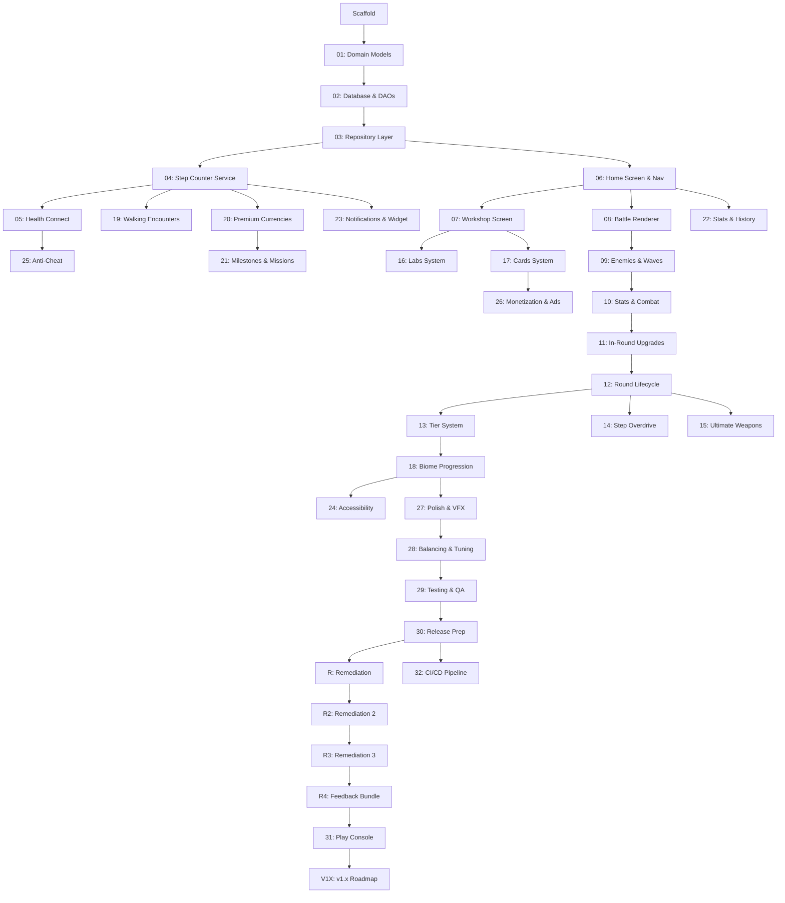

# Master Plan — Steps of Babylon v1.0

This document defines the ordered sequence of sub-plans required to bring Steps of Babylon from its current scaffold to a complete v1.0 release. Each plan is a self-contained chunk of work that builds on the previous ones. Plans should be executed in order.

See `docs/StepsOfBabylon_GDD.md` for the full game design document.

> **Forward planning (2026-06-11):** v1.0 is complete; this document is the completion record. The
> path from here (internal testing → closed test → launch) lives in `docs/plans/plan-FORWARD.md`,
> keyed to a Closed-Test Readiness Gate. The completed plan *files* (Plans 01–30, 10b, R, R2, R3, R4,
> RO-*) are archived under `docs/archive/completed-plans-v1.0/` — the links in the index below point
> there. `plan-31`, `plan-32`, and `plan-V1X-roadmap` remain live in `docs/plans/`.

---

## Plan Index

| # | Plan | Description | Dependencies |
|---|---|---|---|
| 01 | [Domain Models & Currency System](../archive/completed-plans-v1.0/plan-01-domain-models.md) | Define all core domain models (currencies, upgrade types, tier config, enemy types) and the cost calculation engine. Pure Kotlin, no Android deps. | Scaffold |
| 02 | [Room Database & DAOs](../archive/completed-plans-v1.0/plan-02-database.md) | Create all Room entities, DAOs, and the database migration strategy. Player profile, workshop state, lab state, cards, UWs, walking encounters. | Plan 01 |
| 03 | [Repository Layer](../archive/completed-plans-v1.0/plan-03-repositories.md) | Implement repository interfaces (domain) and their Room-backed implementations (data). Expose game state as Flows. | Plan 02 |
| 04 | [Step Counter Service](../archive/completed-plans-v1.0/plan-04-step-counter.md) | Foreground service with persistent notification, TYPE_STEP_COUNTER sensor, WorkManager periodic sync, boot receiver, anti-cheat rate limiting, daily ceiling. | Plan 03 |
| 05 | [Health Connect Integration](../archive/completed-plans-v1.0/plan-05-health-connect.md) | Health Connect SDK setup, step cross-validation, Activity Minute Parity (indoor workout credits), gap-filling when app is killed. | Plan 04 |
| 06 | [Home Screen & Navigation](../archive/completed-plans-v1.0/plan-06-home-navigation.md) | Compose navigation graph, Home/Dashboard screen showing step count, step balance, current tier/biome, best wave, quick-launch battle button. Bottom nav bar. | Plan 03 |
| 07 | [Workshop Screen & Upgrades](../archive/completed-plans-v1.0/plan-07-workshop.md) | Workshop UI (Attack/Defense/Utility tabs), purchase upgrades with Steps, cost formula engine, level persistence, "Quick Invest" button. | Plan 06 |
| 08 | [Battle Renderer — Game Loop & Ziggurat](../archive/completed-plans-v1.0/plan-08-battle-renderer.md) | Custom SurfaceView with dedicated game loop thread, fixed timestep, ziggurat entity rendering, health bar, basic projectile system. | Plan 06 |
| 09 | [Battle System — Enemies & Waves](../archive/completed-plans-v1.0/plan-09-enemies-waves.md) | Enemy entity system (Basic, Fast, Tank, Ranged, Boss, Scatter), wave spawning (26s spawn + 9s cooldown), enemy scaling per wave, collision/damage resolution. | Plan 08 |
| 10 | [Battle System — Stats & Combat](../archive/completed-plans-v1.0/plan-10-stats-combat.md) | Stats resolution engine combining Workshop (permanent) × In-Round (temporary) upgrades multiplicatively. Crit system, knockback, lifesteal, thorn, death defy, defense, damage/meter. | Plan 09 |
| 10b | [Advanced Combat Mechanics](../archive/completed-plans-v1.0/plan-10b-advanced-combat.md) | Orbs (orbiting projectiles), Multishot (fire at N targets), Bounce Shot (projectile chaining). Stats computed in ResolvedStats, gameplay wiring. | Plan 10 |
| 11 | [In-Round Upgrades & Cash Economy](../archive/completed-plans-v1.0/plan-11-in-round-upgrades.md) | Cash earned from kills/waves, in-round upgrade menu (Attack/Defense/Utility tabs), cash cost scaling per purchase, interest mechanic, free upgrade chance. | Plan 10 |
| 12 | [Round Lifecycle & Post-Round](../archive/completed-plans-v1.0/plan-12-round-lifecycle.md) | Round start/end flow, wave counter, speed controls (1x/2x/4x), post-round summary screen (wave record, milestone rewards), return to Workshop. | Plan 11 |
| 13 | [Tier System & Progression](../archive/completed-plans-v1.0/plan-13-tier-system.md) | Tier unlock logic (wave requirements), cash multipliers, battle conditions (Tier 6+: orb resistance, knockback resistance, armored enemies, etc.), tier persistence. | Plan 12 |
| 14 | [Step Overdrive](../archive/completed-plans-v1.0/plan-14-step-overdrive.md) | Overdrive button on battle screen, 4 overdrive types (Assault/Fortress/Fortune/Surge), Step cost deduction, 60-second buff, once-per-round limit, visual aura effects. | Plan 12 |
| 15 | [Ultimate Weapons](../archive/completed-plans-v1.0/plan-15-ultimate-weapons.md) | UW unlock/upgrade with Power Stones, 6 UW types (Death Wave, Chain Lightning, Black Hole, Chrono Field, Poison Swamp, Golden Ziggurat), loadout selection (3 max), cooldowns, visual effects. | Plan 12 |
| 16 | [Labs System](../archive/completed-plans-v1.0/plan-16-labs.md) | Lab screen, research projects with Step cost + real-time duration, background timer, lab slot management (1-4 slots), Gem rush, 10 research types. | Plan 07 |
| 17 | [Cards System](../archive/completed-plans-v1.0/plan-17-cards.md) | Card collection, Card Packs (Gem purchase), 3 rarities, duplicate to Card Dust, card upgrades (5 levels), equip loadout (3 max), per-round activation. | Plan 07 |
| 18 | [Narrative Biome Progression](../archive/completed-plans-v1.0/plan-18-biomes.md) | 5 biomes mapped to tier ranges, battlefield environment art swap, enemy theme swap, ziggurat appearance changes, biome transition cinematic, biome-specific soundtrack hooks. | Plan 13 |
| 19 | [Walking Encounters & Supply Drops](../archive/completed-plans-v1.0/plan-19-walking-encounters.md) | Supply Drop generation (seeded random), push notification delivery, one-tap claim, Unclaimed Supplies inbox (max 10), drop rate tuning, reward distribution. | Plan 04 |
| 20 | [Power Stone & Gem Economy](../archive/completed-plans-v1.0/plan-20-premium-currencies.md) | Weekly step challenges (Power Stone rewards), wave milestone PS rewards, daily login PS, daily login streak Gems, long-distance walking Gem bonuses. | Plan 04 |
| 21 | [Milestones & Daily Missions](../archive/completed-plans-v1.0/plan-21-milestones-missions.md) | Walking milestones (First Steps to Globe Trotter), 3 random daily missions (walking/battle/upgrade), midnight refresh, reward distribution. | Plan 20 |
| 22 | [Stats & History Screen](../archive/completed-plans-v1.0/plan-22-stats-history.md) | Walking history charts (daily/weekly/monthly), battle statistics, all-time stats, Steps vs Activity Minute breakdown. | Plan 06 |
| 23 | [Notifications & Widget](../archive/completed-plans-v1.0/plan-23-notifications-widget.md) | Persistent step count notification, home screen widget (2x2), smart reminders ("2,000 steps away from..."), milestone alerts, biome unlock cinematics. | Plan 04 |
| 24 | [Accessibility](../archive/completed-plans-v1.0/plan-24-accessibility.md) | TalkBack support for all menu screens, battle screen audio cues, color-blind modes (3 palettes), adjustable text size (system font settings), rest day encouragement. | Plan 18 |
| 25 | [Anti-Cheat & Validation](../archive/completed-plans-v1.0/plan-25-anti-cheat.md) | Step velocity analysis (shaker/spoof detection), graduated HC cross-validation (4 offense levels), activity minute gaming prevention, per-minute overlap deduction. | Plan 05 |
| 26 | [Monetization & Ads](../archive/completed-plans-v1.0/plan-26-monetization.md) | Optional reward ads (post-round Gem, double PS, free Card Pack), ad removal IAP, Gem pack IAPs, Season Pass, cosmetic theme IAPs. | Plan 17 |
| 27 | [Polish & Visual Effects](../archive/completed-plans-v1.0/plan-27-polish-vfx.md) | Projectile effects, UW visual spectacles, Overdrive auras, enemy death animations, wave transition effects, UI animations, sound effects integration. | Plan 18 |
| 28 | [Balancing & Tuning](../archive/completed-plans-v1.0/plan-28-balancing.md) | Step economy tuning across player profiles, Workshop cost curves, enemy HP/damage scaling, tier difficulty curves, cash multiplier validation, Card balance pass. | Plan 27 |
| 29 | [Testing & QA](../archive/completed-plans-v1.0/plan-29-testing.md) | Unit tests for domain logic (cost calcs, damage formulas, tier progression), ViewModel tests with fakes, Room DAO instrumented tests, step sensor integration tests, UI tests. | Plan 28 |
| 30 | [Release Prep](../archive/completed-plans-v1.0/plan-30-release.md) | ProGuard/R8 config, app signing, Play Store listing assets, privacy policy, final build verification, AAB generation. | Plan 29 |
| 31 | [Play Console & Store Publication](./plan-31-play-console.md) | Play Console setup, store listing upload, IAP/ad SDK integration, test tracks, pre-launch report, production release. | Plan 30, Plan R (Tier 1), Plan R2 (Tier 1), Plan R3 (Tier 1), Plan R4 (Tier 1) |
| R | [Remediation](../archive/completed-plans-v1.0/plan-R-remediation.md) | Bug and UX fixes from external code review. 12 sub-plans (R01–R12) across 3 priority tiers. Tier 1 blocks release. | Plan 30 |
| R2 | [Remediation 2](../archive/completed-plans-v1.0/plan-R2-remediation.md) | Bug and UX fixes from second external review. 12 sub-plans (R2-01–R2-12) across 3 priority tiers. Tier 1 blocks release. | Plan R |
| R3 | [Remediation 3](../archive/completed-plans-v1.0/plan-R3-remediation-3.md) | Bug fixes from the v5 internal-track on-device smoke test (2026-05-19). 4 sub-plans (R3-01–R3-04) tracked as GitHub issues #1–#4. Tier 1 (R3-01/02/03) blocks closed-track promotion. | Plan R2 |
| R4 | [Remediation 4 — Feedback Bundle](../archive/completed-plans-v1.0/plan-R4-feedback-bundle.md) | Gameplay-redesign bundle from internal-soak feedback (2026-05-22). 8 sub-plans across 4 waves. Removes Overdrive, simplifies Multishot/Bounce, adds Rapid Fire + Help screen, redesigns UWs with auto-trigger + 3-path upgrades, adds boss-drop Power Stones, scraps card dust for copy-based progression. Two Room migrations (v9→v10, v10→v11). 3 new ADRs. | Plan R3 |
| V1X | [v1.x Roadmap](./plan-V1X-roadmap.md) | Post-launch patch sequence derived from the 2026-05-25 GitHub issue triage (33 issues). 29 sub-plans across 4 versioned waves (v1.0.1 polish, v1.0.2 audio, v1.1 testing-infra + simulation extraction, v1.2 cloud save + i18n) plus content/balance/docs ships and 9 strategic v2.x proposals. 1 schema migration for cloud save (v12→v13; v11→v12 was consumed by #127 daily-missions dedup). 7 new ADRs. | Plan 31 |
| 32 | [CI/CD Pipeline](./plan-32-ci.md) | GitHub Actions CI/CD: PR gate (lint + unit + assembleDebug + Room schema-drift guard), instrumented emulator suite (blocking-on-PR + nightly), and a release lane (signed `bundleRelease` → Play internal track on a `v*` tag). Supply-chain hardening: Dependabot, dependency-graph submission, SHA-pinned actions. ADR-0018. | Plan 29, Plan 30, Plan 31 |

---

## Dependency Graph

---

## Execution Notes

- Each plan will have its own detailed markdown file (e.g., `plan-01-domain-models.md`) created when that plan is ready to be worked on.
- Plans can be worked on in parallel where dependencies allow (e.g., Plans 14, 15 can run in parallel since both depend on Plan 12).
- The critical path runs: 01 → 02 → 03 → 06 → 08 → 09 → 10 → 11 → 12 → 13 → 18 → 27 → 28 → 29 → 30 → R (Tier 1) → R2 (Tier 1) → R3 (Tier 1) → R4 (Tier 1) → 31.
- Plan R (Remediation) was added after an external code review. Tier 1 sub-plans (R01–R05) block production release. Tier 2 (R06–R09) should complete before release. Tier 3 (R10–R12) can follow shortly after.
- Plan R2 (Remediation 2) was added after a second external code review. Tier 1 sub-plans (R2-01, R2-02, R2-06) block production release.
- Plan R3 (Remediation 3) was added after the v5 internal-track on-device smoke test surfaced 4 closed-test-blocking bugs filed as GitHub issues #1–#4. Tier 1 (R3-01 / R3-02 / R3-03) blocks the internal → closed-track promotion in Plan 31 Phase G2.
- Plan R4 (Remediation 4 — Internal Soak Feedback Bundle) was added after the AAB v7 internal-soak surfaced 8 gameplay-design issues. All 8 sub-plans are Tier 1 — R4 fully gates the closed-track promotion. The internal-soak window pauses while R4 ships across 4 waves; the closed-track ≥14-day clock starts only after R4 fully lands and the post-R4 internal AAB is promoted.
- Plans 04/05, 16/17, 19/20/21, 22, 23 are feature branches that can be parallelized after their dependencies are met.
- Plan 32 (CI/CD) is repository infrastructure, off the gameplay critical path. It depends only on the test suites (Plan 29), signing config (Plan 30), and the Play internal track + service account (Plan 31) existing; it can be implemented any time after those and gates all subsequent merges once live.

---

## Current Status

- [x] Project scaffold (Gradle, Hilt, Room skeleton, Compose theme, Home placeholder)
- [x] Plan 01: Domain Models & Currency System
- [x] Plan 02: Room Database & DAOs
- [x] Plan 03: Repository Layer
- [x] Plan 04: Step Counter Service
- [x] Plan 05: Health Connect Integration
- [x] Plan 06: Home Screen & Navigation
- [x] Plan 07: Workshop Screen & Upgrades
- [x] Plan 08: Battle Renderer — Game Loop & Ziggurat
- [x] Plan 09: Battle System — Enemies & Waves
- [x] Plan 10: Battle System — Stats & Combat
- [x] Plan 10b: Advanced Combat Mechanics (Orbs, Multishot, Bounce Shot)
- [x] Plan 11: In-Round Upgrades & Cash Economy
- [x] Plan 12: Round Lifecycle & Post-Round
- [x] Domain Layer Unit Tests (all use cases, domain models, formulas, anti-cheat, tier system, labs, cards, encounters, milestones, missions — the live headline test count is in STATE.md / CLAUDE.md, not pinned here)
- [x] Plan 13: Tier System & Progression
- [x] Plan 14: Step Overdrive
- [x] Plan 15: Ultimate Weapons
- [x] Plan 16: Labs System
- [x] Plan 17: Cards System
- [x] Plan 18: Narrative Biome Progression
- [x] Plan 19: Walking Encounters & Supply Drops
- [x] Plan 20: Power Stone & Gem Economy
- [x] Plan 21: Milestones & Daily Missions
- [x] Plan 22: Stats & History Screen
- [x] Plan 23: Notifications & Widget
- [ ] Plan 24: Accessibility *(deferred — post-v1.0)*
- [x] Plan 25: Anti-Cheat & Validation
- [x] Plan 26: Monetization & Ads (real Play Billing v8 + AdMob v25 + UMP v4 wired end-to-end via C.5 PR 1–3 + C.6 PR 1–3; on-device verification PASSED 2026-05-18)
- [x] Plan 27: Polish & Visual Effects
- [x] Plan 28: Balancing & Tuning
- [x] Plan 29: Testing & QA
- [x] Plan 30: Release Prep
- [x] Plan R: Remediation (R01–R12 complete)
- [x] Plan R2: Remediation 2 (R2-01–R2-12)
- [x] Plan R3: Remediation 3 (R3-01–R3-04 all merged)
- [x] Plan R4: Remediation 4 — Internal Soak Feedback Bundle (8 sub-plans, 4 waves; complete 2026-05-24)
- [~] Plan 31: Play Console & Store Publication *(internal track live + on-device-verified, v1.0.9/vc 25; promotion to closed test is judgment-gated on the Closed-Test Readiness Gate, see plan-FORWARD.md. The ≥14-day soak / ≥12-tester clock + production access are Phase 2, beginning AFTER promotion; the production-rollout tag is decided then. Reframed in PR #145.)*
- [~] Plan V1X: v1.x Roadmap (29 sub-plans, 4 waves; authored 2026-05-26 from 2026-05-25 issue triage. Several items now shipping to the internal track ahead of v1.0.0 production — Look & Feel Bundles C/D/E shipped as v1.0.6/v1.0.7/v1.0.8; see CHANGELOG.md. Original post-v1.0.0 sequencing superseded — see plan-V1X-roadmap.md.)
- [x] Plan 32: CI/CD Pipeline (GitHub Actions) *(implemented + merged via PR #100 on 2026-06-03; ci + instrumented lanes live + required on `main`; secrets + `release` environment + branch protection + Play service account configured 2026-06-04. Fully live — first CI-driven release `v1.0.1` (versionCode 17) fired green end-to-end 2026-06-04; `versionCode` now 25 / `versionName` 1.0.9. ADR-0018.)*
