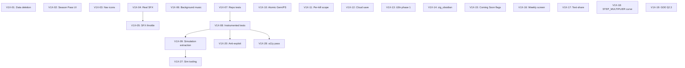

# Roadmap Plan V1X — v1.x Patch Sequence

Post-launch work derived from the GitHub issue triage on 2026-05-25 (`docs/external-reviews/2026-05-25-issue-triage.md`). 33 open issues triaged; 16 verified-accurate findings, 4 already-tracked debt items, 11 strategic roadmap proposals, plus 2 closed-track-blocking fixes (#19, #20) excluded as they are landing on `main` via `fix/19-20-uw-autotrigger-and-seeding`.

This plan is **post-launch**. It is not a release blocker. The closed-track ≥14-day window for AAB v14 is the active gating activity. V1X work begins after v1.0.0 ships to production and the staged rollout completes.

Total scope: ~29 sub-plans across 6 versioned patch releases. Two Room migrations expected (one for #35/#51 atomic-spend wiring, one for #36 cloud save). One major architectural refactor (#37). Several content-bundle ships (#38, #45). Test count expected to move from 656 → ~910.

The triage document already proposed a 6-patch phasing; this plan inherits that structure and turns each patch into a wave.

---

## Sub-Plan Index

| # | Sub-Plan | Wave | Issue(s) | Description | Effort |
|---|---|---|---|---|---|
| V1X-01 | In-app data deletion UI | 1 | #48 | Settings → Delete All Data action wires SQLCipher wipe + 6 SharedPreferences clears + Keystore key deletion + WorkManager cancel + Activity recreate | 1 day |
| V1X-02 | Season Pass UI revamp | 1 | #47 | Surface `seasonPassExpiry` from `StoreUiState`; deep-link to Play subscription management; free-vs-paid comparison | 0.5–1 day |
| V1X-03 | Per-screen navigation icons | 1 | #33 | Replace 9× `Icons.Default.Star` placeholders with category-appropriate icons | 30 min |
| V1X-04 | Real SFX assets | 2 | #38 | Replace placeholder sine-wave .ogg files with Kenney.nl CC0 sound bank — no code changes | 1 day |
| V1X-05 | Frequency-aware SFX throttle | 2 | #46 | Replace 100 ms hard gate with `attackInterval`-scaled throttle so RAPID_FIRE L10 + MULTISHOT actually feels right | 1–2 hours |
| V1X-06 | Background music system | 2 | #39 | MediaPlayer + audio-focus listener + 2 source tracks + Settings UI volume control | 2–3 days |
| V1X-07 | Repository unit-test coverage | 3 | #42 | Add ~30–40 tests across the 4 highest-priority repo impls (Workshop / Player / UltimateWeapon / Card) — pattern established by #20 fix | 4–5 days |
| V1X-08 | Instrumented test infrastructure | 3 | #32, #21 | Stand up `androidTest/` directory; first-pass coverage for battle surface lifecycle + Store IAP flow + deep-link routing | 1 week |
| V1X-09 | Simulation extraction | 3 | #37, #25, #27 | Move simulation tick + entity collection from `presentation/battle/engine/GameEngine` to `domain/battle/engine/Simulation` | 3–4 days |
| V1X-10 | Atomic Gem/PS spend (TOCTOU fix) | 3 | #35 | Apply `creditBattleStepsAtomic` pattern to `spendGemsAtomic` / `spendPowerStonesAtomic` — closes RO-09 #5 | 1 day |
| V1X-11 | Per-kill battle-step credit on @ApplicationScope | 3 | #51 | Move per-kill credit off `viewModelScope` so mid-round nav-away doesn't drop the trailing callback — closes RO-09 #6 | 30 min |
| V1X-12 | Snapshots cloud save | 4 | #36 | Play Games Services Snapshots API for Steps + Workshop + Lab state; conflict-resolution strategy = highest `lifetimeStepsEarned` wins | 1 week |
| V1X-13 | i18n string extraction (phase 1) | 4 | #34 | Extract battle screen + workshop labels + notification strings to `strings.xml`; introduce a `domain/Strings` interface for engine-internal floating-text strings | 2 weeks |
| V1X-14 | One ZIGGURAT_SKIN ships | content | #45 | Author `zig_obsidian` palette in `ZIGGURAT_COLOR_LOOKUP`; remove "Coming Soon" badge for that one cosmetic | 30 min |
| V1X-15 | Mark Tier 11+ + AUTO_UPGRADE_AI as Coming Soon | content | #43, #44 (AUTO_UPGRADE_AI half) | Surface `Biome.CELESTIAL_GATE` + `ResearchType.AUTO_UPGRADE_AI` consistently as v1.x deferred (badge + UI suppression) | 1 hour |
| V1X-15b | ENEMY_INTEL design + ship | content | #44 (ENEMY_INTEL half) | New 10-level Lab research: +2 %/lvl damage outer multiplier + UI overlays at L1/L5/L10 (next-wave composition / enemy HP % / boss countdown) | 1 week |
| V1X-16 | Weekly Challenges expanded view | content | #41 | Lightweight expansion in `CurrencyDashboardScreen` showing target / progress / time-remaining / 4-week history | 1 day |
| V1X-17 | Text-share for personal bests | content | #50 | `ShareCompat.IntentBuilder` from `PostRoundOverlay` + biome-unlock cinematic | 1 hour |
| V1X-18 | STEP_MULTIPLIER asymptotic curve | balance | #49 | Change cap formula from hard `min(level, 100)` clamp to asymptotic `1 - (1 - p)^level` so high levels degrade gracefully — coordinate with RO-09 #3 anti-cheat fix | 1 day |
| V1X-19 | GDD §2.3 reconciliation | docs | #40 | **Decision required:** either remove GPS / Exploration Mode from GDD, or scope as v1.x opt-in feature with privacy + battery work + Play data-safety re-review | 30 min OR 1–2 weeks |
| V1X-20 | Anti-exploit heuristics expansion | proposal | #22 | Layer additional progression-integrity heuristics on top of existing anti-cheat (RO-09 deferred items #3 + #4 form the foundation) | 2 weeks |
| V1X-21 | Privacy-safe telemetry | proposal | #23 | Local-only event log + opt-in upload abstraction; no third-party SDK | 1 week |
| V1X-22 | Onboarding + retention pacing | proposal | #24 | First-session UX redesign; tutorial overlay; first-ever-walk celebration; Day 2 / Day 7 retention hooks | 2 weeks |
| V1X-23 | Performance + battery profiling | proposal | #26 | Baseline Profiles, startup-time reduction, battery efficiency review of foreground service + Health Connect polling cadence | 1 week |
| V1X-24 | Modularisation + architectural constraints | proposal | #27 | Multi-module split (`:domain`, `:data`, `:presentation`, `:battle-engine`); enforce via `dependencyAnalysis` plugin | 1 week |
| V1X-25 | Long-term meta-progression | proposal | #28 | v2.x scope. Prestige system, ascension currency, build diversity beyond the 6 UW × 9 card combinatorial space | future |
| V1X-26 | Upgrade UX + decision support | proposal | #29 | "Best buy" badges, ROI sort in Workshop, per-stat impact preview in Cards screen | 1 week |
| V1X-27 | Internal balancing tooling | proposal | #30 | Headless simulation harness atop V1X-09 (extracted simulation core); regression-test economy curves | 1 week |
| V1X-28 | Thematic identity + a11y + monetisation pass | proposal | #31 | Cross-cutting design + accessibility + IAP review. Pairs with deferred Plan 24 (Accessibility) | 2 weeks |

---

## Wave Structure

| Wave | Items | Schema | Version | Goal |
|---|---|---|---|---|
| 1 | V1X-01, V1X-02, V1X-03 | None | v1.0.1 | Urgent post-launch polish landing within first week of production |
| 2 | V1X-04, V1X-05, V1X-06 | None | v1.0.2 | Audio overhaul — closes the "shipped with sine waves" debt that's tracked in STATE.md |
| 3 | V1X-07, V1X-08, V1X-09, V1X-10, V1X-11 | None | v1.1 | Testing infrastructure + simulation extraction + atomic-spend fixes; major refactor wave |
| 4 | V1X-12, V1X-13 | Yes (cloud save migration tracking) | v1.2 | Cloud save + i18n phase 1; both are user-trust gates |
| Content | V1X-14, V1X-15, V1X-15b, V1X-16, V1X-17 | None | bundled into v1.0.x as bandwidth allows | Content-only ships, no architectural blast radius |
| Balance | V1X-18 | None | v1.0.x or v1.1 | Coordinates with RO-09 deferred #3 — schedule accordingly |
| Docs | V1X-19 | None | any | Just needs the design decision; trivial code change once decided |
| Proposals | V1X-20 through V1X-28 | varies | v1.x and v2.x | Strategic backlog; not yet specced as sub-plans below |

Each wave produces a versioned release (v1.0.1, v1.0.2, v1.1, v1.2). Each wave gets its own AAB upload + smoke test before the next wave starts.

---

## Dependency Graph



V1X-07 (repo tests) lays the groundwork for V1X-08 (instrumented tests) by establishing repo-impl test patterns. V1X-08 then unblocks V1X-09 (simulation extraction) by giving the refactor a safety net. V1X-09 unblocks the strategic V1X-27 (balancing simulation tooling). V1X-04 must precede V1X-05 because the throttle isn't audible without real SFX. V1X-08 unblocks V1X-20 / V1X-28 once instrumented coverage exists.

---

## Execution Notes

**Per-PR protocol** (matches the project's R / R2 / R3 / R4 / RO-08…RO-12 cadence):

1. Branch named `feat/V1X-NN-short-slug` (or `fix/V1X-NN-...` if a sub-plan is purely a fix)
2. Failing regression test committed first (red), then the feature/fix
3. Full suite stays green
4. Doc-sync per `.kiro/steering/11-agent-protocol.md` PR Task-List Convention (AGENTS.md test count, CHANGELOG.md, source-files.md, structure.md if applicable, STATE.md, RUN_LOG.md)
5. PR title `feat(<area>): <summary> (V1X-NN)`
6. Merge → bump versionCode + versionName per the wave's target release tag → bundleRelease → upload to internal track → on-device smoke test → promote to production via staged rollout

**Versioning convention:**

- Wave 1 → v1.0.1 (versionCode 15+)
- Wave 2 → v1.0.2
- Wave 3 → v1.1
- Wave 4 → v1.2
- Content / balance / docs ships fold into the next versioned wave that's already in flight, OR ship as a patch release between waves

**Test count tracking:**

- Wave 1 end: ~660 (V1X-01 +5; V1X-02 +2; V1X-03 unchanged)
- Wave 2 end: ~665 (V1X-04 zero; V1X-05 +3; V1X-06 +5)
- Wave 3 end: ~830 (V1X-07 +35; V1X-08 +50 instrumented; V1X-09 +60; V1X-10 +8; V1X-11 +2)
- Wave 4 end: ~870 (V1X-12 +25; V1X-13 +15)

**Schema migrations:**

- v11 → v12: V1X-12 cloud-save tracking columns (`cloudLastSyncedAt`, `cloudConflictCount` on `PlayerProfileEntity`)

Migration requires Room schema export commit (`app/schemas/`).

**ADRs to write:**

- ADR-0011 — Atomic Gem / Power Stone spend (V1X-10, sibling of ADR-0003)
- ADR-0012 — Simulation extraction (V1X-09)
- ADR-0013 — Cloud save conflict resolution (V1X-12)
- ADR-0014 — i18n string-extraction strategy (V1X-13)
- ADR-0015 — STEP_MULTIPLIER asymptotic curve (V1X-18, supersedes hard-cap design from Plan 01)
- ADR-0016 — GPS / Exploration Mode reconciliation (V1X-19, drops feature from GDD)
- ADR-0017 — ENEMY_INTEL design (V1X-15b)

---

## Sub-Plan Details

*(Detailed specs for each V1X-NN sub-plan follow in the sections below.)*

### V1X-01 — In-app data deletion UI

**Source:** GitHub issue #48 (verified-accurate finding — Tier 1 in triage doc)

**Why:** Play Store user data policy "best practice" for apps collecting health data. Currently compliant via documented external Settings → Storage path, but in-app option is the policy-review-safe choice and avoids any risk of a Play Console policy flag during production review or v1.x re-review.

**Scope:** Add a "Delete All Data" action in `NotificationSettingsScreen` (or rename it `SettingsScreen`). Tapping it shows a 2-step confirmation dialog ("Are you sure?" → "This cannot be undone"). On confirm, perform the wipe sequence and recreate the Activity to reset all in-memory state.

**Wipe sequence (in order):**

1. Cancel all WorkManager work (`WorkManager.cancelAllWork()` — covers `StepSyncWorker`)
2. Stop foreground service (`stopService(StepCounterService)` intent)
3. Close the SQLCipher database connection (`AppDatabase.close()`)
4. Delete the database file (`context.deleteDatabase("steps_of_babylon.db")`)
5. Clear all SharedPreferences (6 wrappers: `BiomePreferences`, `MilestoneNotificationPreferences`, `NotificationPreferences`, `SoundPreferences`, `AntiCheatPreferences`, `StepIngestionPreferences`)
6. Delete the Android Keystore alias used by `DatabaseKeyManager` (`KeyStore.deleteEntry(...)`)
7. Recreate the Activity (`activity.recreate()`) — Hilt rebuilds the entire object graph; Room reseeds via `ensureSeedData` flows; user lands on a fresh Home screen with 0 Steps

**Files affected:**

- `presentation/settings/NotificationSettingsScreen.kt` — new "Delete All Data" Card with Material `Icons.Filled.Delete` icon, danger-styled (red tint)
- `presentation/settings/NotificationSettingsViewModel.kt` — new `deleteAllData(activity: Activity)` action; calls injected new `DataDeletionManager`
- `data/DataDeletionManager.kt` — NEW; `@Singleton @Inject constructor(@ApplicationContext, AppDatabase, KeyManager, WorkManager, prefs...)`; `suspend fun deleteAll(activity: Activity)`
- `di/DatabaseModule.kt` — provides `DataDeletionManager`

**Tests:**

- `data/DataDeletionManagerTest.kt` — Robolectric + real in-memory Room DB. Asserts:
  1. `WorkManager.cancelAllWork()` called
  2. Database file no longer exists post-call
  3. All 6 SharedPreferences are empty post-call
  4. `KeyStore.containsAlias` returns false for the DB key
  5. Idempotent: calling twice doesn't crash
- `presentation/settings/NotificationSettingsViewModelTest.kt` — adds 1 test that the VM action delegates to the manager and triggers `activity.recreate()`

Estimated test count delta: +5 tests.

**ADR:** none required (mechanical wipe; no design decision novel to v1.x).

**Acceptance:**

- Settings screen shows "Delete All Data" entry near bottom, danger-styled
- 2-step confirm prevents accidental tap
- Post-confirm: app returns to Home with 0 Steps, 0 Workshop levels, no equipped cards/UWs, no notifications scheduled, no widget data
- Foreground service stops; restarts only when user re-grants permissions on next session
- On-device smoke test confirms no orphaned Keystore alias (Settings → Apps → Steps of Babylon → Storage shows clean state)

---

### V1X-02 — Season Pass UI revamp

**Source:** GitHub issue #47 (verified-accurate finding — Tier 1 in triage doc)

**Why:** Currently `seasonPassExpiry` is computed in `StoreUiState` but never surfaced. Users who buy the Season Pass have no in-app way to see their expiry date or cancel the auto-renewing subscription, both of which are Play subscription policy expectations.

**Scope (lightweight, ~2 hours):**

1. Display expiry date in Store screen Season Pass row (e.g., "Active until 2026-06-15")
2. "Manage subscription" button below the row → deep-links to Play subscription management
3. Free-vs-paid feature comparison expanded inline

**Files affected:**

- `presentation/store/StoreScreen.kt` — expand the Season Pass card UI (`StoreScreen.kt:93-115`). New `Text(daysRemaining)` + `OutlinedButton("Manage subscription")` that fires `Intent(Intent.ACTION_VIEW, Uri.parse("https://play.google.com/store/account/subscriptions?package=$PACKAGE_NAME"))`
- `presentation/store/StoreViewModel.kt` — already exposes `seasonPassExpiry`; no VM change needed beyond a derived `daysRemaining: Int?` field for display
- `presentation/store/StoreUiState.kt` — add `daysRemaining: Int?` field

**Tests:**

- `presentation/store/StoreViewModelTest.kt` — 2 new tests: `daysRemaining` computation when Season Pass is active (expiry = today + 14 days → 14); `daysRemaining` is null when Season Pass is inactive

Estimated test count delta: +2 tests.

**ADR:** none required.

**Acceptance:**

- Season Pass row in Store shows "Active — N days remaining" when active, "Inactive" otherwise
- "Manage subscription" button opens Play subscription management
- Free-vs-paid comparison visible in the card (Walking Multiplier 100% vs 200%, Daily Gem bonus 0 vs 5, etc.)

**Heavy revamp (deferred):** A dedicated Season Pass screen with full benefit list, history, and rewards calendar (~1 day). Defer to v1.x bandwidth.

---

### V1X-03 — Per-screen navigation icons

**Source:** GitHub issue #33 (verified-accurate finding — Tier 1 in triage doc)

**Why:** 9 of 13 navigation routes share `Icons.Default.Star` (`Screen.kt:13-24`). UX confusion; first-impression issue for closed-test feedback. Also a TalkBack accessibility issue (#33 is also `accessibility`-labelled — the same icon resource gives every entry the same TalkBack `contentDescription` derived from the icon).

**Scope:** Replace each placeholder Star with a category-appropriate `Icons.Filled.*` icon. The `compose-material-icons-extended` dependency is already on the dep list (added by R4-04 for `Icons.Filled.Upgrade`; reused by R4-05 for `Icons.Filled.Help`).

**Mapping:**

| Screen | Current | Proposed |
|---|---|---|
| Stats | `Icons.Default.Star` | `Icons.Filled.BarChart` |
| Weapons | `Icons.Default.Star` | `Icons.Filled.AutoAwesome` (or `Bolt`) |
| Cards | `Icons.Default.Star` | `Icons.Filled.Style` |
| Supplies | `Icons.Default.Star` | `Icons.Filled.Inbox` |
| Economy | `Icons.Default.Star` | `Icons.Filled.AttachMoney` |
| Missions | `Icons.Default.Star` | `Icons.Filled.Flag` |
| Settings | `Icons.Default.Star` | `Icons.Filled.Settings` |
| Store | `Icons.Default.Star` | `Icons.Filled.ShoppingCart` |
| Help | `Icons.Default.Star` | `Icons.AutoMirrored.Filled.HelpOutline` (matches R4-05's HomeScreen icon) |

**Files affected:**

- `presentation/navigation/Screen.kt` — 9 line edits + 9 new imports

**Tests:** none (Compose UI surface, no JVM-testable change).

**ADR:** none required.

**Acceptance:**

- BottomNavBar (5 items: Home, Workshop, Battle, Labs, Stats) uses non-Star icon for Stats
- All 13 screens have visually distinct Material icons in any nav surface that uses them (drawer, hamburger, search results)
- TalkBack reading the BottomNavBar announces 5 distinct labels backed by 5 distinct icons
- R8 release build still strips unused icons from `material-icons-extended` (tree-shaking confirmed by APK size diff < 50 KB)

---

### V1X-04 — Real SFX assets

**Source:** GitHub issue #38 (verified-accurate finding — Tier 2 in triage doc; also tracked in STATE.md "Known issues / debt")

**Why:** All 7 SFX in `app/src/main/res/raw/` are placeholder sine-wave tones. Confirmed against `SoundManager.kt:16-22` — the 7 effects loaded are SHOOT, HIT, ENEMY_DEATH, UW_ACTIVATE, UPGRADE_PURCHASE, WAVE_START, ROUND_END. With real attacks happening 4–10 times per second at higher attack speeds and post-R4-03 RAPID_FIRE bursts, sine-wave SHOOT becomes physically painful.

**Scope:** Source 7 CC0-licensed effects from Kenney.nl (or equivalent) and replace the placeholder `.ogg` files. **Keep existing resource IDs** (`R.raw.sfx_shoot`, etc.) so no code changes are needed.

**Asset selection guide:**

| Effect | Style | Kenney.nl pack candidate |
|---|---|---|
| sfx_shoot | Short pluck/twang/click, ~80–120ms | "Sci-Fi Sounds" laser_small |
| sfx_hit | Sharp impact thud, ~100ms | "Impact Sounds" impact_metal |
| sfx_enemy_death | Crunchy explosion or pop, ~300ms | "Impact Sounds" explosion_small |
| sfx_uw_activate | Big swooshy chord/riser, ~600ms | "Sci-Fi Sounds" power_up_5 |
| sfx_upgrade_purchase | Cheerful chime, ~200ms | "Interface Sounds" confirm_short |
| sfx_wave_start | Horn/drum hit, ~400ms | "Interface Sounds" notification_2 |
| sfx_round_end | Triumphant chord, ~800ms | "Interface Sounds" success_long |

**License compliance:** Kenney.nl assets are CC0 — no attribution required, but adding "Sound effects by Kenney.nl (CC0)" to a future Credits screen is good citizenship.

**Files affected:**

- `app/src/main/res/raw/sfx_shoot.ogg` — replace
- `app/src/main/res/raw/sfx_hit.ogg` — replace
- `app/src/main/res/raw/sfx_enemy_death.ogg` — replace
- `app/src/main/res/raw/sfx_uw_activate.ogg` — replace
- `app/src/main/res/raw/sfx_upgrade.ogg` — replace
- `app/src/main/res/raw/sfx_wave_start.ogg` — replace
- `app/src/main/res/raw/sfx_round_end.ogg` — replace

**Tests:** none (asset content swap; no JVM-testable behavior change). Existing `SoundManager` smoke tests (none currently) would not need updating.

**ADR:** none required.

**Acceptance:**

- On-device playback of all 7 effects sounds professional, not painful
- File sizes under 50 KB each (.ogg compressed); total raw/ asset bundle stays under 350 KB
- APK size impact under 200 KB (Android compresses .ogg in APK, so net delta is small)

**Pairs with V1X-05** — frequency-aware throttle changes the SHOOT cadence, but unless V1X-04 is in place first, the throttle change isn't audibly meaningful (sine waves clip at any frequency).

---

### V1X-05 — Frequency-aware SFX throttle

**Source:** GitHub issue #46 (verified-accurate finding — Tier 2 in triage doc)

**Why:** `SoundManager.play()` currently has a hard 100ms gate on SHOOT (`SoundManager.kt:32-37`), capping audible shoots at 10/sec. After R4-03 (RAPID_FIRE L10 = 3.0× attack speed) and high MULTISHOT levels (post-R4-02b L10 = 11 targets), a player can technically fire ~30 projectiles/sec but only hear 10. Result: end-game weapon feedback feels hollow — directly contradicts the "reward for upgrading" feedback loop.

**Scope:** Replace the hard 100ms gate with a frequency-aware throttle that scales with the current `attackInterval`. At baseline 1 attack/sec, throttle = 100ms (unchanged from today). At 5 attacks/sec, throttle = 50ms. At 10 attacks/sec, throttle = 30ms (still throttled to prevent SoundPool channel exhaustion at 8 max streams).

**Algorithm:**

```kotlin
fun play(effect: SoundEffect, expectedIntervalMs: Long = 100L) {
    if (muted) return
    if (effect == SoundEffect.SHOOT) {
        val now = System.currentTimeMillis()
        // Scale throttle to ~1/3 of expected interval, floor 30ms, ceiling 100ms
        val throttle = (expectedIntervalMs / 3L).coerceIn(30L, 100L)
        if (now - lastShootTime < throttle) return
        lastShootTime = now
    }
    soundIds[effect]?.let { soundPool.play(it, volume, volume, 1, 0, 1f) }
}
```

Caller (`GameEngine` or `ZigguratEntity` projectile-fire site) passes `attackInterval * 1000`.

**Files affected:**

- `presentation/audio/SoundManager.kt` — `play(effect)` becomes `play(effect, expectedIntervalMs = 100L)`
- `presentation/battle/entities/ZigguratEntity.kt` (or wherever the SHOOT trigger fires) — pass `attackInterval * 1000` to `play(SoundEffect.SHOOT, ...)`
- New test file `presentation/audio/SoundManagerTest.kt` (Robolectric)

**Tests:**

- `SoundManagerTest.kt` — 3 new tests:
  1. Default 100ms throttle preserves backward compat (1 call → plays; 50ms later → throttled)
  2. Scaled throttle at 200ms expected interval allows ~67ms cadence (200/3 = 67)
  3. Floor enforced: at 30ms expected interval (would compute 10ms), throttle floors at 30ms

Estimated test count delta: +3 tests.

**ADR:** none required.

**Acceptance:**

- L1 Workshop attack speed (~1.0/sec): SHOOT cadence audibly identical to pre-fix
- L10 RAPID_FIRE active (~3.0/sec): SHOOT cadence audibly tripled, no clipping
- Late-game MULTISHOT 11 targets: each shot still triggers one SHOOT (already correct — multishot doesn't fire 11 separate sounds; it's one weapon firing 11 projectiles)
- SoundPool max streams (8) not exhausted in any combination; HIT/ENEMY_DEATH still play layered with SHOOT

---

### V1X-06 — Background music system

**Source:** GitHub issue #39 (verified-accurate finding — Tier 2 in triage doc)

**Why:** Battle screen is silent between SFX events. `grep` for `MediaPlayer|ExoPlayer` across the codebase returns nothing. Quality-of-life gap; closed-test feedback will note the lack of music as a weakness.

**Scope:** Add a `MusicManager` using `MediaPlayer` (not ExoPlayer — less dependency overhead, and looped playback is the only feature needed). 2 source tracks: `bgm_walking_calm.ogg` (Home / Workshop / Labs / non-battle screens) and `bgm_battle_intense.ogg` (Battle screen). Crossfade on screen transition. Audio focus listener pauses on phone call / Spotify / etc.

**Files affected:**

- `presentation/audio/MusicManager.kt` — NEW. Holds 2 `MediaPlayer` instances; `playWalkingMusic()` / `playBattleMusic()` / `pauseMusic()` / `resumeMusic()`. Implements `AudioManager.OnAudioFocusChangeListener`. Crossfade via `setVolume` over 500ms `Handler.postDelayed` ramp.
- `presentation/audio/MusicPreferences.kt` — NEW. SharedPreferences wrapper for music mute toggle + volume slider.
- `presentation/audio/SoundManager.kt` — no change; SFX and music are separate channels (different `usage` and `contentType` AudioAttributes).
- `presentation/MainActivity.kt` — instantiate `MusicManager` in `onCreate`; call `playWalkingMusic()` from `onResume`; observe nav state (via `NavController.currentBackStackEntryAsState()`) to switch tracks; release in `onDestroy`.
- `presentation/settings/NotificationSettingsScreen.kt` (or `SettingsScreen.kt`) — add Music volume slider + mute toggle in same UI block as the existing SFX volume controls.
- `presentation/settings/NotificationSettingsViewModel.kt` — add `setMusicVolume` / `setMusicMuted` actions wiring to `MusicPreferences`.
- `app/src/main/res/raw/bgm_walking_calm.ogg` — NEW asset (~2-3 min loopable, Kenney.nl or Pixabay CC0)
- `app/src/main/res/raw/bgm_battle_intense.ogg` — NEW asset

**Tests:**

- `presentation/audio/MusicManagerTest.kt` — Robolectric. 4 tests:
  1. `playWalkingMusic` starts the walking MediaPlayer, no battle MediaPlayer running
  2. `playBattleMusic` while walking is active triggers crossfade (both at 50% volume after 250ms, walking at 0% after 500ms)
  3. `pauseMusic` from audio focus loss pauses both instances
  4. `resumeMusic` from audio focus gain resumes only the active track
- `MusicPreferencesTest.kt` — 1 test: round-trip mute + volume

Estimated test count delta: +5 tests.

**ADR:** none required.

**Acceptance:**

- Walking music plays softly on Home / Workshop / Labs / Cards / Stats
- Battle music swaps in within 500ms of entering Battle screen
- Phone call interrupts music; music resumes on call end
- Mute toggle in Settings silences music without affecting SFX
- Volume slider 0–100% works in real time
- No audio glitches on screen rotation or process death/restart

**Asset license compliance:** Same as V1X-04 — Kenney.nl or Pixabay CC0 tracks; record license in `docs/release/credits.md` (NEW file as part of this PR).

---

### V1X-07 — Repository unit-test coverage

**Source:** GitHub issue #42 (verified-accurate finding — Tier 3 in triage doc)

**Why:** Only `CosmeticRepositoryImplTest` exists today. 7 other repo impls have zero direct tests. Bug-coverage analysis from the triage shows that issues #20 (Workshop/Lab additive seeding) and #18 (card pack persistence) would have been caught by direct repo tests with pre-seeded historical rows. The `WorkshopRepositoryImplTest` + `LabRepositoryImplTest` added by the #19/#20 fix bundle (commit `230309c`) establish the pattern.

**Scope:** Add ~30–40 tests across the 4 highest-priority repo impls:

| Repo | Priority | Tests | Coverage focus |
|---|---|---|---|
| WorkshopRepositoryImpl | (already partial post-#20) | +3 | Atomic purchase happy + insufficient + concurrent paths |
| PlayerRepositoryImpl | High | +8 | Wallet round-trip, atomic adjustments, lifetime counter desync |
| UltimateWeaponRepositoryImpl | High | +10 | Per-path level upgrades, isUnlocked transitions, equip slot enforcement (3 max) |
| CardRepositoryImpl | High | +12 | Copy-count incrementing, level-up consumes correct copies (rarity-scaled), pack opening duplicate handling |
| LabRepositoryImpl | (already partial post-#20) | +5 | Active research timer transitions, slot unlock, rush completion |
| StepRepositoryImpl | Medium | +5 | Daily record creation, escrow lifecycle, getDailyRecord queries |
| WalkingEncounterRepositoryImpl | Low | (defer) | — |
| BillingRepository | (already covered by `BillingManagerImplTest`) | — | — |

Total ~43 new tests.

**Files affected:**

- `data/repository/PlayerRepositoryImplTest.kt` — NEW
- `data/repository/UltimateWeaponRepositoryImplTest.kt` — NEW
- `data/repository/CardRepositoryImplTest.kt` — NEW
- `data/repository/StepRepositoryImplTest.kt` — NEW
- `data/repository/WorkshopRepositoryImplTest.kt` — extend existing file with 3 atomic-purchase scenarios
- `data/repository/LabRepositoryImplTest.kt` — extend existing file with 5 active-research scenarios

**Pattern (matches `WorkshopRepositoryImplTest.kt` post-#20):**

```kotlin
@RunWith(RobolectricTestRunner::class)
class PlayerRepositoryImplTest {
    private lateinit var db: AppDatabase
    private lateinit var dao: PlayerProfileDao
    private lateinit var repo: PlayerRepositoryImpl

    @Before fun setUp() {
        db = Room.inMemoryDatabaseBuilder(
            ApplicationProvider.getApplicationContext(),
            AppDatabase::class.java
        ).allowMainThreadQueries().build()
        dao = db.playerProfileDao()
        repo = PlayerRepositoryImpl(dao)
    }

    @After fun tearDown() = db.close()

    @Test fun `wallet observe emits initial empty profile after seed`() = runTest { ... }
    @Test fun `addCurrency atomic update of wallet + lifetimeEarned`() = runTest { ... }
    // etc.
}
```

**Tests:** see breakdown above. Total +43.

Estimated test count delta: +43 tests (656 → ~699 by end of V1X-07 alone).

**ADR:** none required (test-only addition; pattern already established).

**Acceptance:**

- All 4 high-priority repo impls have direct test coverage
- Each test uses real in-memory Room DB (Robolectric), not fake DAOs — exercises actual SQL
- Atomic-transaction tests use the @Transaction default-method seam to verify atomicity under simulated concurrency
- Suite runtime grows by ~5–10s; still well under 60s total
- All tests pass on first run on a clean checkout

---

### V1X-08 — Instrumented test infrastructure

**Source:** GitHub issue #32 (verified-accurate finding — Tier 3 in triage doc) + GitHub issue #21 (roadmap proposal)

**Why:** Glob `androidTest/**` returns zero files. Project has zero instrumented tests. R3-01 (battle backgrounding state loss) and #19 (UW auto-trigger race) both ship as JVM-only Robolectric tests because there's no instrumented suite. Robolectric is good but cannot exercise true Android lifecycle, real foreground services, real Health Connect SDK calls, or true SurfaceView rendering.

**Scope (Phase 1 — infrastructure + 3 high-value suites):**

1. Set up `app/src/androidTest/java/com/whitefang/stepsofbabylon/` directory + AndroidJUnitRunner config
2. Add Hilt-android-testing for instrumented DI
3. Three first-pass test suites:

| Suite | Coverage | Why |
|---|---|---|
| `BattleSurfaceLifecycleTest` | Full Battle activity launch + backgrounding + foregrounding cycle | Catches R3-01-class bugs that Robolectric can't |
| `StoreIapFlowTest` | Mock BillingClient → product query → purchase → consume; happy + cancelled + pending paths | Catches Plan 31 closed-track regressions |
| `DeepLinkIntentTest` | All 13 deep-link routes via `Intent.setData`; verifies nav state | Catches `Screen.argumentFreeRoutes` drift |

**Files affected:**

- `app/build.gradle.kts` — add `testInstrumentationRunner = "com.whitefang.stepsofbabylon.HiltTestRunner"`; add `dagger.hilt.android.testing` dep + `androidx.test:runner` + `androidx.test.ext:junit` (likely already present transitively)
- `gradle/libs.versions.toml` — add `hilt-android-testing` entry mirroring existing `hilt` version
- `app/src/androidTest/java/com/whitefang/stepsofbabylon/HiltTestRunner.kt` — NEW. AndroidJUnitRunner subclass that swaps `Application` to `HiltTestApplication`.
- `app/src/androidTest/AndroidManifest.xml` — NEW. Hilt test app reference.
- `app/src/androidTest/java/com/whitefang/stepsofbabylon/battle/BattleSurfaceLifecycleTest.kt` — NEW. ~10 tests using `ActivityScenario` + Espresso.
- `app/src/androidTest/java/com/whitefang/stepsofbabylon/store/StoreIapFlowTest.kt` — NEW. ~15 tests using `FakeBillingManager` + Espresso.
- `app/src/androidTest/java/com/whitefang/stepsofbabylon/navigation/DeepLinkIntentTest.kt` — NEW. ~13 tests, one per route, using `Intent` + `IntentsTestRule`.

**Test runner:**

- Add `connectedDebugAndroidTest` task to `run-gradle.sh` examples in README
- Document required emulator (API 34+) in plan-V1X-roadmap.md acceptance section

**Tests:** ~38 instrumented tests in the new androidTest source set. JVM test count unchanged.

Estimated test count delta: +0 JVM, +38 instrumented (656 + 43 from V1X-07 → 699 JVM after Wave 3 first half).

**ADR:** none required at this scope. If future instrumented test patterns warrant codification, consider an ADR-0016 in a follow-up V1X-08.x ticket.

**Acceptance:**

- `./gradlew connectedDebugAndroidTest` runs on a connected emulator and passes
- All 3 suites green
- CI pipeline (when added) gates on both JVM + instrumented suites
- Backgrounding the battle activity in BattleSurfaceLifecycleTest preserves wave state (the R3-01 regression guard at instrumented level)

---

### V1X-09 — Simulation extraction

**Source:** GitHub issue #37 (verified-accurate finding — Tier 3 in triage doc) + GitHub issue #25 (replay testing) + GitHub issue #27 (modularisation proposal)

**Why:** `GameEngine.kt` lives in `presentation/`, imports `android.graphics.Canvas` directly, and is ~700 lines of mixed simulation + entity-system + auto-trigger + cosmetic-resolution + render logic. Pure simulation logic (wave spawn timing, entity tick, collision, stat resolution) is logically domain code. Mixing it with rendering violates the Clean Architecture invariant declared in `AGENTS.md` ("`domain/` must have zero Android imports") and prevents the kind of headless deterministic-replay testing #25 calls for.

**Scope (Option C from triage — partial extraction):**

Extract the simulation tick + entity collection + stat resolution into a new `domain/battle/engine/Simulation` class. `GameEngine` retains the rendering host role and delegates simulation to the new domain class.

**New layout:**

```
domain/battle/engine/
├── Simulation.kt          # NEW. Pure-Kotlin simulation tick.
├── SimulationState.kt     # NEW. Snapshot data class (entities, wave, cash, etc.) — immutable
├── SimulationEvent.kt     # NEW. Sealed event types emitted from tick (EnemyDeath, BossKilled, WaveComplete, UWTriggered, FloatingTextRequested)
└── EntityProtocol.kt      # NEW. Pure-Kotlin entity interface (no Canvas)

presentation/battle/engine/
├── GameEngine.kt          # SHRUNK. Holds Simulation + entity render delegates. update() forwards to Simulation. render() loops entities and dispatches Canvas calls.
├── EntityRenderer.kt      # NEW. Maps entity types to Canvas render impls (split out of Entity.render())
└── ... (other files unchanged)
```

**Migration approach:**

1. Create `domain/battle/engine/Simulation.kt` empty
2. Move pure-logic methods from `GameEngine` one-by-one: `tickWaveSpawner`, `tickEntities`, `tickCollisions`, `tickRapidFire`, `tickRecoveryPackages`, `tickRapidFire`, `updateUWs`, `applyDamageToZiggurat`, `applyThorn`, `applyLifesteal`, `handleEnemyDeath`. Each move: keep delegating call site in `GameEngine` to preserve the engine's public API.
3. Replace `Canvas`-using paths in entities with `EntityRenderer.render(entity, canvas)`. Domain `Entity` interface has `update(deltaTime, world)`; rendering is dispatched in `presentation/`.
4. Replace `Volatile` callback fields with `SimulationEvent` flow: `Simulation` exposes `Flow<SimulationEvent>`, `BattleViewModel` collects.
5. Extract `applyStats` / `setStats` cleanly; `Simulation` owns ResolvedStats.

**Files affected:**

- `domain/battle/engine/Simulation.kt` — NEW (~400 LOC pure Kotlin)
- `domain/battle/engine/SimulationState.kt` — NEW (~80 LOC immutable data class)
- `domain/battle/engine/SimulationEvent.kt` — NEW (~30 LOC sealed class)
- `domain/battle/engine/EntityProtocol.kt` — NEW (~40 LOC interface)
- `presentation/battle/engine/GameEngine.kt` — SHRUNK from ~700 to ~250 LOC; holds `Simulation` instance + render delegates
- `presentation/battle/engine/EntityRenderer.kt` — NEW (~150 LOC); maps entity types to Canvas calls
- `presentation/battle/entities/*` — split each into pure-Kotlin update logic (`domain/battle/entity/`) + Canvas render impl (`presentation/battle/entities/`)
- `presentation/battle/BattleViewModel.kt` — collect `simulation.events` instead of polling `engine.uiSnapshot`

**Tests:**

- `domain/battle/engine/SimulationTest.kt` — NEW. ~50 tests covering all the moved logic in pure-Kotlin (no Robolectric needed). Replaces ~30 of the existing `GameEngineTest.kt` tests.
- `presentation/battle/engine/GameEngineTest.kt` — keep ~20 tests focused on rendering host role (cosmetic overrides, biome theme application)
- New replay golden test scaffolding (V1X-27 builds on this)

Estimated test count delta: +60 net JVM tests (some moved from `GameEngineTest`, many added on the pure simulation seam).

**ADR:** **ADR-0012 — Simulation extraction.** Records the decision (Option C partial vs Option A full vs Option B keep-as-is), the rationale (testing leverage + Clean Architecture compliance + V1X-27 enablement), and the migration approach.

**Acceptance:**

- `domain/battle/engine/` exists; zero Android imports
- `Simulation` is fully testable with pure-JVM tests; no Robolectric required
- Existing GameEngineTest scenarios (RAPID_FIRE timer, RECOVERY_PACKAGES heal, CHRONO_FIELD enemy slow, GOLDEN_ZIGGURAT fortune stacking) ALL pass post-extraction
- Battle screen visually identical pre- and post-refactor (no rendering regression)
- AAB size unchanged (within 5%)
- Suite runtime stays under 60s

**Risk:** This is a substantial refactor. Schedule for early in Wave 3 so V1X-08 (instrumented tests) can serve as the safety net. Pair with a dedicated PR review window.

---

### V1X-10 — Atomic Gem / Power Stone spend (TOCTOU fix)

**Source:** GitHub issue #35 (already-tracked debt — RO-09 deferred finding #5; user requested full sub-plan spec)

**Why:** Currently `PlayerRepositoryImpl.spendGems(amount)` and `spendPowerStones(amount)` perform a non-atomic check-then-deduct sequence:

```kotlin
suspend fun spendGems(amount: Long): Boolean {
    val current = dao.get().first()?.gemBalance ?: return false
    if (current < amount) return false
    dao.adjustGemBalance(-amount)
    return true
}
```

Under simulated concurrency (two simultaneous purchases in the Store, or a Lab rush + Card pack opening triggered close together), both reads can return `current = 100`, both pass the check, and both deduct, producing a -50 balance silently corrected by a separate clamp elsewhere. The wallet stays correct at 0 due to non-negative clamps (CurrencyGuardTest), but the lifetime-spent counter on the Stats screen over-counts.

**Severity per RO-09:** Cosmetic (Stats lifetime-spent display drift only). But the fix shape is proven by `creditBattleStepsAtomic` and `creditBossPowerStonesAtomic` (both shipped in R4-07), so applying it to gem/PS spend is mechanical and worth doing as part of v1.x cleanup.

**Scope:** Add 2 new SQL-guarded atomic deduct methods to `PlayerProfileDao`, mirroring the shape of `adjustStepBalanceIfSufficient` (B.2 PR 1):

```kotlin
@Query("""
    UPDATE player_profile
    SET gemBalance = gemBalance - :amount,
        lifetimeGemsSpent = lifetimeGemsSpent + :amount
    WHERE id = 1 AND gemBalance >= :amount
""")
suspend fun adjustGemBalanceIfSufficient(amount: Long): Int

@Query("""
    UPDATE player_profile
    SET powerStoneBalance = powerStoneBalance - :amount,
        lifetimePowerStonesSpent = lifetimePowerStonesSpent + :amount
    WHERE id = 1 AND powerStoneBalance >= :amount
""")
suspend fun adjustPowerStoneBalanceIfSufficient(amount: Long): Int
```

Returns the number of rows updated (1 = success, 0 = insufficient). Caller checks return value:

```kotlin
suspend fun spendGems(amount: Long): Boolean =
    dao.adjustGemBalanceIfSufficient(amount) == 1
```

**Repository contract change:** `spendGems` / `spendPowerStones` already return `Boolean`. The contract is unchanged; only the implementation becomes atomic.

**Schema impact:** Two existing columns `lifetimeGemsSpent` and `lifetimePowerStonesSpent` already exist on `PlayerProfileEntity` (verify via `data/local/PlayerProfileEntity.kt`). If they don't exist, this becomes a v11 → v12 migration adding them. **Investigation required as part of V1X-10 spike.**

If columns exist: no schema change; pure DAO-method addition.
If columns don't exist: add 2 NOT NULL DEFAULT 0 columns via `MIGRATION_11_12`.

**Files affected:**

- `data/local/PlayerProfileDao.kt` — 2 new atomic-deduct queries
- `data/repository/PlayerRepositoryImpl.kt` — `spendGems` and `spendPowerStones` rewritten to delegate to atomic queries
- `data/local/PlayerProfileEntity.kt` — verify lifetime-spent columns; add if missing
- `data/local/Migrations.kt` — `MIGRATION_11_12` (conditional on column existence)
- `data/local/AppDatabase.kt` — bump version conditional on schema change

**Tests:**

- `data/local/PlayerProfileDaoTest.kt` — NEW (or extend existing). 6 tests:
  1. `adjustGemBalanceIfSufficient` returns 1 + deducts when balance sufficient
  2. `adjustGemBalanceIfSufficient` returns 0 + balance unchanged when insufficient
  3. Lifetime-spent counter increments only on successful deduct
  4. Concurrent simulated double-spend: only one succeeds (test via `runBlocking` parallel coroutines)
  5. Same 4 tests for `adjustPowerStoneBalanceIfSufficient`
- `data/repository/PlayerRepositoryImplTest.kt` (added in V1X-07) — extended with 2 tests verifying `spendGems` / `spendPowerStones` delegate correctly

Estimated test count delta: +8 tests.

**ADR:** **ADR-0011 — Atomic Gem / Power Stone spend.** Sibling of ADR-0003 (Battle Step Rewards). Records the SQL-guarded deduct pattern, verifies it composes with existing `creditBattleStepsAtomic` shape, notes that lifetime-spent counter drift was the original symptom and is closed by the same atomic write.

**Acceptance:**

- `spendGems(amount)` returns `true` iff balance was sufficient and deduct succeeded
- Concurrent double-spend regression test passes — exactly one of two simultaneous spend calls succeeds
- Stats screen lifetime-spent counter does not drift positive after stress-test (manual: rapid purchase tapping in Store)
- All existing PlayerRepository call sites (`PurchaseGemPack`, `OpenCardPack`, `RushResearch`, `UnlockLabSlot`, `UnlockUltimateWeapon`, `UpgradeUltimateWeapon`) work unchanged

---

### V1X-11 — Per-kill battle-step credit on @ApplicationScope

**Source:** GitHub issue #51 (already-tracked debt — RO-09 deferred finding #6; user requested full sub-plan spec)

**Why:** `BattleViewModel` credits per-kill battle steps via `viewModelScope.launch { creditBattleStepsAtomic(...) }`. When the user navigates away mid-round, `viewModelScope` cancels and any in-flight credit coroutine is cancelled before the DB write commits. Result: ≤1 step lost per pending callback at the moment of nav-away. Not a wallet desync (Room's atomic `creditBattleStepsAtomic` either fully commits or doesn't), but the lifetime-step display drifts negative.

**Severity per RO-09:** Cosmetic (lifetime-step display drift only). Wallet remains correct via the atomic path.

**Fix shape:** Identical to B.3 PR 2's `onCleared` migration to `@ApplicationScope CoroutineScope`. The scope is already injected into `BattleViewModel` (the `runEndRoundPersistence` block uses it for mid-nav round persistence). Single-line change:

```kotlin
// BEFORE:
viewModelScope.launch {
    awardBattleStepsUseCase.invoke(today, kill.stepsReward)
}

// AFTER:
applicationScope.launch {
    awardBattleStepsUseCase.invoke(today, kill.stepsReward)
}
```

**Files affected:**

- `presentation/battle/BattleViewModel.kt` — single call-site flip from `viewModelScope` to `applicationScope` in the per-kill credit path

**Tests:**

- `presentation/battle/BattleViewModelTest.kt` — 2 new tests:
  1. Per-kill credit launched in `applicationScope` survives `viewModelScope.cancel()` — verify by injecting a fake `applicationScope` whose Job is independently observable
  2. Mid-round nav-away mid-credit completes the credit (Robolectric, with a delay between kill and `cancel()`)

Estimated test count delta: +2 tests.

**ADR:** none required (single-line fix; pattern documented by B.3 PR 2's existing rationale in STATE.md and the `@ApplicationScope` @Qualifier in `di/CoroutineScopeModule.kt`).

**Acceptance:**

- Per-kill battle-step credit completes successfully when user navs away mid-round
- Lifetime-step counter on Stats screen does not drift negative after rapid round-quit stress test (manual: kill → quit → kill → quit cadence)
- All existing BattleViewModel tests pass
- No new Robolectric setup needed; existing `applicationScope` injection in `BattleViewModelTest` is reusable

---

### V1X-12 — Snapshots cloud save

**Source:** GitHub issue #36 (verified-accurate finding — Tier 4 in triage doc)

**Why:** `allowBackup="false"` is correctly set in AndroidManifest (privacy + SQLCipher concerns), but no cloud save path exists. Trust risk: real for a fitness game where progression = real walking effort. Losing months of step progress on device wipe / phone change is the kind of issue that causes 1-star reviews and refund requests. Settings warning at minimum for v1.0; full Snapshots API for v1.x.

**Scope (this sub-plan = full Snapshots integration):**

Use Google Play Games Services Snapshots API to back up:

- Player wallet (`PlayerProfileEntity`)
- Workshop levels (full `WorkshopUpgradeEntity` table)
- Lab research progress (`LabResearchEntity` table — including in-progress timers)
- Card inventory + level + copies (`CardInventoryEntity` table)
- UW state (`UltimateWeaponStateEntity` table — per-path levels post-R4-06)
- Daily login streak + lifetime counters

NOT backed up:

- Daily step records (privacy + size — covered by Health Connect)
- Walking encounters (transient inbox)
- Cosmetic ownership (re-derivable from milestone state)
- Billing receipts (re-fetched from Play Billing on next launch)

**Conflict resolution strategy (locked decision for ADR-0013):** highest `lifetimeStepsEarned` wins. Step lifetime is the single irreversible monotonic counter in the system. If two devices have diverged save data, the one with higher lifetime steps is treated as the canonical newer state.

**Sync triggers:**

1. App background event (`onPause` of MainActivity)
2. Round end (post-`runEndRoundPersistence` commit)
3. Manual sync button in Settings
4. App foreground after >24h gap

**Schema additions for sync tracking:**

`PlayerProfileEntity` adds:
- `cloudLastSyncedAt: Long = 0` — wall-clock ms of last successful sync
- `cloudConflictCount: Int = 0` — diagnostic counter incremented on each conflict-resolution event

Migration v11 → v12 adds these 2 columns.

**Files affected:**

- `data/cloud/SnapshotManager.kt` — NEW (~250 LOC). Wraps `SnapshotsClient`. `suspend fun saveSnapshot(snapshot: SaveData)`, `suspend fun loadSnapshot(): SaveData?`, `suspend fun resolveConflict(local, remote): SaveData`.
- `data/cloud/SaveData.kt` — NEW. Serializable bundle of all backed-up entities. JSON via kotlinx.serialization (already on dep list).
- `data/cloud/CloudSyncWorker.kt` — NEW @HiltWorker. Periodic + immediate workers.
- `domain/usecase/SyncToCloud.kt` — NEW. Aggregates entity flows into `SaveData`, calls `SnapshotManager.saveSnapshot`.
- `domain/usecase/RestoreFromCloud.kt` — NEW. Calls `loadSnapshot`, runs conflict resolution, applies to local DB via `withTransaction { ... }`.
- `data/local/PlayerProfileEntity.kt` — 2 new columns
- `data/local/Migrations.kt` — `MIGRATION_11_12`
- `data/local/AppDatabase.kt` — version 11 → 12
- `data/repository/PlayerRepositoryImpl.kt` — exposes `cloudLastSyncedAt` flow for Settings UI
- `presentation/MainActivity.kt` — Google Sign-In button + sign-in result handler; wires `onPause` sync trigger
- `presentation/settings/NotificationSettingsScreen.kt` — new "Cloud Save" section: sign-in status, last sync time, manual "Sync now" button
- `app/build.gradle.kts` — add `play-services-games-v2` + `play-services-auth`
- `gradle/libs.versions.toml` — new entries for Play Games Services SDK
- New AdMob-style `BuildConfig.GAMES_SERVICES_GAME_ID` — set in `app/build.gradle.kts`
- AndroidManifest.xml — `<meta-data>` for game ID

**Play Console setup:**

- Enable Play Games Services for the app in Play Console
- Configure Snapshots feature (max 1 snapshot, max 1 MB)
- Document new permissions in privacy policy update (NEW: `docs/release/privacy-policy.md` revision)

**Tests:**

- `data/cloud/SnapshotManagerTest.kt` — Robolectric. ~12 tests covering serialization round-trip, conflict-resolution rule, error paths (auth fail, network fail, snapshot conflict).
- `domain/usecase/SyncToCloudTest.kt` — pure JVM. ~8 tests covering aggregation correctness across all backed-up entities.
- `domain/usecase/RestoreFromCloudTest.kt` — pure JVM. ~5 tests covering local-DB application, transaction atomicity, conflict-counter increment.

Estimated test count delta: +25 tests.

**ADR:** **ADR-0013 — Cloud save conflict resolution.** Records (1) what's synced and what's not, (2) why `lifetimeStepsEarned` is the canonical conflict tiebreaker, (3) sync trigger schedule, (4) sign-in optionality (cloud save is opt-in; offline play unaffected if user declines).

**Acceptance:**

- User can sign in to Google Play Games from Settings; sign-in status reflected in real time
- First post-sign-in launch on a new device restores cloud save successfully (verify by manual cross-device test)
- Round-end and `onPause` trigger automatic background sync
- Conflict resolution returns the higher-`lifetimeStepsEarned` save without UI prompt; conflict counter increments
- Manual "Sync now" button shows in-progress spinner + success/error toast
- Privacy policy updated to disclose Play Games Services + Google account email collection
- Play Console privacy review re-submitted (the second submission reflects Play Games Services SDK addition)

**Risk:** Privacy policy update + Play Console re-review may add 3–5 days to v1.2 timeline. Consider dropping V1X-12 to v1.3 if Wave 4 timeline pressure mounts.

---

### V1X-13 — i18n string extraction (phase 1)

**Source:** GitHub issue #34 (verified-accurate finding — Tier 2 in triage doc)

**Why:** `strings.xml` has only one entry (`app_name`). Every UI string is hardcoded in Kotlin. Hard blocker for non-English markets. Lint's `HardcodedText` rule appears to be suppressed or escaping reach — investigate as part of this PR. Estimated total scope is large; this sub-plan covers **phase 1 only** (battle screen + workshop labels + notification text). Phases 2 and 3 fold into v1.3 / v1.4.

**Scope (Phase 1):**

| Surface | Strings | Approach |
|---|---|---|
| Battle screen UI (HUD, overlays, buttons) | ~30 strings | Direct `stringResource(...)` extraction |
| Workshop screen labels + categories | ~20 strings | Direct extraction |
| Notification text (StepNotificationManager + SupplyDropNotificationManager + MilestoneNotificationManager) | ~15 strings | Direct extraction |
| Engine-internal floating-text strings ("RAPID FIRE!", "+N PS", etc.) | ~10 strings | NEW `domain/Strings` interface + Hilt-injected impl reading resources |

**Engine-internal strings — design constraint:**

`GameEngine` lives in `presentation/` today (V1X-09 may move it to `domain/`). Either way, the simulation needs to emit display strings without directly reading Android resources from the engine class. Solution: introduce a `domain/Strings` interface:

```kotlin
package com.whitefang.stepsofbabylon.domain

interface Strings {
    fun rapidFireBurst(): String
    fun bossDropPs(amount: Int): String
    fun lifestealHp(amount: Int): String
    fun recoveryHeal(percent: Float): String
    // ...
}
```

`data/AndroidStrings.kt` implements with `Context.getString(R.string....)`. `GameEngine` (or `Simulation` post-V1X-09) takes `Strings` as constructor param. Tests inject a `FakeStrings` impl.

**Files affected:**

- `app/src/main/res/values/strings.xml` — populated with ~75 string resources
- `app/src/main/res/values-en/strings.xml` — same (default; safety net if `values/` collisions occur in v1.4 phase 3)
- `presentation/battle/BattleScreen.kt` — `~30` `Text("Foo")` → `Text(stringResource(R.string.battle_foo))`
- `presentation/battle/ui/PostRoundOverlay.kt` — same
- `presentation/battle/ui/PauseOverlay.kt` — same
- `presentation/battle/ui/InRoundUpgradeMenu.kt` — same
- `presentation/workshop/WorkshopScreen.kt` — same
- `presentation/workshop/UpgradeCard.kt` — same
- `service/StepNotificationManager.kt` — same
- `service/SupplyDropNotificationManager.kt` — same
- `service/MilestoneNotificationManager.kt` — same
- `domain/Strings.kt` — NEW interface
- `data/AndroidStrings.kt` — NEW impl + `@Singleton @Inject constructor(@ApplicationContext)`
- `di/StringsModule.kt` — NEW `@Binds Strings → AndroidStrings`
- `presentation/battle/engine/GameEngine.kt` — Inject `Strings`; replace string literals with calls
- `app/src/test/.../fakes/FakeStrings.kt` — NEW for VM/engine tests

**Lint config audit:**

Add to `app/build.gradle.kts`:
```kotlin
android {
    lint {
        warningsAsErrors += "HardcodedText"
        // ... existing config
    }
}
```

This will fail the build if any new hardcoded strings appear in UI files going forward. Document the policy in `docs/architecture.md`.

**Tests:**

- `presentation/...Test.kt` files unchanged (Compose tests don't typically check string content; the `Strings` interface is verified via VM tests)
- Engine tests: existing `GameEngineTest.kt` tests that assert FloatingText content (R3-02 lifesteal test, R4-07 boss-drop PS test) updated to assert via `FakeStrings.lifestealHp(amount)` instead of literal "+N HP" string

Estimated test count delta: +15 tests (covering the new `AndroidStrings` impl + `Strings` interface contract). Existing engine tests modified, not duplicated.

**ADR:** **ADR-0014 — i18n string-extraction strategy.** Records the phase 1/2/3 split, the `domain/Strings` interface pattern, the lint policy, and the deferred-translation approach (v1.3 = pseudo-locale testing; v1.4 = first non-English locale shipped).

**Acceptance:**

- All Phase 1 strings (battle + workshop + notifications + engine-internal) live in `strings.xml`
- Lint runs `HardcodedText` as error; no violations
- App runs identically in English (the only locale)
- Pseudo-locale via developer options still renders correctly (longer strings don't break layouts)
- Engine tests use `FakeStrings` consistently; no string-literal assertions remain

**Phase 2 / 3 (deferred to v1.3 / v1.4):**

- Phase 2: All remaining screens (Cards, UWs, Labs, Stats, Settings, Help, Store, Economy, Missions, Supplies)
- Phase 3: First localization (Spanish or German based on Play Console install data once available)

---

### V1X-14 — One ZIGGURAT_SKIN ships (`zig_obsidian`)

**Source:** GitHub issue #45 (already-tracked debt — see STATE.md "Known issues / debt"; user requested full sub-plan spec)

**Why:** 7 cosmetics ship "Coming Soon" in Store. Pipeline (RO-07 cosmetic renderer override) is fully wired for ZIGGURAT_SKIN — proven by C.2 PR 2 / 3 / 3b / 3c shipping `zig_jade`, `lapis_lazuli_skin`, `garden_ziggurat_skin`, `sandals_of_gilgamesh`. The 4 cosmetics with palettes work end-to-end. The 3 remaining ZIGGURAT_SKIN seeds (`zig_obsidian`, `zig_crystal`, `zig_golden`) just need palette data added to `ZIGGURAT_COLOR_LOOKUP` in `CosmeticRepositoryImpl`. The 4 non-ziggurat seeds (`proj_fire`, `proj_lightning`, `enemy_shadow`, `enemy_neon`) require new override consumers — out of scope for this sub-plan.

**Scope:** Ship one of the 3 remaining ZIGGURAT_SKIN cosmetics — `zig_obsidian` — with a dark-stone palette appropriate to its name. Cost-asymmetric: this is ~30 minutes of content edit + test write.

**Palette (locked by this sub-plan, recordable in ADR-0008's amendment):**

```kotlin
"zig_obsidian" to listOf(
    Color.parseColor("#1A1A1A").toArgb(),  // Outer layer 1: deep obsidian black
    Color.parseColor("#2D2D2D").toArgb(),  // Layer 2
    Color.parseColor("#3F3F3F").toArgb(),  // Layer 3 (mid)
    Color.parseColor("#525252").toArgb(),  // Layer 4
    Color.parseColor("#7A6F4D").toArgb(),  // Apex: dim gold-bronze contrast (mythological obsidian-bronze ziggurats had bronze caps)
)
```

5 stops correspond to the 5 stepped ziggurat layers (matches `ZigguratEntity` rendering pattern from C.2 PR 1).

**Files affected:**

- `data/repository/CosmeticRepositoryImpl.kt` — add `"zig_obsidian"` entry to `ZIGGURAT_COLOR_LOOKUP`. **No new seed row needed** — the existing seed row from initial cosmetic seeding already exists; this just adds the palette so the override pipeline picks it up.

**Tests:**

- `data/repository/CosmeticRepositoryImplTest.kt` — extend with 1 new test asserting `zig_obsidian` in `ZIGGURAT_COLOR_LOOKUP` with the 5 expected ARGB values. Mirrors the existing 4-cosmetic exact-value tests.

Estimated test count delta: +1 test.

**ADR:** none required (mechanical content add; the precedent is set by C.2 PR 2 / 3 / 3b / 3c).

**Acceptance:**

- `zig_obsidian` becomes purchasable in Store (no longer "Coming Soon")
- Equipping `zig_obsidian` on a battle round visually swaps ziggurat layer colors to the obsidian palette
- Existing cosmetic ownership survives the content drop (per the C.2 PR 2 `ensureSeedData` per-cosmeticId filter pattern)

**Out of scope:**

- `zig_crystal`, `zig_golden` — same mechanic but design choice required for palette. Each can ship as V1X-14b / V1X-14c when palettes are decided.
- `proj_fire`, `proj_lightning` — require new `ProjectileEntity` override consumer. ~1 day each.
- `enemy_shadow`, `enemy_neon` — require new `EnemyEntity` override consumer. ~1 day each.

The 6 remaining cosmetics roll into v1.x content as bandwidth allows.

---

### V1X-15 — Mark Tier 11+ + AUTO_UPGRADE_AI as Coming Soon

**Source:** GitHub issue #43 (verified-accurate finding) + GitHub issue #44 (already-tracked debt; user requested full sub-plan spec). User decision 2026-05-26: CELESTIAL_GATE stays deferred; AUTO_UPGRADE_AI stays deferred; ENEMY_INTEL gets design content shipped via the new V1X-15b below.

**Why:** Two parallel issues with identical fix shape:

1. **#43:** `Biome.CELESTIAL_GATE` is mapped to tier 11..Int.MAX_VALUE in `Biome.kt`, but `TierConfig` caps at Tier 10. Players can never reach `CELESTIAL_GATE`. The biome name and concept appear in the GDD but the unlock is a dead enum.
2. **#44 (AUTO_UPGRADE_AI half):** `ResearchType.AUTO_UPGRADE_AI` is flagged `isComingSoon = true` (RO-11 #B.2) but still appears in the Labs UI as a "Coming Soon" row. No v1.x design appetite per user decision 2026-05-26.

ENEMY_INTEL is split out to V1X-15b below for proper v1.x design + ship.

**Scope:**

- Add `isComingSoon: Boolean = false` to `Biome` data class
- Set `Biome.CELESTIAL_GATE.isComingSoon = true`
- HomeScreen TierSelector renders Coming Soon biomes as locked with explanatory tooltip ("Reserved for v1.x — Tier 11+")
- LabsScreen filters out only `AUTO_UPGRADE_AI` (ENEMY_INTEL stays visible per V1X-15b)

**Files affected:**

- `domain/model/Biome.kt` — add `isComingSoon` field; flag CELESTIAL_GATE
- `presentation/home/TierSelector.kt` — render locked-style for Coming Soon biomes; add tooltip
- `presentation/labs/LabsScreen.kt` — filter `isComingSoon` items out of the list
- `presentation/labs/LabsViewModel.kt` — if `LabsUiState` exposes the full enum list, filter at the VM layer

**Tests:**

- `domain/model/BiomeTest.kt` — extend with 1 test: only CELESTIAL_GATE is flagged `isComingSoon`
- `presentation/labs/LabsViewModelTest.kt` — extend with 1 test: AUTO_UPGRADE_AI not visible in `LabsUiState.researchList` (ENEMY_INTEL IS visible per V1X-15b)
- `domain/model/ResearchTypeTest.kt` — update set-equality contract: AUTO_UPGRADE_AI is the **only** `isComingSoon` enum (was previously AUTO_UPGRADE_AI + ENEMY_INTEL; ENEMY_INTEL flips to wired in V1X-15b)

Estimated test count delta: +2 tests (1 new + 1 modified contract).

**ADR:** none required (consistent application of existing `isComingSoon` pattern).

**Acceptance:**

- HomeScreen Tier 11+ tier (if reached someday) shows CELESTIAL_GATE as locked
- Labs screen shows only the 9 wired research types (8 pre-V1X-15b + ENEMY_INTEL after V1X-15b lands)
- AUTO_UPGRADE_AI in-progress research state preserved (per the RO-11 #B.2 contract — research progress preserved for v1.x reactivation)
- All existing Labs tests pass

**Sequencing:** V1X-15 and V1X-15b can land in either order or together. Recommend bundling into one PR — they touch the same files (`ResearchTypeTest`, `LabsScreen`, `LabsViewModel`).

---

### V1X-15b — ENEMY_INTEL design + ship

**Source:** GitHub issue #44 (already-tracked debt; user decision 2026-05-26: design content for v1.x ship).

**Why:** ENEMY_INTEL was flagged `isComingSoon = true` in RO-11 #B.2 because no design existed. User has now approved designing v1.x content for it. Theme: "tactical awareness research — the better you understand your enemies, the harder you hit and the more you see."

**Design (locked by this sub-plan, recordable in ADR-0017):**

ENEMY_INTEL is a 10-level Lab research project that grants two stacked benefits:

1. **Combat (every level):** +2 % damage to all enemies per level. Outer multiplier on `ResolvedStats.damage` matching the existing DAMAGE_RESEARCH pattern from RO-11 #A.1, but at a smaller per-level coefficient (DAMAGE_RESEARCH = 5 %/lvl; ENEMY_INTEL = 2 %/lvl). Stacks multiplicatively with DAMAGE_RESEARCH and CRITICAL_RESEARCH.
2. **Information (level milestones):** UI overlays unlock at L1, L5, and L10:
   - **L1+:** During the 9-second wave cooldown phase, the wave announcement banner shows the **next wave's enemy composition** (e.g., "Next wave: 12 BASIC, 4 RANGED, 1 BOSS")
   - **L5+:** Each spawned enemy renders an **HP percentage** above its existing HP bar ("73 %" instead of just the bar). Pure visual; doesn't change combat math.
   - **L10:** HUD displays a **boss-arrival countdown** when the next wave will contain a boss ("Boss in 18s")

**Cost + time curve (matches existing CASH_RESEARCH pattern):**

| Parameter | Value | Source pattern |
|---|---|---|
| baseCostSteps | 8,000 | CASH_RESEARCH |
| costScaling | 1.5× | CASH_RESEARCH |
| baseTimeHours | 4 | CASH_RESEARCH |
| timeScaling | 1.10× | CASH_RESEARCH |
| maxLevel | 10 | All wired research |
| Description | "Tactical awareness. +2 % damage per level. Reveals next wave at L1, enemy HP at L5, boss timing at L10." | new |

L10 cumulative cost ≈ 460,000 Steps. L10 cumulative time ≈ 64 hours real time. Comparable to CASH_RESEARCH end-state.

**Files affected:**

- `domain/model/ResearchType.kt` — ENEMY_INTEL constructor: `isComingSoon = false`; populate `baseCostSteps = 8000`, `costScaling = 1.5`, `baseTimeHours = 4`, `timeScaling = 1.10`, `maxLevel = 10`; new description string. Drop the "Reserved for v1.x" placeholder.
- `domain/usecase/ResolveStats.kt` — add ENEMY_INTEL outer-multiplier on `damage` field. Formula: `damage * (1.0 + 0.02 * enemyIntelLevel)`. Stacks multiplicatively with the existing DAMAGE_RESEARCH multiplier.
- `domain/usecase/DescribeUpgradeEffect.kt` — ENEMY_INTEL formatting: cap-aware output ("Now: +0 % → Next: +2 %"). Hidden from in-round upgrade menu (it's research, not in-round); included in Workshop reuse code path.
- `presentation/battle/effects/WaveAnnouncement.kt` — augment cooldown-phase render with next-wave composition string when `enemyIntelLevel >= 1`. Composition string built from `WaveSpawner.getWaveComposition(currentWave + 1)` (new public helper).
- `presentation/battle/engine/WaveSpawner.kt` — NEW `fun getWaveComposition(wave: Int): Map<EnemyType, Int>` helper that runs the existing wave-composition algorithm without spawning. Pure function, easily testable.
- `presentation/battle/entities/EnemyEntity.kt` — in `render()`, when `enemyIntelLevel >= 5`, draw an HP-percent text label above the existing HP bar.
- `presentation/battle/engine/GameEngine.kt` — propagate `enemyIntelLevel: Int` into engine state via `BattleViewModel.labLevels` (already plumbed via RO-11 #A.2). Pass to WaveAnnouncement + EnemyEntity render path.
- `presentation/battle/ui/HealthBarRenderer.kt` (or similar HUD location) — boss-arrival countdown rendered when `enemyIntelLevel >= 10`. Reads `WaveSpawner.wavesUntilNextBoss()` (new public helper that scans the wave-composition table forward).
- `presentation/battle/BattleViewModel.kt` — thread `enemyIntelLevel` from `labLevels` into engine.
- `presentation/labs/LabsScreen.kt` — ENEMY_INTEL no longer hidden (per V1X-15 update). Description shows the new tactical-awareness text.

**Tests:**

- `domain/usecase/ResolveStatsTest.kt` — 5 new tests:
  1. ENEMY_INTEL L0 produces no damage multiplier change
  2. ENEMY_INTEL L1 produces 1.02× damage
  3. ENEMY_INTEL L10 produces 1.20× damage
  4. ENEMY_INTEL stacks multiplicatively with DAMAGE_RESEARCH (L5 each → 1.10× × 1.25× = 1.375×)
  5. ENEMY_INTEL combined with CRITICAL_RESEARCH preserves both multipliers
- `domain/model/ResearchTypeTest.kt` — set-equality contract update: AUTO_UPGRADE_AI is the only `isComingSoon`; ENEMY_INTEL has full balance values populated
- `domain/usecase/DescribeUpgradeEffectTest.kt` — 1 new test: ENEMY_INTEL Lv 0 → Lv 1 readout ("Now: +0 % → Next: +2 %")
- `presentation/battle/engine/WaveSpawnerTest.kt` — 3 new tests for `getWaveComposition`: wave 5 returns the correct composition map without state change; wave with boss returns boss in the map; far-future wave returns valid composition (deterministic)
- `presentation/battle/engine/GameEngineTest.kt` — 2 new tests: ENEMY_INTEL L1 propagates to next-wave-composition payload; ENEMY_INTEL L10 propagates to boss-countdown payload
- `presentation/battle/BattleViewModelTest.kt` — 1 new test: changing ENEMY_INTEL lab level mid-VM rebroadcasts engine state with new value

Estimated test count delta: +12 tests (modified: 1; new: 11).

**Cross-cutting impact on other tests:**

- `presentation/labs/LabsViewModelTest.kt` — the V1X-15 modified test asserts ENEMY_INTEL IS visible (not filtered)
- `domain/model/ResearchTypeTest.kt` — the set-equality contract change (V1X-15 + V1X-15b combined) goes from `{AUTO_UPGRADE_AI, ENEMY_INTEL}` to `{AUTO_UPGRADE_AI}`

**ADR:** **ADR-0017 — ENEMY_INTEL design.** Records the dual-benefit design (combat + information), the 2 %/level damage coefficient choice (smaller than DAMAGE_RESEARCH because ENEMY_INTEL also grants UI value), the 3 milestone unlock thresholds (L1 / L5 / L10), and the cost-curve match to CASH_RESEARCH. Sibling of ADR-0011 / ADR-0012 / ADR-0013 / ADR-0014 / ADR-0015 / ADR-0016 in the V1X series.

**Acceptance:**

- ENEMY_INTEL appears in Labs screen with full description and balance values
- Researching ENEMY_INTEL costs 8,000 Steps + 4 hours at L1; scales correctly through L10
- L1 ENEMY_INTEL: pre-wave countdown shows next wave's enemy composition string
- L5 ENEMY_INTEL: every visible enemy shows HP % label above its HP bar
- L10 ENEMY_INTEL: HUD shows boss-arrival countdown when boss is in next wave
- Damage scales per level (verifiable via ResolveStats output)
- ENEMY_INTEL stacks with DAMAGE_RESEARCH multiplicatively
- All existing Labs / Battle tests pass; ENEMY_INTEL set-equality contract reflects only AUTO_UPGRADE_AI as Coming Soon

**Risk / open balance items:**

1. **2 %/level damage coefficient** is a first-pass guess. After on-device testing in Wave 3 (or whenever V1X-15b lands) re-evaluate vs DAMAGE_RESEARCH 5 %/lvl baseline. If players strictly prefer DAMAGE_RESEARCH over ENEMY_INTEL because the +2 % damage feels weaker than DAMAGE_RESEARCH's +5 %, the UI value isn't compensating enough. Consider raising to 3 %/level.
2. **Boss-arrival countdown** at L10 may be too information-rich at end-game. Closed-test feedback will tell.
3. **HP % label rendering** must not interfere with existing HP bar at high enemy counts (Tank waves at high tiers). Test with 30+ enemies on screen.

**Sequencing:** Bundle V1X-15 + V1X-15b into a single PR (touches same test files). Effort estimate: ~1 week (3 days design impl + 2 days tests + 2 days on-device verification).

---

### V1X-16 — Weekly Challenges expanded view

**Source:** GitHub issue #41 (verified-accurate finding — Tier 4 in triage doc)

**Why:** Weekly Challenge data layer fully implemented; surfaced only as a summary line in `CurrencyDashboardScreen`. Users can't see target / progress / time-remaining / past results. Lightweight v1.0 scope is a few hours of UI work.

**Scope (lightweight, ~1 day):**

Expand the existing Weekly section in `CurrencyDashboardScreen` (no new screen, no new nav route). Add:

- Current week target (e.g., 50,000 steps)
- Current progress bar (e.g., 32,500 / 50,000)
- Time remaining ("3d 14h until reset")
- Last 4 weeks history: target met (✓ green) or missed (✗ red) per week with PS reward count

**Files affected:**

- `presentation/economy/CurrencyDashboardScreen.kt` — expand the Weekly section card from one row to ~4 rows
- `presentation/economy/CurrencyDashboardViewModel.kt` — add `weeklyHistory: List<WeeklyResult>` to `EconomyUiState` (last 4 weeks)
- `presentation/economy/EconomyUiState.kt` — new `WeeklyResult` data class
- `data/repository/WeeklyChallengeRepositoryImpl.kt` (or wherever weekly challenge data lives) — expose `observeLastNWeeks(n: Int): Flow<List<WeeklyChallengeEntity>>`

**Tests:**

- `presentation/economy/CurrencyDashboardViewModelTest.kt` — extend with 2 tests: 4-week history populates; missed-week + met-week mix renders correctly

Estimated test count delta: +2 tests.

**ADR:** none required.

**Acceptance:**

- CurrencyDashboardScreen Weekly section shows progress bar + countdown
- Last 4 weeks history renders below the active-week section
- All existing Economy tests pass

**Heavyweight alternative (deferred):** Dedicated Weekly Challenges screen with full history + future challenge variants + opt-in challenge difficulty selection. ~3–5 days. Defer to v1.x bandwidth or post-design-review.

---

### V1X-17 — Text-share for personal bests

**Source:** GitHub issue #50 (verified-accurate finding — Tier 4 in triage doc)

**Why:** No social sharing. `grep ShareCompat|ACTION_SEND` returns nothing. Cheap v1.0-style polish; ~1 hour for text-share. Image-share (~2-3 days for offscreen Canvas + FileProvider) deferred to V1X-17b.

**Scope (text-share only):**

Add a "Share" button in 2 locations:

1. `PostRoundOverlay` — when round ends with new wave record (`isNewRecord = true`)
2. Biome-unlock cinematic — when player reaches a new tier unlocking a new biome

Tap → `ShareCompat.IntentBuilder` → standard Android share sheet → user picks WhatsApp / Twitter / Telegram / etc.

**Share-text templates:**

- Wave record: "I just hit Wave {N} on Tier {T} in Steps of Babylon! Built up by walking {steps} steps today. {playStoreUrl}"
- Biome unlock: "I just unlocked the {biomeName} in Steps of Babylon! Powered by {totalSteps} lifetime steps. {playStoreUrl}"

`{playStoreUrl}` is a constant in `BuildConfig` set at build time.

**Files affected:**

- `presentation/battle/ui/PostRoundOverlay.kt` — add Share button when `isNewRecord = true`
- `presentation/battle/ui/BiomeTransitionOverlay.kt` (or wherever biome unlock is rendered) — add Share button
- `BuildConfig.PLAY_STORE_URL` — set in `app/build.gradle.kts` to `"https://play.google.com/store/apps/details?id=com.whitefang.stepsofbabylon"`

**Tests:**

- None (Compose UI surface; standard `ShareCompat.IntentBuilder` is well-tested by AndroidX). The `PLAY_STORE_URL` is a BuildConfig constant; no test value.

Estimated test count delta: 0.

**ADR:** none required.

**Acceptance:**

- New-wave-record post-round screen shows Share button alongside Continue/Retry
- Tapping Share opens system share sheet with pre-populated text
- Biome-unlock cinematic offers Share at the bottom

**Image-share follow-up (V1X-17b):** Render a 1080x1080 share card with the wave number / biome / step count over a styled background using offscreen Canvas, save to FileProvider, share as image. ~2-3 days. Defer.

---

### V1X-18 — STEP_MULTIPLIER asymptotic curve

**Source:** GitHub issue #49 (verified-accurate finding — Tier 4 in triage doc)

**Why:** `UpgradeType.STEP_MULTIPLIER` config has `cap = 100, scaling = 1.35`, meaning at L100 the player has +100% step multiplier (effectively 2× walking steps). Cost at L100 ≈ baseCost × 1.35^100 ≈ 1.5 × 10^14 Steps — physically impossible. The cap is a hard `min(level, 100)` clamp; once reached, additional levels do nothing. End-game players hit a wall.

**Decision needed:** Replace hard clamp with asymptotic curve. Two options:

**Option 1 — Hyperbolic (recommended):** `multiplier(level) = 1 + (1 - (1 - p)^level)` where `p = 0.05` per level. At L0: 1.0×. At L20: 1 + 0.642 = 1.642×. At L100: 1 + 0.994 = 1.994×. At L200: ~2.0× (asymptotic to +100%). Scaling `1.35×` keeps cost meaningful. No hard cap needed.

**Option 2 — Soft cap with diminishing returns:** Keep linear up to L50, then halve effect per level past L50. Less elegant but more readable to players.

**Recommended for V1X-18: Option 1.**

**Cross-cutting concern (locked by user 2026-05-26 indirectly via STATE.md):** Interacts with anti-cheat — RO-09 deferred finding #3 (STEP_MULTIPLIER × CV unit mismatch) should be designed alongside any cap change. The fix here MUST coordinate with RO-09 #3, since changing the curve also changes how multiplied-step credits flow into the cross-validator.

**Scope:**

- Modify `UpgradeType.STEP_MULTIPLIER.config` to remove the `cap = 100` field (or set `cap = Int.MAX_VALUE`)
- `ResolveStats` (or `DailyStepManager`) reads STEP_MULTIPLIER as: `multiplier = 1.0 + (1.0 - (1.0 - 0.05).pow(level))`
- `DescribeUpgradeEffect` formats the readout: "Now: +X.X% → Next: +Y.Y%" (vs. pre-fix linear "+X% → +Y%")
- RO-09 #3 fix folded in: cross-validator's STEP_MULTIPLIER unit awareness updated to account for the new curve (specifically: cross-validator subtracts the known multiplier-bonus before comparing sensor steps to Health Connect, so multiplied steps don't trigger false-positive offense escalation)

**Files affected:**

- `domain/model/UpgradeType.kt` — STEP_MULTIPLIER config update
- `domain/usecase/ResolveStats.kt` — new asymptotic formula
- `data/sensor/DailyStepManager.kt` — uses ResolveStats for the multiplier; no change beyond the curve
- `data/healthconnect/StepCrossValidator.kt` — RO-09 #3 fix: subtract STEP_MULTIPLIER bonus before comparing
- `domain/usecase/DescribeUpgradeEffect.kt` — STEP_MULTIPLIER format branch updated for asymptotic output
- New schema column? **NO** — multiplier-bonus is computable from `WorkshopUpgradeEntity.STEP_MULTIPLIER.level` so no persistent state needed

**Tests:**

- `domain/usecase/ResolveStatsTest.kt` — extend STEP_MULTIPLIER tests for L1 / L20 / L100 / L200 asymptotic values
- `domain/usecase/DescribeUpgradeEffectTest.kt` — update existing STEP_MULTIPLIER readout test for new format
- `data/healthconnect/StepCrossValidatorTest.kt` — extend with 4 tests covering RO-09 #3: high-multiplier player walks 5000 sensor steps with L20 STEP_MULTIPLIER → cross-validator subtracts 1623 bonus before comparing → no false-positive offense
- `balance/StepEconomyTest.kt` — update step-economy curves for asymptotic multiplier; verify 1-year progression still feasible

Estimated test count delta: +12 tests.

**ADR:** **ADR-0015 — STEP_MULTIPLIER asymptotic curve.** Records the formula, the rationale (end-game progression wall), the RO-09 #3 cross-validator fix, and supersedes the original "hard cap at 100%" decision from Plan 01.

**Acceptance:**

- Player at L100 STEP_MULTIPLIER sees "Now: +99.4% → Next: +99.5%" — meaningful but diminishing
- L200+ remains within ~+100% asymptote; no hard cap UI message
- Cross-validator no longer flags high-multiplier players as cheaters
- Step-economy balance tests still produce sensible 1-year progression curves

**Risk:** Existing high-level players may notice their step income drops slightly (asymptotic vs linear at low levels still yields the same rate). Communicate via in-app changelog.

---

### V1X-19 — GDD §2.3 (Exploration / GPS) reconciliation

**Source:** GitHub issue #40 (verified-accurate finding — Tier 4 in triage doc)

**Why:** GDD §2.3 describes a GPS-based "Exploration Mode" feature that doesn't exist in the codebase. `grep LocationManager|FusedLocationProviderClient` returns zero results. The design doc and the shipping product are out of sync. This is a **decision sub-plan**, not an implementation sub-plan.

**Two options (user must decide):**

**Option A — Drop Exploration Mode from GDD (recommended for v1.0):**

- ~30 minutes
- Edit `docs/StepsOfBabylon_GDD.md` §2.3 to remove the feature
- Add a "Future considerations (post-v1.0)" appendix listing GPS/Exploration as a deferred concept
- Privacy / battery / Play data-safety implications: zero (no SDK addition)

**Option B — Implement Exploration Mode for v1.x (larger commitment):**

- 1–2 weeks
- Add `play-services-location` dependency
- Foreground service permission upgrade: `ACCESS_BACKGROUND_LOCATION` (intrusive permission; expect Play Console review delay)
- Privacy policy update + Play data safety re-submission (Plan 31 Phase E was already submitted; re-submitting adds 3–5 days)
- Battery optimization audit: GPS is one of the most battery-hungry permissions; passive (`fusedLocationProviderClient.requestLocationUpdates(highPriorityFalse)`) only
- New Exploration entity + DAO + repository + use case + UI screen
- Reward distribution: discovered locations grant Steps / Gems / Power Stones based on visit counts

**Recommendation in this sub-plan: Option A.** Battery + privacy + Play review cost is high; gameplay payoff is uncertain pre-launch. Reframe Exploration as a v2.x meta-progression feature that can ship alongside V1X-25 (long-term meta-progression).

**Scope (Option A):**

- Edit GDD §2.3
- Add appendix "Future v2.x considerations"
- Update `docs/architecture.md` with the explicit "no GPS / location services in v1.0/v1.x" callout

**Files affected:**

- `docs/StepsOfBabylon_GDD.md` — section edit
- `docs/architecture.md` — note added

**Tests:** none (docs change).

**ADR:** **ADR-0016 — GPS / Exploration Mode reconciliation.** Records the decision, the rationale (battery + privacy + Play review cost), and the v2.x reservation.

**Acceptance:**

- GDD reads consistently with shipping product
- ADR documents the decision so future agents don't reintroduce the feature without a re-decision
- No Play Console policy ambiguity ("the game doesn't track location" stays accurate)

---

## Strategic Roadmap Proposals (V1X-20 through V1X-28)

These sub-plans are not yet specced at full implementation depth — they describe the strategic direction for v1.x and v2.x work. Each entry maps to one of the 11 roadmap proposal issues (#21–31) and provides scope guidance, prerequisites, and rough effort. Full implementation-grade specs will be authored when the corresponding sub-plan is scheduled.

---

### V1X-20 — Anti-exploit heuristics expansion

**Source:** GitHub issue #22 (roadmap proposal)

**Premise:** Existing anti-cheat (rate limiter, velocity analyzer, daily ceiling, Health Connect cross-validation, activity-minute validator, graduated 4-offense response) is solid for v1.0. v1.x can layer additional heuristics for higher-confidence cheat detection without raising false-positive rates.

**Candidate heuristics:**

1. **Cross-day step inertia:** Steps per minute should not exceed sustained pace by >2× over a multi-day rolling window. Detects burst-and-rest exploitation.
2. **Tier progression rate:** Tier unlocks within `<X` steps invalidate the unlock; require `>X` lifetime steps for any tier transition. (X = some empirical floor TBD post-launch.)
3. **In-round cash inflation detection:** End-of-round cash significantly exceeding theoretical max for the wave (HP-scaling-aware) flags the round as "review needed" — credits to save data are deferred for manual review.
4. **Health Connect divergence rolling alarm:** Currently single-day divergence triggers offense escalation. Multi-day rolling divergence with `<X%` correlation flags a soft-block requiring user re-permissioning.

**Prerequisites:** RO-09 deferred items #3 (STEP_MULTIPLIER × CV unit mismatch — closes a false-positive class) + #4 (lifetime counter desync — needs to be reliable for the cross-day inertia heuristic).

**Effort estimate:** 2 weeks for all 4 heuristics + tuning. Each heuristic ~3 days for design + impl + tuning + tests.

**Pairs with:** V1X-08 (instrumented test infra — needed for end-to-end exploit replay testing) + V1X-21 (telemetry — needed to observe false-positive rate in production).

---

### V1X-21 — Privacy-safe telemetry

**Source:** GitHub issue #23 (roadmap proposal)

**Premise:** Currently zero observability into production. No way to see if RAPID_FIRE is being purchased, if cards are being equipped at expected rates, if cloud save (V1X-12) succeeds for `>95%` of sessions.

**Scope:**

- Local-only event log (rolling 7-day buffer in Room) — opt-in upload to a "send diagnostics" sink later
- No third-party SDK (no Firebase, no Mixpanel — all are privacy-flag-able)
- Events: `app_open`, `round_started`, `round_ended`, `purchase_attempted`, `purchase_succeeded`, `cloud_sync_succeeded`, `cloud_sync_failed`, `crash` (caught), `anti_cheat_offense`
- **No PII**, ever — events are pure counts + categorical labels
- Settings toggle: "Help improve the app by sending anonymous usage stats" (default OFF — opt-in only)
- Upload: `WorkManager` periodic with 24h cadence; `BuildConfig` URL constant for the sink (TBD; could be a Cloudflare Worker writing to D1)

**Effort estimate:** 1 week for local infra + Settings UI + WorkManager upload. Sink (if needed) is separate infra cost.

**Pairs with:** V1X-08 (instrumented tests verify event emission) + V1X-22 (telemetry critically needed to evaluate onboarding effectiveness).

---

### V1X-22 — Onboarding + retention pacing

**Source:** GitHub issue #24 (roadmap proposal)

**Premise:** First-launch experience is bare. New player drops into HomeScreen with 0 Steps, no permissions, no idea what the game is about. Tutorial overlay + first-ever-walk celebration + Day 2 / Day 7 retention hooks would close measurable retention gaps.

**Scope:**

- First-launch tutorial overlay (3-5 swipeable slides explaining Steps, Workshop, Battle, Walking → Power)
- "Welcome bonus" 100 free Steps to unlock the first Workshop upgrade immediately (no walking required for first taste)
- First-time wave 5 reached → celebration animation + tutorial card explaining tier unlocks
- Day 2 / Day 7 push notification ("Your ziggurat misses you — 250 Steps from your next biome!") — uses existing `MilestoneNotificationManager` pattern
- Settings opt-out for tutorial

**Effort estimate:** 2 weeks for full onboarding + retention hooks. Onboarding overlay alone is ~3 days.

**Pairs with:** V1X-21 (telemetry to measure D2 / D7 retention impact).

---

### V1X-23 — Performance + battery profiling

**Source:** GitHub issue #26 (roadmap proposal)

**Premise:** Two main optimization targets. (1) App startup time — currently unmeasured; baseline likely 800-1500ms. Baseline Profiles can cut this significantly. (2) Battery efficiency — foreground service runs continuously when device is moving; Health Connect polling cadence currently 15 minutes (StepSyncWorker). Either may be over-aggressive.

**Scope:**

- Add `androidx.profileinstaller` + Baseline Profile generation
- Profile-guided optimization: focus on Home → Workshop → Battle launch path (most-used flow)
- Battery audit:
  - Foreground service notification update cadence (currently 30s throttle — can it be 60s?)
  - Health Connect read frequency (15 min → 30 min reduces polling burden by 50%; verify cross-validation accuracy not degraded)
  - Sensor polling: `TYPE_STEP_COUNTER` is hardware-throttled by Android; no app-side improvement possible
- Re-measure with Macrobenchmark in instrumented suite (V1X-08 enables this)

**Effort estimate:** 1 week. Baseline Profile generation is ~2 days; battery audit + parameter tuning is ~3 days.

---

### V1X-24 — Modularisation + architectural constraints

**Source:** GitHub issue #27 (roadmap proposal)

**Premise:** App is currently single-module. Compile times are starting to noticeably grow (incremental Kotlin compile ~15-25s). Multi-module split + dependency-analysis enforcement would reduce compile times and codify the Clean Architecture invariants.

**Proposed split:**

```
:domain                   # Pure Kotlin, no Android deps. Domain models + use cases + repository interfaces.
:data                     # Android-dependent. Room + repositories + sensors + Health Connect + Billing + Ads.
:presentation             # Compose + ViewModels + nav + screens.
:battle-engine            # Pure Kotlin. Simulation core (post-V1X-09 extraction).
:battle-renderer          # Android-dependent. SurfaceView + Canvas rendering. Depends on :battle-engine.
:app                      # Hilt wiring + MainActivity + manifest.
```

Enforcement via [`com.autonomousapps.dependency-analysis`](https://github.com/autonomousapps/dependency-analysis-android-gradle-plugin) plugin.

**Prerequisites:** V1X-09 (simulation extraction) lands first — multi-module makes more sense once `domain/battle/engine/` exists.

**Effort estimate:** 1 week. Most of the work is in the `:domain` extraction; subsequent modules follow trivially. Build time reduction expected: incremental Kotlin compile drops from ~20s to ~5s.

---

### V1X-25 — Long-term meta-progression

**Source:** GitHub issue #28 (roadmap proposal)

**Premise:** v2.x scope. Player engagement curve declines as Workshop fully levels and all UWs are upgraded across all 3 paths. Need long-term metabolism after that point.

**Candidate concepts:**

- **Prestige system:** Reset Workshop / Lab levels in exchange for permanent multiplier ("Ascension Crystals"). Multi-prestige stacking. Enabled at lifetime steps `>X`.
- **Build diversity:** New "Mastery" passive trees beyond the 6 UW × 9 card combinatorial space. Tree per UW; spending mastery points unlocks build-defining mods (e.g., CHAIN_LIGHTNING + "Fork" mastery → splits into 2 chain branches).
- **Endless mode:** Tier-11+ unlock with infinite scaling; biome `CELESTIAL_GATE` finally has gameplay (closes #43 retroactively).
- **Daily challenges:** Random modifier rounds (e.g., "Today: 50% UW cooldown, but enemies spawn 2× faster") with reward tracks.

**Effort estimate:** v2.x scope, ~6-8 weeks of full-time effort. Each concept is its own multi-PR feature.

**Pairs with:** V1X-19 (GPS/Exploration deferred to v2.x — could fold here as "real-world location prestige").

---

### V1X-26 — Upgrade UX + decision support

**Source:** GitHub issue #29 (roadmap proposal)

**Premise:** Workshop screen shows costs, but a level-30 player has 24 upgrade options across 3 categories. Choosing optimally requires arithmetic the user shouldn't have to do.

**Scope:**

- "Best buy" badge: highlight the upgrade with the highest stat-impact-per-step (auto-computed by `DescribeUpgradeEffect` deltas / `CalculateUpgradeCost`)
- ROI sort: alongside category tabs, an ROI sort sees the upgrade list reordered
- Per-stat impact preview in Cards screen: "Equipping IRON_SKIN +20% defense (current: 50%, post-equip: 60%)"
- Quick-buy multiplier ("Buy 5 levels at once") with Step cost summary
- Stat-comparison preview when hovering an upgrade: current ResolvedStats vs. post-purchase ResolvedStats side-by-side

**Effort estimate:** 1 week. Most of the math is already in `DescribeUpgradeEffect` (RO-11 #C); UX is the bulk of the work.

**Pairs with:** V1X-22 (telemetry to measure conversion impact).

---

### V1X-27 — Internal balancing + economy simulation tooling

**Source:** GitHub issue #30 (roadmap proposal) + GitHub issue #25 (replay testing — paired)

**Premise:** Balance constants live in `domain/model/` and are validated by 39 regression tests in `balance/`. Adjusting balance for v1.x patches requires re-running tests + manually verifying the player profiles still feel right. A headless simulation harness (built atop V1X-09's extracted simulation core) would let designers run "1 year of player gameplay" in seconds and see the resulting curves.

**Scope:**

- `tools/balance-simulator/` — Kotlin Native or JVM CLI tool that loads `domain/battle/engine/Simulation` (from V1X-09) and runs deterministic player gameplay
- 5 player profiles (matches existing `StepEconomyTest`): Casual / Average / Active / Athletic / Power Walker
- Output: progression curves for each profile (steps over time, tier unlocks, UW unlock timing, max wave)
- Comparison mode: run 2 balance configs side-by-side, output diff
- Replay mode: deterministic seed → replay golden file → assert byte-identical state at each tick (closes #25)

**Effort estimate:** 1 week. Most architecture is reusable from V1X-09's simulation core; CLI tooling is the new work.

**Prerequisites:** V1X-09 (simulation extraction).

---

### V1X-28 — Thematic identity + a11y + monetisation pass

**Source:** GitHub issue #31 (roadmap proposal)

**Premise:** Cross-cutting design + accessibility + IAP review. Pairs with deferred Plan 24 (Accessibility — TalkBack + color-blind modes + adjustable text + audio cues).

**Scope:**

- **Thematic identity:** Color palette consistency audit across all 13 screens; ensure Material3 theme reflects the Babylonian + ziggurat aesthetic
- **Accessibility:**
  - TalkBack support for all screens (currently inconsistent)
  - Color-blind palettes (3 modes: protanopia, deuteranopia, tritanopia) wired into BiomeTheme
  - Adjustable text size honoring system font scale
  - Battle-screen audio cues (already partially via SFX; need narrator-style key-event readout)
  - Reduced motion mode (already partial via `ReducedMotionCheck`)
- **Monetisation pass:**
  - Live-price refresh on app resume / locale change (Plan 31 PR B noted as v1.x deferral)
  - Subscription cancel flow audit (V1X-02 deep-link satisfies the basic case)
  - "Earn Gems by walking longer" — alternative non-IAP gem source for high-engagement free players
  - Pricing experimentation framework (A/B price testing via Play Console — not Firebase)

**Effort estimate:** 2 weeks. Each axis (thematic / a11y / monetisation) is ~5 days.

**Pairs with:** V1X-22 (telemetry for monetisation A/B), V1X-21 (privacy-safe telemetry foundation), V1X-03 (per-screen icons — first step in thematic identity).

---

## Closed Roadmap Items (Already Tracked Elsewhere)

Some triage items map to existing tracked debt rather than V1X-NN sub-plans:

| Issue | Status | Tracked at |
|---|---|---|
| #19 | Closed-track blocker (excluded from this plan) | Branch `fix/19-20-uw-autotrigger-and-seeding` (merged 2026-05-25) |
| #20 | Closed-track blocker (excluded from this plan) | Branch `fix/19-20-uw-autotrigger-and-seeding` (merged 2026-05-25) |
| #44 | Already-tracked debt (full spec in V1X-15) | This plan, V1X-15 above |
| #45 | Already-tracked debt (full spec in V1X-14) | This plan, V1X-14 above |
| #35 | Already-tracked debt (full spec in V1X-10) | This plan, V1X-10 above |
| #51 | Already-tracked debt (full spec in V1X-11) | This plan, V1X-11 above |

---

## Resolved Decisions (2026-05-26)

1. **#43 / V1X-15 — CELESTIAL_GATE design:** keep deferred for v1.x. Tier 11+ stays unreachable; CELESTIAL_GATE flagged `isComingSoon = true` on `Biome` data class. v2.x meta-progression (V1X-25) is the appropriate venue if the biome is ever revived.
2. **#44 / V1X-15b — ENEMY_INTEL design:** ship v1.x content. New sub-plan V1X-15b (above) captures the full design — +2 %/level damage multiplier + UI overlays at L1/L5/L10. AUTO_UPGRADE_AI half stays deferred under V1X-15.
3. **#40 / V1X-19 — GPS / Exploration Mode:** drop from GDD. ADR-0016 records the decision; v2.x revival deferred to V1X-25 alongside other meta-progression work.
4. **#49 / V1X-18 — STEP_MULTIPLIER curve coordination:** RO-09 deferred #3 (cross-validator unit mismatch) lands in the same PR as the asymptotic-curve change. Single PR, single ADR (ADR-0015), single test sweep.

## Open Questions

1. **V1X-20 — Anti-exploit heuristics:** before specing, run a 4-week "review needed" audit on production data (post-V1X-21 telemetry) to see actual cheat patterns. Heuristics tuned to real data are vastly more effective than designed-from-theory.
2. **V1X-25 — v2.x meta-progression:** entirely v2.x scope. Schedule discussion deferred until v1.x wave 4 lands.
3. **V1X-15b balance — ENEMY_INTEL 2 %/level coefficient:** first-pass guess. Re-evaluate on-device vs DAMAGE_RESEARCH 5 %/level baseline; raise to 3 %/level if UI value isn't compensating enough for combat asymmetry.

---

## Priority Tiers

**Tier 1 — Closed-track polish (Wave 1, target v1.0.1):** V1X-01 (data delete), V1X-02 (Season Pass UI), V1X-03 (nav icons). Land within ~1 week of v1.0.0 production rollout.

**Tier 2 — Audio + content (Wave 2 + content ships, target v1.0.2):** V1X-04, V1X-05, V1X-06 (audio overhaul). V1X-14 (one ziggurat skin), V1X-15 (Coming Soon flags), V1X-16 (Weekly screen), V1X-17 (text-share). Land within ~3 weeks of v1.0.0.

**Tier 3 — Major refactor (Wave 3, target v1.1):** V1X-07, V1X-08, V1X-09, V1X-10, V1X-11. Multi-month effort. ≥1 month of testing on closed track before promoting to production.

**Tier 4 — User-trust gates (Wave 4, target v1.2):** V1X-12, V1X-13. Cloud save + i18n. ≥2 months out from v1.0.0.

**Strategic backlog:** V1X-20 through V1X-28 — schedule alongside v1.x or push to v2.x.

**Balance + docs (any wave):** V1X-18 (STEP_MULTIPLIER), V1X-19 (GDD §2.3). Fold into the next applicable wave.

---

## Cross-references

- Source triage: `docs/external-reviews/2026-05-25-issue-triage.md`
- Master plan registration entry: `docs/plans/master-plan.md` (to be updated when this plan is approved)
- Closed-track-blocking #19 + #20 fixes: branch `fix/19-20-uw-autotrigger-and-seeding`, merged via PR #52 (commit `230309c`)
- Plan R4 (predecessor — feedback bundle): `docs/plans/plan-R4-feedback-bundle.md`
- Plan 31 (Play Console — currently active): `docs/plans/plan-31-play-console.md`
- ADR-0003 (Battle Step Rewards): `docs/agent/DECISIONS/ADR-0003-battle-step-rewards.md`
- Privacy policy (canonical, in repo): `docs/release/privacy-policy.md`
